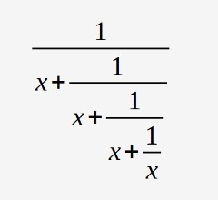

## 2.6.1.10 LAB: Operadores e expressões

## Tempo estimado
20 minutos

## Nível de dificuldade
Intermédio

## Objetivos
* familiarizar-se com o conceito de números, operadores e operações aritméticas em Python;
* compreender a precedência e associatividade dos operadores Python, bem como o uso adequado de parêntesis.

## Cenário
A sua tarefa é a de completar o código, de forma a avaliar a seguinte expressão:



O resultado deve ser atribuído a `y`. Tenha cuidado - observe os operadores e mantenha as suas prioridades em mente. Não hesite em utilizar os parêntesis de que necessitar.

Pode utilizar variáveis adicionais para encurtar a expressão (mas não é necessário). Teste o seu código com cuidado.

```
x = float(input("Enter value for x: "))

# Write your code here.

print("y =", y)
```
## Dados de Teste
Input de amostra: `1`

Output esperado:

`y = 0.6000000000000001`

Input de amostra: 10

Output esperado:

`y = 0.09901951266867294`

Input de amostra: 100

Output esperado:

`y = 0.009999000199950014`

Input de amostra: -5

Output esperado:

`y = -0.19258202567760344`
