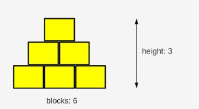

## 3.2.1.14 LAB: Essenciais do loop while

## Tempo estimado
20-30 minutos

## Nível de dificuldade
Médio

## Objetivos
Familiarizar o aluno a:

* a utilização do loop `while` ;
* encontrar a correta implementação de regras definidas verbalmente;
* refletir situações da vida real em código informático.

## Cenário
Leia esta história: um rapaz e o seu pai, um programador de computador, estão a brincar com blocos de madeira. Eles estão a construir uma pirâmide.

A sua pirâmide é um pouco estranha, pois na realidade é uma parede em forma de pirâmide - é plana. A pirâmide é empilhada de acordo com um princípio simples: cada camada inferior contém mais um bloco do que a camada superior.

A figura ilustra a regra utilizada pelos construtores:



A sua tarefa é escrever um programa que leia o número de blocos que os construtores têm, e que produza a altura da pirâmide que pode ser construída utilizando estes blocos.

Nota: a altura é medida pelo número de **camadas completamente preenchidas** - se os construtores não tiverem um número suficiente de blocos e não conseguirem completar a camada seguinte, terminam o seu trabalho imediatamente.

Teste o seu código utilizando os dados por nós fornecidos.

```
blocks = int(input("Enter the number of blocks: "))

#
# Write your code here.
#	

print("The height of the pyramid:", height)
```

## Dados de teste

Input de amostra: `6`

Output esperado: `The height of the pyramid: 3`

Input de amostra: `20`

Output esperado: `The height of the pyramid: 5`

Input de amostra: `1000`

Output esperado: `The height of the pyramid: 44`

Input de amostra: `2`

Output esperado: `The height of the pyramid: 1`