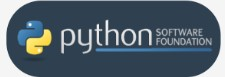
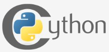
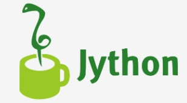
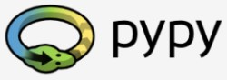

# Python Essentials 1:
# Módulo 1.1

## Introdução ao Python e à programação informática

Neste módulo, aprenderá sobre:

* Os fundamentos da programação informática, ou seja, como o computador funciona, como o programa é executado, como a linguagem de programação é definida e construída;
* a diferença entre compilação e interpretação;
* o que é o Python, como se posiciona entre outras linguagens de programação, e o que distingue as diferentes versões de Python

## 1.1.1.1 Programação - noções básicas
## Como funciona um programa de computador?

Este curso tem como objetivo mostrar o que é a linguagem Python e para o que é utilizada. Vamos começar a partir do básico.

Um programa torna um computador utilizável. Sem um programa, um computador, mesmo o mais poderoso, nada mais é do que um objeto. Da mesma forma, sem um pianista, um piano não é mais do que uma caixa de madeira.

Os computadores são capazes de executar tarefas muito complexas, mas essa capacidade não lhes é inata. A natureza de um computador é bastante diferente.

Ele só pode executar operações extremamente simples, por exemplo, um computador não pode avaliar o valor de uma função matemática complicada por si só, embora isto não esteja fora do âmbito das possibilidades num futuro próximo.

Computadores contemporâneos só podem avaliar os resultados de operações muito fundamentais, como adicionar ou dividir, mas podem fazê-lo muito rapidamente, e podem repetir estas ações virtualmente um qualquer número de vezes.

Imagine que quer saber a velocidade média que alcançou durante uma longa viagem. Sabe a distância, sabe o tempo, precisa da velocidade.

Naturalmente, o computador será capaz de calcular isto, mas o computador não está ciente de coisas como distância, velocidade ou tempo. Portanto, é necessário instruir o computador a:

* aceitar um número que represente a distância;
* aceitar um número que represente o tempo de viagem;
* dividir o valor anterior pelo último e armazenar o resultado na memória;
* exibir o resultado (representando a velocidade média) num formato legível.

Estas quatro simples ações formam um programa. É claro que estes exemplos não são formalizados, e estão muito longe do que o computador pode compreender, mas são suficientemente bons para serem traduzidos para uma linguagem que o computador possa aceitar.

**Linguagem (Language)** é a palavra-chave.

## 1.1.1.2 Programação - noções básicas
## Linguagens naturais vs. linguagens de programação

Uma linguagem é um meio (e uma ferramenta) para expressar e registar pensamentos. Há muitas linguagens ao nosso redor. Algumas delas não requerem nem a fala nem a escrita, como a linguagem corporal; é possível expressar os seus sentimentos mais profundos com muita precisão sem dizer uma palavra.

Outra linguagem que usa diariamente é a sua língua materna, que usa para manifestar a sua vontade e para pensar na realidade. Os computadores também têm a sua própria linguagem, chamada linguagem de **máquina,** que é muito rudimentar.

Um computador, mesmo o mais sofisticado tecnicamente, é desprovido até mesmo de um vestígio de inteligência. Pode-se dizer que é como um cão bem treinado - responde apenas a um conjunto pré-determinado de comandos conhecidos.

Os comandos que reconhece são muito simples. Podemos imaginar que o computador responde a ordens como "pega nesse número, divide-o por outro e guarda o resultado".

Um conjunto completo de comandos conhecidos é chamado de **lista de instruções**, por vezes abreviado para **IL** (do inglês, Instruction List). Os diferentes tipos de computadores podem variar em função do tamanho das suas IL, e as instruções podem ser completamente diferentes em diferentes modelos.

Nota: as linguagens de máquina são desenvolvidas por humanos.

Atualmente, nenhum computador é capaz de criar uma nova linguagem. No entanto, isso pode mudar em breve. Por outro lado, as pessoas também utilizam uma série de línguas muito diferentes, mas estas línguas desenvolveram-se naturalmente. Além disso, ainda estão a evoluir.

São criadas novas palavras todos os dias e as palavras antigas desaparecem. Estas línguas são chamadas linguagens **naturais.**

## 1.1.1.3 Programação - noções básicas
## O que faz uma linguagem?

Podemos dizer que cada linguagem (de máquina ou natural, não importa) é constituída pelos seguintes elementos:

* um **alfabeto:** um conjunto de símbolos utilizados para construir palavras de uma determinada linguagem (por exemplo, o alfabeto latino para inglês, o alfabeto cirílico para russo, o Kanji para japonês, etc.)
* um **lexis:** (ou seja, um dicionário) um conjunto de palavras que a linguagem oferece aos seus utilizadores (por exemplo, a palavra "computador" vem do dicionário de língua inglesa, enquanto que 
"cmoptrue" não; a palavra "chat" está presente tanto nos dicionários de inglês como de francês, mas os seus significados são diferentes)
* uma **sintaxe:** um conjunto de regras (formais ou informais, escritas ou sentidas intuitivamente) utilizadas para determinar se uma determinada sequência de palavras forma uma frase válida (por exemplo,  "Eu sou uma pitão" é uma frase sintaticamente correta, enquanto "Eu uma pitão sou" não é)
* **semântica:** um conjunto de regras que determinam se uma determinada frase faz sentido (por exemplo, "Comi um donut" faz sentido, mas "Um donut comeu-me" não faz)

O IL é, de facto, o **alfabeto de uma linguagem de máquina**. Este é o conjunto mais simples e primário de símbolos que podemos utilizar para dar comandos a um computador. É a língua materna do computador.

Infelizmente, esta língua está muito longe de ser uma língua materna humana. Todos nós (tanto computadores como humanos) precisamos de algo mais, uma linguagem comum para computadores e humanos, ou uma ponte entre os dois mundos diferentes.

Precisamos de uma linguagem em que os humanos possam escrever os seus programas e uma linguagem que os computadores possam utilizar para executar os programas, uma linguagem que seja muito mais complexa do que a linguagem das máquinas e, no entanto, muito mais simples do que a linguagem natural.

Tais linguagens são muitas vezes chamadas linguagens de programação de alto nível. São pelo menos um pouco semelhantes aos naturais na medida em que utilizam símbolos, palavras e convenções legíveis para os seres humanos. Estas linguagens permitem aos seres humanos expressar comandos a computadores que são muito mais complexos do que os oferecidos pelas ILs.

Um programa escrito numa linguagem de programação de alto nível é chamado **source code** (em contraste com o machine code executado por computadores). Da mesma forma, o ficheiro que contém o source code chama-se **source file**.

## 1.1.1.4 Programação - noções básicas | Compilação vs. Interpretação
## Compilação vs. interpretação

A programação informática é o ato de compor os elementos da linguagem de programação selecionada pela ordem que provocará o efeito desejado. O efeito pode ser diferente em cada caso específico - depende da imaginação, conhecimento e experiência do programador.

É claro que tal composição tem de ser correta em muitos sentidos:

* **alfabeticamente** - um programa precisa de ser escrito num guião reconhecível, tal como romano, cirílico, etc.
* **lexicamente** - cada linguagem de programação tem o seu dicionário e é preciso dominá-lo; felizmente, é muito mais simples e menor do que o dicionário de qualquer língua natural;
* **sintaticamente** - cada linguagem tem as suas regras, e estas devem ser obedecidas;
* **semanticamente** - o programa tem de fazer sentido.
Infelizmente, um programador também pode cometer erros com cada um dos quatro sentidos acima referidos. Cada um deles pode fazer com que o programa se torne completamente inútil.

Vamos supor que tenha escrito um programa com sucesso. Como persuadir o computador a executá-lo? Tem de transformar o seu programa em linguagem de máquina. Felizmente, a tradução pode ser feita pelo próprio computador, tornando todo o processo rápido e eficiente.

Há duas formas diferentes de **transformar um programa de uma linguagem de programação de alto nível em linguagem de máquina:**

**COMPILAÇÃO** - o source program é traduzido uma vez (no entanto, este ato deve ser repetido sempre que modificar o source code) obtendo um ficheiro (por exemplo, um ficheiro .exe se o código se destinar a ser executado no MS Windows) contendo o machine code; agora pode distribuir o ficheiro por todo o mundo; o programa que executa esta tradução chama-se compilador ou tradutor;

**INTERPRETAÇÃO** - você (ou qualquer utilizador do código) pode traduzir o source program cada vez que este tem de ser executado; o programa que executa este tipo de transformação chama-se intérprete, pois interpreta o código cada vez que se pretende executá-lo; também significa que não pode simplesmente distribuir o source code tal como está, porque o utilizador final também precisa do intérprete para o executar.

Devido a algumas razões muito fundamentais, uma linguagem de programação particular de alto nível foi concebida para se enquadrar numa destas duas categorias.

Há muito poucas linguagens que possam ser compiladas e interpretadas. Normalmente, uma linguagem de programação é projetada com este fator na mente dos seus construtores - será ela compilada ou interpretada?

## 1.1.1.5 Programação - noções básicas | Compilação vs. Interpretação
## O que é que o intérprete realmente faz?

Vamos assumir mais uma vez que escreveu um programa. Agora, existe como um **arquivo de computador**: um programa de computador é na realidade um pedaço de texto, por isso o source code é normalmente colocado em **arquivos de texto.**

Nota: tem de ser **texto puro**, sem quaisquer decorações como diferentes fontes, cores, imagens embutidas ou outros suportes. Agora tem de invocar o intérprete e deixá-lo ler o seu source file.

O intérprete lê o source code de uma forma que é comum na cultura ocidental: de cima para baixo e da esquerda para a direita. Há algumas exceções - elas serão abordadas mais tarde no curso.

Em primeiro lugar, o intérprete verifica se todas as linhas subsequentes estão corretas (utilizando os quatro aspetos abordados anteriormente).

Se o compilador encontrar um erro, termina o seu trabalho imediatamente. O único resultado, neste caso, é uma **mensagem de erro.**

O intérprete informá-lo-á onde se encontra o erro e o que o causou. No entanto, estas mensagens podem ser enganadoras, uma vez que o intérprete não é capaz de seguir exatamente as suas intenções, e pode detetar erros a alguma distância das suas verdadeiras causas.

Por exemplo, se tentar utilizar uma entidade com um nome desconhecido, causará um erro, mas o erro será descoberto no local onde tenta utilizar a entidade, e não onde o nome da nova entidade foi introduzido.

Por outras palavras, a razão real está normalmente localizada um pouco mais cedo no código, por exemplo, no local onde teve de informar o intérprete de que ia utilizar a entidade do nome.

Se a linha parecer boa, o intérprete tenta executá-la (nota: cada linha é normalmente executada separadamente, pelo que o trio "read-check-execute" pode ser repetido muitas vezes - mais vezes do que o número real de linhas no source file, uma vez que algumas partes do código podem ser executadas mais de uma vez).

É também possível que uma parte significativa do código possa ser executada com sucesso antes de o intérprete encontrar um erro. Este é um comportamento normal neste modelo de execução.

Pode perguntar agora: o que é melhor? O modelo "compilador" ou o modelo "intérprete"? Não há uma resposta óbvia. Se houvesse, um destes modelos já teria deixado de existir há muito tempo. Ambos têm as suas vantagens e as suas desvantagens.

## 1.1.1.6 Programação - noções básicas | Compilação vs. Interpretação
## Compilação vs. Interpretação - vantagens e desvantagens

### VANTAGENS

#### COMPILAÇÃO

* a execução do código traduzido é geralmente mais rápida;
* apenas o utilizador tem de ter o compilador - o end-user (utilizador final) pode usar o código sem ele;
* o código traduzido é armazenado utilizando linguagem de máquina - como é muito difícil de entender, as suas próprias invenções e truques de programação provavelmente permanecerão segredo.

#### INTERPRETAÇÃO

* pode executar o código assim que o concluir - não há fases adicionais de tradução;
* o código é armazenado usando linguagem de programação, não de máquina - isto significa que pode ser executado em computadores utilizando diferentes linguagens de máquina; não se compila o código separadamente para cada arquitetura diferente.

### DESVANTAGENS

#### COMPILAÇÃO

* a compilação em si pode ser um processo muito demorado - pode não ser capaz de executar o seu código imediatamente após qualquer alteração;
* tem de ter tantos compiladores quanto plataformas de hardware em que queira que o seu código seja executado.

#### INTERPRETAÇÃO

* não espere que a interpretação aumente o seu código para alta velocidade - o seu código irá partilhar o poder do computador com o intérprete, pelo que não pode ser realmente rápido;
* tanto você como o end-user têm de ter o intérprete para executar o seu código.

## O que significa tudo isto para si?

* O Python é uma **linguagem interpretada**. Isto significa que herda todas as vantagens e desvantagens descritas. Naturalmente, acrescenta algumas das suas características únicas a ambos os conjuntos.
* Se quiser programar em Python, precisará do **intérprete Python**. Não será capaz de executar o seu código sem ele. Felizmente, **o Python é gratuito**. Esta é uma das suas vantagens mais importantes.

Devido a razões históricas, as linguagens concebidas para serem utilizadas na forma de interpretação são muitas vezes chamadas **linguagens de scripting**, enquanto os source programs codificados que as utilizam são chamados **scripts.**

## 1.1.2.1 Python - uma ferramenta, não um réptil
## O que é o Python?

O Python é uma linguagem de programação de grande utilização, interpretada, orientada a objetos, e de alto nível com semântica dinâmica, utilizada para programação de uso geral.

E embora possa conhecer o python (pitão) como uma grande cobra, o nome da linguagem de programação Python vem de uma antiga série de comédia televisiva da BBC chamada **Monty Python's Flying Circus.**

No auge do seu sucesso, a equipa Monty Python estava a realizar os seus sketches para audiências ao vivo em todo o mundo, incluindo no Hollywood Bowl.

Uma vez que os Monty Python são considerados um dos dois nutrientes fundamentais para um programador (sendo o outro pizza), o criador de Python nomeou a linguagem em honra do programa de televisão.

## Quem criou o Python?

Uma das características espantosas de Python é o facto de ser realmente o trabalho de uma pessoa. Normalmente, novas linguagens de programação são desenvolvidas e publicadas por grandes empresas que empregam muitos profissionais, e devido às regras de direitos de autor, é muito difícil nomear qualquer uma das pessoas envolvidas no projeto. O Python é uma exceção.

Não há muitas linguagens cujos autores sejam conhecidos pelo nome. O Python foi criado por **Guido van Rossum**, nascido em 1956 em Haarlem, Holanda. É claro que Guido van Rossum não desenvolveu e evoluiu ele próprio todos os componentes de Python.

A rapidez com que o Python se espalhou pelo mundo é o resultado do trabalho contínuo de milhares (muitas vezes anónimos) de programadores, testadores, utilizadores (muitos deles não são especialistas em IT) e entusiastas, mas deve dizer-se que a primeira ideia (a semente da qual o Python brotou) chegou a uma cabeça - a de Guido.

## 1.1.2.2 Python - uma ferramenta, não um réptil
## Um projeto de programação de hobby
As circunstâncias em que o Python foi criado são um pouco confusas. De acordo com Guido van Rossum:

*"Em Dezembro de 1989, estava à procura de um projeto de programação de "hobby" que me mantivesse ocupado durante a semana por volta do Natal. O meu escritório (...) estaria fechado, mas eu tinha um computador em casa, e não tinha muito mais nas mãos. Decidi escrever um intérprete para a nova linguagem de escrita em que tinha pensado ultimamente: um descendente do ABC que apelaria aos hackers Unix/C. Escolhi Python como título de trabalho para o projeto, estando de humor ligeiramente irreverente (e sendo um grande fã do Monty Python's Flying Circus).*
Guido van Rossum

## Objetivos do Python

Em 1999, Guido van Rossum definiu os seus objetivos para o Python:"

* uma linguagem **fácil e intuitiva**, tão poderosa como a dos principais concorrentes;
* de **open source**, para que qualquer pessoa possa contribuir para o seu desenvolvimento;
* código que seja tão **compreensível** como o inglês simples;
* **adequado para tarefas cotidianas**, permitindo tempos de desenvolvimento curtos.

Cerca de 20 anos mais tarde, é evidente que todas estas intenções foram cumpridas. Algumas fontes dizem que o Python é a linguagem de programação mais popular no mundo, enquanto outras afirmam que é a terceira ou a quinta.

O Conceito do Ministério dos Passeios Tolos

Seja como for, continua a ocupar uma posição elevada no top dez do [PYPL PopularitY of Programming Language](9https://pypl.github.io/PYPL.html) e no [TIOBE Programming Community Index](https://www.tiobe.com/tiobe-index/).

O Python não é uma linguagem jovem. É **madura e confiável**. Não é uma one-hit wonder. É uma estrela brilhante no firmamento da programação, e o tempo gasto a aprender Python é um investimento muito bom.

## 1.1.2.3 Python - uma ferramenta, não um réptil | Porquê Python?
## O que torna o Python especial?

Como é que os programadores, jovens e velhos, experientes e novatos, querem utilizá-lo? Como aconteceu que grandes empresas adotassem o Python e implementassem os seus principais produtos utilizando-o?

Há muitas razões - já enumerámos algumas delas, mas vamos enumerá-las novamente de uma forma mais prática:

* é **fácil de aprender** - o tempo necessário para aprender Python é menor do que para muitas outras linguagens; isto significa que é possível iniciar a programação em si mais rapidamente;
* é **fácil de ensinar** - a carga de trabalho de ensino é menor do que a necessária para outras linguagens; isto significa que o professor pode colocar mais ênfase em técnicas de programação gerais (independentes da linguagem), não desperdiçando energia em truques exóticos, estranhas exceções e regras incompreensíveis;
* é **fácil de usar** para escrever novo software - é muitas vezes possível escrever código mais rapidamente quando se usa Python;
* é **fácil de compreender** - é também frequentemente mais fácil e rápido de compreender o código de outra pessoa se for escrito em Python;
* é **fácil de obter, instalar e implementar** - o Python é gratuito, aberto e multiplataforma; nem todas as linguagens se podem gabar disso.

É claro que o Python também tem os seus inconvenientes:

* não é um demónio da velocidade - o Python não oferece um desempenho excecional;
* em alguns casos pode ser resistente a algumas técnicas de teste mais simples - isto pode significar que depurar o código Python pode ser mais difícil do que com outras linguagens; felizmente, cometer erros é sempre mais difícil em Python.

Deve também ser afirmado que o Python não é a única solução do seu género disponível no mercado do TI.

Tem muitos seguidores, mas há muitos que preferem outras linguagens e nem sequer consideram o Python para os seus projetos.

## 1.1.2.4 Python - uma ferramenta, não um réptil | Porquê Python, porque não?
## Rivais do Python?

O Python tem dois concorrentes diretos, com propriedades e predisposições comparáveis. Estes são:

* **Perl** - uma linguagem de scripting originalmente de autoria de Larry Wall;
* **Ruby** - uma linguagem de scripting originalmente escrita por Yukihiro Matsumoto.
A primeira é mais tradicional, mais conservadora do que Python, e assemelha-se a algumas das boas e antigas linguagens derivadas da clássica linguagem de programação C.

Em contraste, esta última é mais inovadora e mais cheia de ideias frescas do que Python. O próprio Python encontra-se algures entre estas duas criações.

A Internet está cheia de fóruns com infinitas discussões sobre a superioridade de um destes três sobre os outros, caso pretenda saber mais sobre cada um deles.

## Onde podemos ver o Python em ação?

Vemo-lo todos os dias e em quase todo o lado. É utilizado extensivamente para implementar **serviços complexos da Internet** como motores de busca, armazenamento em nuvem e ferramentas, redes sociais, etc. Sempre que utiliza qualquer um destes serviços, está na realidade muito próximo de Python, embora não o conheça.

Muitas **ferramentas em desenvolvimento** são implementadas em Python. Cada vez mais **aplicações de uso diário** estão a ser escritas em Python. Muitos **cientistas** abandonaram ferramentas proprietárias dispendiosas e mudaram para o Python. Muitos **testadores** de projetos de TI começaram a utilizar o Python para realizar procedimentos de teste repetíveis. A lista é longa.

## Porque não Python?

Apesar da popularidade crescente de Python, ainda existem alguns nichos onde o Python está ausente, ou raramente é visto:

* **programação de baixo nível** (por vezes chamada programação "close to metal"): se quiser implementar um condutor ou motor gráfico extremamente eficaz, não utilizaria Python;
* **aplicações para dispositivos móveis**: embora este território ainda esteja à espera de ser conquistado pelo Python, é muito provável que um dia tal venha a acontecer.

## 1.1.3.1 Python 2 vs. Python 3
## Há mais do que um Python

Existem dois tipos principais de Python, chamados Python 2 e Python 3.

O Python 2 é uma versão mais antiga do Python original. Desde então o seu desenvolvimento tem sido intencionalmente parado, embora isso não signifique que não hajam atualizações. Pelo contrário, as atualizações são emitidas regularmente, mas não se destinam a modificar a linguagem de forma significativa. Preferem corrigir quaisquer bugs recém-descobertos e falhas de segurança. O caminho de desenvolvimento de Python 2 já chegou a um beco sem saída, mas o Python 2 em si ainda está muito vivo.

**Python 3 é a versão mais recente (para ser mais preciso, a atual versão) da linguagem. Está a percorrer o seu próprio caminho de evolução, criando os seus próprios padrões e hábitos.**

Estas duas versões do Python não são compatíveis uma com a outra. Os scripts de Python 2 não serão executados num ambiente Python 3 e vice-versa, portanto, se quiser que o antigo código Python 2 seja executado por um intérprete Python 3, a única solução possível é reescrevê-lo, não do zero, claro, pois grandes partes do código podem permanecer intocadas, mas terá de rever todo o código para encontrar todas as incompatibilidades possíveis. Infelizmente, este processo não pode ser totalmente automatizado.

É demasiado difícil, demasiado demorado, demasiado caro e demasiado arriscado migrar uma velha aplicação Python 2 para uma nova plataforma. É possível que a reescrita do código lhe introduza novos bugs. É mais fácil e mais sensato deixar estes sistemas em paz e melhorar o intérprete existente, em vez de tentar trabalhar dentro do source code já em funcionamento.

O conceito Python 2 vs. Python 3O Python 3 não é apenas uma versão melhor do Python 2 - é uma linguagem completamente diferente, embora seja muito semelhante à sua predecessora. Quando se olha para eles à distância, parecem ser os mesmos, mas quando se olha de perto, no entanto, notam-se muitas diferenças.

Se estiver a modificar uma antiga solução Python existente, então é altamente provável que tenha sido codificada em Python 2. Esta é a razão pela qual o Python 2 ainda está a ser utilizado. Há demasiadas aplicações Python 2 existentes para o descartar completamente.

**NOTA**

Se vai iniciar um novo projeto Python, **deve usar Python 3, e esta é a versão de Python que será usada durante este curso.**

É importante lembrar que pode haver diferenças menores ou maiores entre as versões posteriores do Python 3 (por exemplo, Python 3.6 introduziu chaves de dicionário ordenadas por defeito sob a implementação do CPython) - a boa notícia, porém, é que todas as versões mais recentes de Python 3 são **retrocompatíveis** com as versões anteriores de Python 3. Sempre que for significativo e importante, tentaremos realçar essas diferenças no curso.

Todas as amostras de código que irá encontrar durante o curso foram testadas contra Python 3.4, Python 3.6, Python 3.7, e Python 3.8.

## 1.1.3.2 Há mais do que um Python: CPython e Cython
## Python aka CPython

Para além do Python 2 e Python 3, existe mais de uma versão de cada uma. 

 

Logotipo Python Software FoundationEm primeiro lugar, existem os Pythons que são mantidos pelas pessoas reunidas em torno da PSF ([Python Software Foundation](https://www.python.org/psf-landing/)), uma comunidade que visa desenvolver, melhorar, expandir e popularizar o Python e o seu ambiente. O presidente da PSF é o próprio Guido von Rossum, e por esta razão, estes Pythons são chamados de **canónicos**. São também considerados **Pythons de referência**, pois qualquer outra implementação da linguagem deve seguir todas as normas estabelecidas pelo PSF.

Guido van Rossum utilizou a linguagem de programação "C" para implementar a primeira versão da sua linguagem, e esta decisão ainda está em vigor. Todos os Pythons provenientes do PSF são escritos na linguagem "C". Há muitas razões para esta abordagem e ela tem muitas consequências. Uma delas (provavelmente a mais importante) é que graças a ela, o Python pode ser facilmente portado e migrado para todas as plataformas com a capacidade de compilar e executar programas em linguagem "C" (praticamente todas as plataformas têm esta característica, o que abre muitas oportunidades de expansão para Python).

É por isso que a implementação da PSF é frequentemente referida como **CPython**. Este é o Python mais influente entre todos os Pythons do mundo.

## Cython

Outro membro da família Python é o **Cython**.

Logotipo CythonO Cython é uma das várias soluções possíveis para a mais dolorosa das características de Python - a falta de eficiência. Grandes e complexos cálculos matemáticos podem ser facilmente codificados em Python (muito mais facilmente do que em "C" ou qualquer outra linguagem tradicional), mas a execução do código resultante pode ser extremamente demorada.

Como são conciliadas estas duas contradições? Uma solução é escrever as suas ideias matemáticas usando Python, e quando estiver absolutamente seguro de que o seu código está correto e produz resultados válidos, pode traduzi-lo para "C". Certamente, o "C" correrá muito mais rápido do que Python puro.

É isto que o Cython pretende fazer - traduzir automaticamente o código Python (limpo e claro, mas não demasiado rápido) em código "C" (complicado e falador, mas ágil).

## 1.1.3.3 Há mais do que um Python: Jython, PyPy e RPython
## Jython

Outra versão do Python é chamada **Jython**.

“J” é para “Java”. Imagine um Python escrito em Java em vez de C. Isto é útil, por exemplo, se desenvolver sistemas grandes e complexos escritos inteiramente em Java, e quiser acrescentar alguma flexibilidade Python a eles. O CPython tradicional pode ser difícil de integrar em tal ambiente, já que C e Java vivem em mundos completamente diferentes e não partilham muitas ideias comuns.

Jython pode comunicar com a infra-estrutura Java existente de forma mais eficaz. É por isso que alguns projetos o consideram utilizável e necessário.

Nota: a atual implementação do Jython segue as normas do Python 2. Até ao momento, não há Jython em conformidade com Python 3

## PyPy e RPython

Dê uma vista de olhos ao logotipo em baixo. É um rébus. Consegue resolvê-lo?

É um logótipo do **PyPy** - um Python dentro de um Python. Por outras palavras, representa um ambiente Python escrito em linguagem Python, chamado *RPython* (Restricted Python). Na verdade, é um subconjunto de Python.

O source code de PyPy não é executado na forma de interpretação, mas sim traduzido para a linguagem de programação C e depois executado separadamente.

Isto é útil porque se quiser testar qualquer nova funcionalidade que possa ser (mas não tem de ser) introduzida na implementação do Python convencional, é mais fácil verificá-la com o PyPy do que com o CPython. É por isto que o PyPy é antes uma ferramenta para pessoas que desenvolvem Python, do que para o resto dos utilizadores.

Isto não torna o PyPy menos importante ou menos sério do que o CPython, é claro.

Além disso, o PyPy é compatível com a linguagem do Python 3.

Existem muitos mais Pythons diferentes no mundo. Encontrá-los-á se procurar, **mas este curso irá concentrar-se no CPython.**

