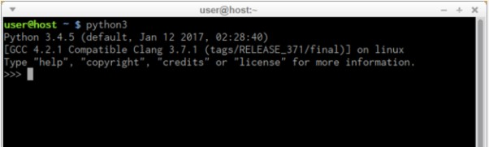
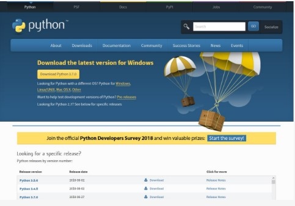
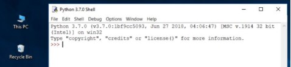
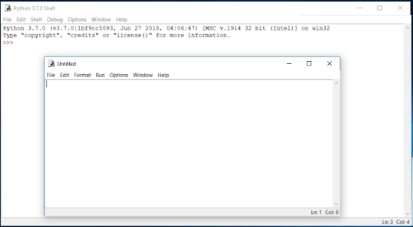
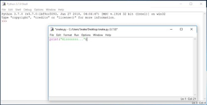
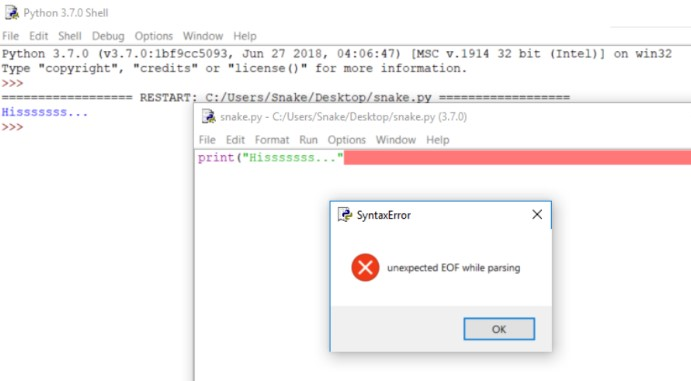
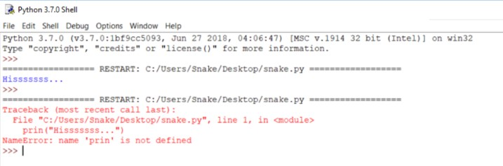

# Python Essentials 1:
# Módulo 1.2

## 1.2.1.1 Comece a sua viagem em Python
## Como obter o Python e como conseguir utilizá-lo

Existem várias maneiras de obter a sua própria cópia do Python 3, dependendo do sistema operativo que utilize.

**Utilizadores de Linux provavelmente já têm o Python instalado** - este é o cenário mais provável, já que a infraestrutura do Python é intensamente utilizada por muitos componentes do sistema operativo Linux.

Por exemplo, alguns distribuidores podem acoplar as suas ferramentas específicas ao sistema e muitas destas ferramentas, como gestores de pacotes, são frequentemente escritas em Python. Algumas partes de ambientes gráficos disponíveis no mundo Linux também podem utilizar o Python.

Se for um utilizador Linux, abra o terminal/consola e digite:
```
python3
```

no shell prompt, pressione Enter e aguarde.

Se vir algo deste género:

```
Python 3.4.5 (default, Jan 12 2017, 02:28:40)
[GCC 4.2.1 Compatible Clang 3.7.1 (tags/RELEASE_371/final)] on linux
Type "help", "copyright", "credits" or "license" for more information.
>>>
```

Então não tem de fazer mais nada

Se o Python 3 estiver ausente, consulte a sua documentação do Linux para saber como utilizar o seu gestor de pacotes para descarregar e instalar um novo pacote - o que precisa chama-se **python3**, ou o seu nome começa com isso.

Todos os utilizadores que não sejam Linux podem descarregar uma cópia em [https://www.python.org/downloads/](https://www.python.org/downloads/).



## 1.2.1.2 Comece a sua viagem em Python | Descarregar e instalar o Python
## Baixar e instalar o Python

Como o browser diz ao site onde entrou o sistema operativo que utiliza, o único passo que tem de dar é clicar na versão Python apropriada que deseja.

Neste caso, selecione Python 3. O site oferece sempre a versão mais recente do mesmo.

Se for um **utilizador do Windows**, inicie o ficheiro .exe descarregado e siga todos os passos.

Deixe as configurações padrão que o instalador sugere por agora, com uma exceção - veja a caixa de verificação chamada **Add Python 3.x to PATH** e verifique-a.

Isto tornará as coisas mais fáceis.

Se for um **utilizador MacOS**, uma versão do Python 2 pode já ter sido pré-instalada no seu computador, mas como vamos trabalhar com o Python 3, ainda assim terá de descarregar e instalar o ficheiro .pkg relevante a partir do site Python.



## 1.2.1.3 Comece a sua viagem em Python
## Iniciar o seu trabalho com Python

Agora que tem o Python 3 instalado, é altura de verificar se funciona, e fazer o primeiro uso do mesmo.

Este será um procedimento muito simples, mas deve ser o suficiente para o convencer de que o ambiente Python é completo e funcional.

Existem muitas formas de utilizar o Python, especialmente se vier a ser um programador Python.

Para começar o seu trabalho, precisa das seguintes ferramentas:

* um **editor** que o irá apoiar na escrita do código (deve ter algumas características especiais, não disponíveis em ferramentas simples); este editor dedicado dar-lhe-á mais do que o equipamento padrão do sistema operativo;
* um **console** na qual pode correr o seu código recém-escrito e pará-lo à força quando ficar fora de controlo;
* uma ferramenta chamada um **debugger**, capaz de correr o seu código passo a passo e que lhe permite inspecioná-lo em cada momento da execução.
Para além dos seus muitos componentes úteis, a instalação padrão de Python 3 contém uma aplicação muito simples mas extremamente útil chamada IDLE.

**IDLE** é um acrónimo: Integrated Development and Learning Environment.

Navegue pelos menus do seu sistema operativo, encontre o IDLE algures sob Python 3.x e inicie-o. Isto é o que deve ver:



## 1.2.1.4 Comece a sua viagem em Python
## Como escrever e executar o seu primeiro programa

É agora tempo de escrever e executar o seu primeiro programa de Python 3. Será muito simples, por agora.

O primeiro passo é criar um novo source file e preenchê-lo com código. Clique em File no menu do IDLE e escolha New file.



Como pode ver, o IDLE abre uma nova janela para si. Pode utilizá-la para escrever e alterar o seu código.

Esta é a **janela do editor**. O seu único objetivo é ser um local de trabalho em que o seu source code é tratado. Não confundir a janela do editor com a janela shell. Desempenham funções diferentes.

A janela do editor está atualmente sem título, mas é uma boa prática começar a trabalhar nomeando o source file.

Clique em File (na nova janela), depois clique em Save as..., selecione uma pasta para o novo ficheiro (o ambiente de trabalho é um bom local para as suas primeiras tentativas de programação) e escolha um nome para o novo ficheiro.

Nota: não defina nenhuma extensão para o nome do ficheiro que vai utilizar. O Python precisa que os seus ficheiros tenham a extensão .py, por isso deve confiar nas predefinições da janela de diálogo. A utilização da extensão padrão .py permite que o sistema operativo abra adequadamente estes ficheiros.

## 1.2.1.5 Comece a sua viagem em Python
## Como escrever e executar o seu primeiro programa

Agora coloque apenas uma linha na sua janela do editor recém-aberta e nomeada.

A linha tem este aspeto:

```
print("Hisssssss...")
```

Pode utilizar a área de transferência para copiar o texto para o ficheiro.

Não vamos explicar o significado do programa neste momento. Encontrará uma discussão detalhada no próximo capítulo.

Veja mais de perto as aspas. Estas são as formas mais simples de aspas (neutras, retas, mudas, etc.) tipicamente utilizadas nos source files. Não tente usar aspas tipográficas (curvas, curvilíneas, inteligentes, etc.), utilizadas por processadores de texto avançados, uma vez que o Python não as aceita.



Se tudo correr bem e não houver erros no código, a janela da consola irá mostrar-lhe os efeitos causados pela execução do programa.

Neste caso, o programa **sibila**.

Tente executá-lo mais uma vez. E mais uma vez.

Agora feche ambas as janelas e regresse ao ambiente de trabalho.

## 1.2.1.6 Comece a sua viagem em Python
## Como estragar e corrigir o seu código

Agora reinicie o IDLE.

* Clique em File, Open, aponte para o ficheiro que guardou anteriormente e deixe o IDLE lê-lo.
* Tente executá-lo novamente pressionando F5 quando a janela do editor estiver ativa.

Como pode ver, o IDLE é capaz de guardar o seu código e recuperá-lo quando precisar dele novamente.

O IDLE contém um recurso adicional e útil.

* Primeiro, remova o parêntesis final.
* Em seguida, insira o parêntesis novamente.

O seu código deve parecer-se com o que está aqui em baixo:

``` 
Hisssssss... 
```
output


Python 3.7.0 IDLE - Executar um programa depois de remover parêntesis da função print()

Cada vez que colocar o parêntesis final no seu programa, o IDLE mostrará a parte do texto limitada com um par de parêntesis correspondentes. Isto ajuda-o a lembrar-se de os colocar em pares.

Retire novamente o parêntesis final. O código torna-se incorreto. Contém agora um erro de sintaxe. O IDLE não deve deixar que o execute.

Tente executar o programa novamente. O IDLE irá lembrá-lo de guardar o ficheiro modificado. Siga as instruções.

## 1.2.1.7 Comece a sua viagem em Python
## Como estragar e corrigir o seu código

Observe cuidadosamente todas as janelas.

Uma nova janela – diz que o intérprete encontrou um EOF (end-of-file) embora (na sua opinião) o código deva conter mais algum texto.

A janela do editor mostra claramente onde isto aconteceu.



Corrija o código agora. Deve ficar assim:

```
print("Hisssssss...")
```

Execute-o para ver se “sibila” novamente.

Vamos estragar o código mais uma vez. Remova uma letra da palavra print. Execute o código pressionando F5. O que acontece agora?

## 1.2.1.8 Comece a sua viagem em Python
## Como estragar e corrigir o seu código

Deve ter notado que a mensagem de erro gerada para o erro anterior é bastante diferente da primeira.



Isto acontece porque a natureza do erro é **diferente** e o erro é descoberto numa **fase diferente** de interpretação.

A janela do editor não fornecerá qualquer informação útil sobre o erro, mas as janelas da consola poderão.

A mensagem (a vermelho) mostra (nas linhas subsequentes):

* o **traceback** (que é o caminho que o código percorre através de diferentes partes do programa - pode ignorá-lo por agora, uma vez que está vazio num código tão simples);
* a **localização do erro** (o nome do ficheiro contendo o erro, o número da linha e o nome do módulo); nota: o número pode ser enganador, uma vez que o Python normalmente mostra o local onde primeiro se notam os efeitos do erro, não necessariamente o erro em si;
* o **conteúdo da linha errada**; nota: a janela do editor IDLE não mostra os números das linhas, mas mostra a localização atual do cursor no canto inferior direito; use-a para localizar a linha errada num source code longo;
* o **nome do erro** e uma breve explicação.

Experimente criar novos ficheiros e executar o seu código. Tente fazer output de uma mensagem diferente para o ecrã, por exemplo ``` roar! ```, ``` meow ```, ou até mesmo talvez um ``` oink! ```. Tente estragar e corrigir o seu código - veja o que acontece.

## 1.2.1.9 Conclusão do Módulo
## Parabéns!
## Concluiu o Módulo 1.

Muito bem! Chegou ao fim do Módulo 1 e completou um marco importante na sua educação em programação Python. Aqui está um breve resumo dos objetivos que abordou e com os quais se familiarizou no Módulo 1:

* os fundamentos da programação informática, ou seja, como o computador funciona, como o programa é executado, como a linguagem de programação é definida e construída;
* A diferença entre compilação e interpretação;
* a informação básica sobre Python e como se posiciona entre outras linguagens de programação, e o que distingue as suas diferentes versões;
* os recursos de estudo e os diferentes tipos de interfaces que irá utilizar no curso.

Está agora pronto para fazer o teste do módulo, que o ajudará a avaliar o que aprendeu até agora.