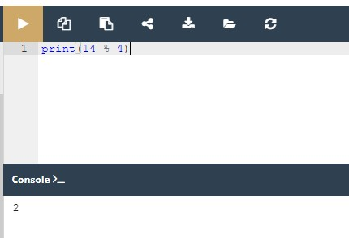
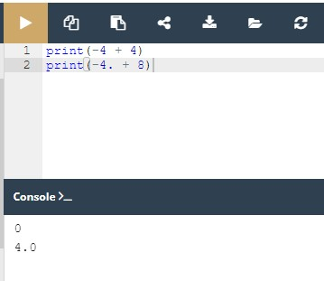
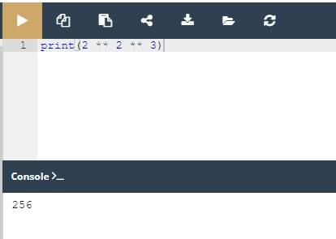
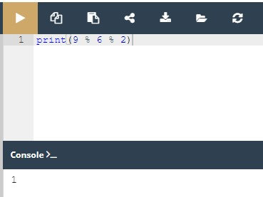
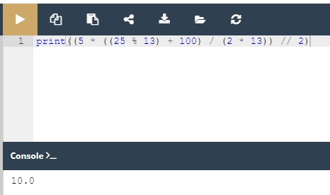

## 2.3.1.1 Operadores - ferramentas de manipulação de dados
## Python como uma calculadora

Agora, vamos mostrar-lhe um lado completamente novo da função print(). Já sabe que a função é capaz de lhe mostrar os valores dos literais que lhe são transmitidos pelos argumentos.

Na verdade, pode fazer algo mais. Dê uma vista de olhos no snippet:

```
print(2+2)
```

Digite novamente o código no editor e execute-o. Consegue adivinhar o output?

Deve ver o número quatro. Sinta-se à vontade para experimentar com outros operadores.

Sem levar isto demasiado a sério, acabou de descobrir que o Python pode ser usado como calculadora. Não é muito útil, e definitivamente não é de bolso, mas é uma calculadora.

Levando-o mais a sério, estamos agora entrando na província dos **operadores** e das **expressões**.

## Operadores básicos

Um **operador** é um símbolo da linguagem de programação, que é capaz de operar sobre os valores.

Por exemplo, tal como na aritmética, o sinal `+` (mais) é o operador que é capaz de **adicionar** dois números, dando o resultado da adição.

Mas nem todos os operadores Python são tão óbvios como o sinal de mais, por isso vamos analisar alguns dos operadores disponíveis em Python, e explicaremos que regras regem a sua utilização, e como interpretar as operações que realizam.

Começaremos pelos operadores que estão associados às operações aritméticas mais amplamente reconhecidas:

```
+, -, *, /, //, %, **
```

A ordem do seu aparecimento não é acidental. Falaremos mais sobre o assunto depois de termos passado por todos eles.

**Lembre-se**: Os dados e os operadores, quando ligados entre si, formam **expressões**. A expressão mais simples é um literal em si.

## 2.3.1.2 Operadores - ferramentas de manipulação de dados
## Operadores aritméticos: exponenciação

Um sinal `**` (duplo asterisco) é um operador de **exponenciação** (potência). O seu argumento esquerdo é a **base**, o seu direito, o **expoente**.

A matemática clássica prefere a notação com sobrescrito, tal como esta: 2<sup>3</sup>. Os editores de texto puro não aceitam isso, por isso o Python usa `**` ao invés, por exemplo, ``2 ** 3``.

Dê uma vista de olhos aos nossos exemplos na janela do editor.


Nota: rodeamos os asteriscos duplos com espaços nos nossos exemplos. Não é obrigatório, mas melhora a **legibilidade** do código.

Os exemplos mostram uma característica muito importante de praticamente todos os **operadores numéricos** de Python.

Execute o código e veja cuidadosamente os resultados que produz. Consegue ver alguma regularidade aqui?


**Lembre-se**: É possível formular as seguintes regras com base neste resultado:

* quando **ambos** os argumentos `**` são inteiros, o resultado é também um inteiro;
* quando **pelo menos um** argumento `**` é um float, o resultado é também um float.

Esta é uma distinção importante a lembrar.

## 2.3.1.3 Operadores - ferramentas de manipulação de dados
## Operadores aritméticos: multiplicação

Um sinal `*` (asterisco) é um **operador de multiplicação**.

Execute o código abaixo e verifique se a nossa regra de inteiro vs. float ainda está a funcionar.

```
print(2 * 3)
print(2 * 3.)
print(2. * 3)
print(2. * 3.)
```


## 2.3.1.4 Operadores - ferramentas de manipulação de dados
## Operadores aritméticos: divisão

O sinal `/` (barra) é um **operador de divisão**.

O valor em frente da barra é um **dividendo**, o valor por detrás da barra, um *divisor*.

Execute o código abaixo e analise os resultados.

```
print(6 / 3)
print(6 / 3.)
print(6. / 3)
print(6. / 3.)
```


Deve ver que existe uma exceção à regra.

**O resultado produzido pelo operador da divisão é sempre um float**, independentemente de o resultado parecer ou não ser um float à primeira vista: `1 / 2`, ou se se parecer com um inteiro puro: `2 / 1`.

Isto é um problema? Sim, é. Acontece por vezes que é realmente necessária uma divisão que forneça um valor inteiro, não um float.

Felizmente, o Python pode ajudá-lo com isso.

## Operadores aritméticos: divisão inteira

Um sinal `//` (dupla barra) é um operador de **divisão inteira**. Difere do operador padrão `/` em dois detalhes:

* o seu resultado não tem a parte fracionada - está ausente (para inteiros), ou é sempre igual a zero (para floats); isto significa que **os resultados são sempre arredondados**;
* está em conformidade com a regra inteiro vs. float.
  
Execute o exemplo abaixo e veja os resultados:

```
print(6 // 3)
print(6 // 3.)
print(6. // 3)
print(6. // 3.)
```

Como se pode ver, a divisão inteiro por inteiro dá um resultado inteiro. Todos os outros casos produzem floats.


Vamos fazer alguns testes mais avançados.

Veja o seguinte snippet:

```
print(6 // 4)
print(6. // 4)
```


Imagine que usámos `/` em vez de `//` - consegue prever os resultados?

Sim, seria `1.5` em ambos os casos. Isso é claro.

Mas que resultados devemos esperar com `//` divisão?

Execute o código e veja por si mesmo.


O que obtemos são dois uns - um inteiro e um float.

O resultado da divisão inteira é sempre arredondado para o valor inteiro mais próximo, que é inferior ao resultado real (não arredondado).

Isto é muito importante: **o arredondamento vai sempre para o número inteiro menor**.

Veja o código abaixo e tente prever os resultados mais uma vez:

```
print(-6 // 4)
print(6. // -4)
```


Nota: alguns dos valores são negativos. Isto irá obviamente afetar o resultado. Mas como?

O resultado são dois dois negativos. O resultado real (não arredondado) é `-1.5` em ambos os casos. No entanto, os resultados são sujeitos a arredondamento. **O arredondamento vai para o menor valor inteiro**, e o menor valor inteiro é `-2`, logo: `-2` e `-2.0`.

NOTA

A divisão inteira também pode ser chamada **floor division**. Definitivamente, no futuro, deparar-se-á com este termo.

## 2.3.1.5 Operadores - ferramentas de manipulação de dados
## Operadores: remainder (modulo)

O próximo operador é bastante peculiar, visto não ter equivalente entre os operadores aritméticos tradicionais.

A sua representação gráfica em Python é o sinal `%` (percentagem), o que pode parecer um pouco confuso.

Tente pensar nisto como uma barra (operador de divisão) acompanhada por dois pequenos círculos engraçados.

O resultado do operador é um **remainder (resto) deixado após a divisão inteira.**

Por outras palavras, é o valor que sobrou depois de dividir um valor por outro para produzir um quociente inteiro.

Nota: o operador às vezes é chamado **modulo** noutras linguagens de programação.

Dê uma vista de olhos no snippet - tente prever o seu resultado e, em seguida, execute-o:

`print(14 % 4)`



Como pode ver, o resultado é dois. Esta é a razão:

`14 // 4` dá `3` → este é o **quociente** inteiro;
`3 * 4` dá `12` → como resultado da **multiplicação de quocientes e divisores**;
`14 - 12` dá `2` → este é o **resto**.

Este exemplo é um pouco mais complicado:

`print(12 % 4.5)`

Qual é o resultado?

Verifique

`3,0` - não `3` mas `3.0` (a regra ainda funciona: `12 // 4.5` dá `2.0`; `2.0 * 4.5` dá `9.0`; `12 - 9.0` dá `3.0`)

## Operadores: como não dividir

Como provavelmente sabe, **a divisão por zero não funciona**.

**Não** tente:

* executar uma divisão por zero;
* executar uma divisão inteira por zero;
* encontrar um remainder de uma divisão por zero.
  
finalizado
2.3.1.5 Operadores - ferramentas de manipulação de dados

iniciar a partir do 
2.3.1.6 Operadores - ferramentas de manipulação de dados

## 2.3.1.6 Operadores - ferramentas de manipulação de dados
## Operadores: adição

O operador de **adição** é o sinal `+` (mais), que está totalmente de acordo com os padrões matemáticos.

Novamente, dê uma vista de olhos no snippet do programa em baixo:

```
print(-4 + 4)
print(-4. + 8)
```

O resultado não deve ser nada surpreendente. Execute o código para o verificar.



## O operador de subtração, operadores unários e binários

O operador de **subtração** é obviamente o sinal `-` (menos), embora deva notar que este operador também tem outro significado - **ele pode alterar o sinal de um número**.

Esta é uma grande oportunidade para apresentar uma distinção muito importante entre operadores **unários** e **binários**.

Em aplicações de subtração, **o operador menos espera dois argumentos**: o da esquerda (um **minuendo** em termos aritméticos) e o da direita (um **subtraendo**).

Por esta razão, o operador de subtração é considerado um dos operadores binários, assim como os operadores de adição, multiplicação e divisão.

Mas o operador menos pode ser usado de uma forma diferente (unária) - veja a última linha do snippet em baixo:

```
print(-4 - 4)
print(4. - 8)
print(-1.1)
```

A propósito: há também um operador `+` unário. Pode utilizá-lo assim:

`print(+2)`

O operador preserva o sinal de seu único argumento - o correto.

Embora tal construção seja sintaticamente correta, a sua utilização não faz muito sentido, e seria difícil encontrar uma boa razão para o fazer.

Dê uma vista de olhos no snippet acima - consegue adivinhar o seu output?

## 2.3.1.7 Operadores - ferramentas de manipulação de dados
## Os operadores e as suas prioridades

Até agora, temos tratado cada operador como se não tivesse qualquer ligação com os outros. Obviamente, uma situação tão ideal e simples é uma raridade na programação real.

Além disso, encontrará muito frequentemente mais do que um operador numa só expressão, e então esta presunção já não é tão óbvia.

Considere a seguinte expressão:

`2 + 3 * 5`

Provavelmente lembra-se da escola que **as multiplicações precedem as adições**.

Deve certamente lembrar-se que primeiro deve multiplicar 3 por 5 e, mantendo o 15 na sua memória, depois adicioná-los a 2, obtendo assim o resultado de 17.

O fenómeno que leva alguns operadores a agir antes de outros é conhecido como ***a hierarquia de prioridades***.

O Python define com precisão as prioridades de todos os operadores, e assume que os operadores de maior (mais alta) prioridade realizam as suas operações antes dos operadores de menor prioridade.

Portanto, se sabe que `*` tem uma prioridade maior do que `+`, o cálculo do resultado final deve ser óbvio.

## Os operadores e as suas ligações

A **ligação** do operador determina a ordem dos cálculos efetuados por alguns operadores com igual prioridade, colocados lado a lado numa só expressão.

A maioria dos operadores de Python têm ligação do lado esquerdo, o que significa que o cálculo da expressão é realizado da esquerda para a direita.

Este exemplo simples mostrar-lhe-á como funciona. Veja:

`print(9 % 6 % 2)`

Há duas formas possíveis de avaliar esta expressão:

da esquerda para a direita: primeiro `9 % 6` dá `3` e, em seguida, `3 % 2` dá `1`;
da direita para a esquerda: primeiro `6 % 2` dá `0` e, em seguida, `9 % 0` causa um **erro fatal**.

Execute o exemplo e veja o que obtém.


O resultado deve ser `1`. Este operador tem **ligação do lado esquerdo**. Mas há uma exceção interessante.

## 2.3.1.8 Operadores - ferramentas de manipulação de dados
## Operadores e seus bindings: exponenciação

Repita a experiência, mas agora com exponenciação.

Use este snippet de código:

`print(2 ** 2 ** 3)`

Os dois resultados possíveis são:

```
2 ** 2 → 4; 4 ** 3 → 64
2 ** 3 → 8; 2 ** 8 → 256
```

Execute o código. O que vê?



O resultado mostra claramente que **o operador de exponenciação utiliza a ligação do lado direito**.

## 2.3.1.9 Operadores - ferramentas de manipulação de dados
## Lista de prioridades

Uma vez que é novo nos operadores Python, não queremos apresentar neste momento a lista completa de prioridades dos operadores.

Em vez disso, vamos mostrar-lhe a sua forma truncada, e vamos expandi-la de forma consistente à medida que introduzimos novos operadores.

Veja a tabela abaixo:

|Prioridade|Operador||
|---|---|---|	
|1	|`+`, `-`	|unário|
|2	|`**`	||
|3	|`*`, `/`, `//`, `%`||	
|4	|`+`, `-`	|binário|

Nota: enumeramos os operadores por ordem **das prioridades mais altas (1) até às mais baixas (4).**

Tente trabalhar com a seguinte expressão:

`print(2 * 3 % 5)`

Ambos os operadores (`*` e `%`) têm a mesma prioridade, pelo que o resultado só pode ser adivinhado quando se conhece a direção de ligação. Como pensa? Qual é o resultado?

Verifique


## Operadores e parêntesis

Claro, é sempre permitido utilizar **parêntesis**, o que pode alterar a ordem natural de um cálculo.

De acordo com as regras aritméticas, as **subexpressões entre parêntesis são sempre calculadas em primeiro lugar**.

Pode-se usar tantos parêntesis quantos forem necessários, e são frequentemente usados para **melhorar a legibilidade** de uma expressão, mesmo que não alterem a ordem das operações.

Um exemplo de uma expressão com vários parêntesis é este:

`print((5 * ((25 % 13) + 100) / (2 * 13)) // 2`)

Tente calcular o valor que é impresso para a consola. Qual é o resultado da função `print()` ?



## 2.3.1.10 RESUMO DA SECÇÃO
## Key takeaways

1. Uma **expressão** é uma combinação de valores (ou variáveis, operadores, chamadas a funções - em breve aprenderá sobre elas) que avalia a um valor, por exemplo, `1 + 2`.

2. Os **operadores** são símbolos especiais ou keywords capazes de operar sobre os valores e realizar operações (matemáticas), por exemplo, o `*` operador multiplica dois valores: `x * y`.

3. Operadores aritméticos em Python: `+` (adição), `-` (subtração), `*` (multiplicação), `/` (divisão clássica - devolve sempre um float), `%` (módulo - divide o operando esquerdo pelo operando direito e devolve o resto da operação, por exemplo, `5 % 2 = 1`), `**` (exponenciação - operando esquerdo elevado à potência do operando direito, por exemplo, `2 ** 3 = 2 * 2 * 2 = 8`), `//` (divisão por piso/inteiro - devolve um número resultante da divisão, mas arredondado para baixo para o número inteiro mais próximo, por exemplo `3 // 2.0 = 1.0`)

4. Um operador **unário** é um operador com apenas um operando, por exemplo, `-1`, ou `+3`.

5. Um operador **binário** é um operador com dois operandos, por exemplo, `4 + 5`, ou `12 % 5`.

6. Alguns operadores atuam antes de outros - **a hierarquia de prioridades**:

* unário `+` e `-` têm a prioridade mais alta
* depois: `**`, depois: `*`, `/`, e `%` e, depois, a prioridade mais baixa: binário `+` e `-`.

7. Subexpressões **entre parêntesis** são sempre calculadas em primeiro lugar, por exemplo, `15 - 1 * (5 * (1 + 2)) = 0`.

8. O operador de **exponenciação** utiliza **ligação do lado direito**, por exemplo **2 ** 2 ** 3 = 256**.


**Exercício 1**

Qual é o output do seguinte snippet?

`print((2 ** 4), (2 * 4.), (2 * 4))`

Verifique
`16 8.0 8`

**Exercício 2**

Qual é o output do seguinte snippet?

`print((-2 / 4), (2 / 4), (2 // 4), (-2 // 4))`

Verifique
`-0.5 0.5 0 -1`

**Exercício 3**

Qual é o output do seguinte snippet?

`print((2 % -4), (2 % 4), (2 ** 3 ** 2))`

Verifique
`-2 2 512`