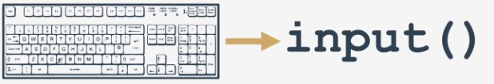
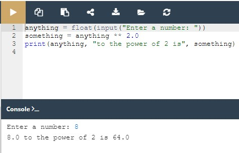

## 2.6.1.1 Como falar com um computador
## A função input()

Vamos agora apresentar-lhe uma função completamente nova, que parece ser um reflexo da boa e velha função `print()` .

Porquê? Bem, `print()` envia dados para o console.

A nova função obtém dados dela.

`print()` não tem resultado utilizável. O significado da nova função é **devolver um resultado muito utilizável**.

A função é chamada `input()`. The name of the function says everything.

A tecla programável `input()` function is able to read data entered by the user and to return the same data to the running program.

O programa pode manipular os dados, tornando o código genuinamente interativo.

Virtualmente todos os programas **lêem e processam dados**. Um programa que não recebe um input do utilizador é um **programa surdo**.

Dê uma vista de olhos no nosso exemplo:
```
print("Tell me anything...")
anything = input()
print("Hmm...", anything, "... Really?")
```

Isto mostra um caso muito simples de utilização da função `input()` .

Nota:

* O programa pede ao utilizador que introduza alguns dados da consola (muito provavelmente utilizando um teclado, embora também seja possível introduzir dados utilizando voz ou imagem);
* a função input() é invocada sem argumentos (esta é a forma mais simples de usar a função); a função irá mudar a consola para o modo de input; verá um cursor a piscar, e poderá introduzir algumas keystrokes, terminando com a tecla Enter; todos os dados introduzidos serão enviados para o seu programa através do resultado da função;
* nota: é necessário atribuir o resultado a uma variável; isto é crucial - a falta desta etapa fará com que os dados introduzidos se percam;
então, utilizamos a função print() para fazer output dos dados que obtemos, com algumas observações adicionais.
* Tente executar o código e deixe que a função demonstre o que pode fazer por si.



## 2.6.1.2 Como falar com um computador
## A função input() com um argumento

A função `input()` pode fazer algo mais: pode incitar o utilizador sem qualquer ajuda de `print()`.

Modificámos um pouco o nosso exemplo, olha para o código:
```
anything = input("Tell me anything...")
print("Hmm...", anything, "...Really?")
```

Nota:

* a keyword `input()` é invocada com um argumento - é uma string contendo uma mensagem;
* a mensagem será exibida na consola antes de ser dada ao utilizador a oportunidade de introduzir qualquer coisa;
* `input()` fará então o seu trabalho.

Esta variante da invocação `input()` simplifica o código e torna-o mais claro.

## O resultado da função input()

Já o dissemos, mas deve ser afirmado uma vez mais sem ambiguidade: o **resultado da função** `input()` é **uma string**.

Uma string contendo todos os carateres que o utilizador introduz a partir do teclado. Não é um inteiro ou um float.

Isto significa que **não deve usá-la como um argumento de qualquer operação aritmética**, por exemplo, não pode usar estes dados para os elevar ao quadrado, dividi-los por qualquer coisa, ou dividir qualquer coisa por eles.
```
anything = input("Enter a number: ")
something = anything ** 2.0
print(anything, "to the power of 2 is", something)
```

## 2.6.1.3 Como falar com um computador
## A função input() - operações proibidas

Veja o código no editor. Execute-o, insira qualquer número e prima Enter.

```
# Testing TypeError message.

anything = input("Enter a number: ")
something = anything ** 2.0
print(anything, "to the power of 2 is", something)
```

O que acontece?

O Python deve ter dado o seguinte output:

```
Traceback (most recent call last):
File ".main.py", line 4, in <module>
something = anything ** 2.0
TypeError: unsupported operand type(s) for ** or pow(): 'str' and 'float'
```

A última linha da frase explica tudo - tentou aplicar o operador `**` para `'str'` (string) acompanhado com `'float'`.

Isto é proibido.

Isto deve ser óbvio - pode prever o valor de `"to be or not to be"` elevado à potência de `2`?

Não podemos. O Python também não pode.

Será que caímos num impasse? Existe uma solução para este problema? Claro que existe.

## 2.6.1.4 Como falar com um computador
## Type casting

O Python oferece duas funções simples para especificar um tipo de dados e resolver este problema - aqui estão elas: `int()` e `float()`.

Os seus nomes são self-commenting:

* a função `int()` **toma um argumento** (por exemplo, uma string: `int(string)`) e tenta convertê-lo num inteiro; se falhar, todo o programa também falhará (há uma solução para esta situação, mas mostrar-lhe-emos isto um pouco mais tarde);
* a função `float()` toma um argumento (por exemplo, uma string: `float(string)`) e tenta convertê-lo num float (o resto é o mesmo).

Isto é muito simples e muito eficaz. Além disso, pode invocar qualquer uma das funções, passando os `input()` resultados diretamente para elas. Não há necessidade de utilizar qualquer variável como armazenamento intermédio.

Implementámos a ideia no editor - dê uma vista de olhos ao código.

Pode imaginar como flui a string introduzida pelo utilizador a partir de `input()` para `print()`?

Tente executar o código modificado. Não se esqueça de introduzir um **número válido**.

Verifique alguns valores diferentes, pequenos e grandes, negativos e positivos. Zero é também um bom input.



## 2.6.1.5 Como falar com um computador
## Mais sobre input() e type casting

Ter uma equipe composta pelo trio `input()`-`int()`-`float()` abre muitas novas possibilidades.

Acabará por ser capaz de escrever programas completos, aceitando dados sob a forma de números, processando-os e exibindo os resultados.

É claro que estes programas serão muito primitivos e pouco utilizáveis, uma vez que não podem tomar decisões, e consequentemente não são capazes de reagir de forma diferente a diferentes situações.

No entanto, isto não é realmente um problema; vamos mostrar-lhe como ultrapassá-lo em breve.
<hr>
O nosso próximo exemplo refere-se ao programa anterior para encontrar o comprimento de uma hipotenusa. Vamos reescrevê-lo e torná-lo capaz de ler o comprimento das pernas a partir da consola.

Veja a janela do editor - é este o aspeto que tem agora.

O programa pede duas vezes ao utilizador o comprimento de ambas as pernas, avalia a hipotenusa e imprime o resultado.

Execute-o e tente introduzir alguns valores negativos.
```
leg_a = float(input("Input first leg length: "))
leg_b = float(input("Input second leg length: "))
hypo = (leg_a**2 + leg_b**2) ** .5
print("Hypotenuse length is", hypo)
```
O programa - infelizmente - não reage a este erro óbvio.

Vamos ignorar esta fraqueza por agora. Voltaremos a este assunto em breve.
<hr>
Note que no programa que pode ver no editor, a variável `hypo` é utilizada apenas para uma única finalidade - para guardar o valor calculado entre a execução da linha de código adjacente.

Como a função `print()` aceita uma expressão como seu argumento, pode **remover a variável** do código.

Tal como isto:
```
leg_a = float(input("Input first leg length: "))
leg_b = float(input("Input second leg length: "))
print("Hypotenuse length is", (leg_a**2 + leg_b**2) ** .5)

```

## 2.6.1.6 Como falar com um computador: operadores de string
## Operadores de String - introdução

Chegou o momento de voltar a estes dois operadores aritméticos: `+` e `*`.

Queremos mostrar-lhe que eles têm uma segunda função. Eles são capazes de fazer algo mais do que apenas **adicionar** e **multiplicar**.

Vimo-los em ação onde os seus argumentos são números (floats ou inteiros, não importa).

Agora vamos mostrar-lhe que eles também conseguem lidar com strings, embora de uma forma muito específica.

## Concatenação

O sinal `+` (mais), quando aplicado a duas strings, torna-se um **operador de concatenação**:

`string + string`

Simplesmente **concatena** (cola) duas strings numa. Claro que, tal como o seu irmão aritmético, pode ser usado mais de uma vez numa expressão, e em tal contexto comporta-se de acordo com a ligação do lado esquerdo.

Em contraste com o seu irmão aritmético, o operador da concatenação **não é comutativo**, ou seja `"ab" + "ba"` não é o mesmo que `"ba" + "ab"`.

Não se esqueça - se quiser que o sinal `+` seja um **concatenador**, não um adicionador, deve assegurar-se de que **ambos os seus argumentos são strings**.

Não se podem misturar tipos aqui.
<hr>
Este programa simples mostra o sinal `+` na sua segunda utilização:
```
fnam = input("May I have your first name, please? ")
lnam = input("May I have your last name, please? ")
print("Thank you.")
print("\nYour name is " + fnam + " " + lnam + ".")
```

Nota: usando `+` para concatenar strings permite construir o output de uma forma mais precisa do que com uma função pura `print()` , mesmo que enriquecida com os `end=` e `sep=` argumentos de keyword.

Execute o código e veja se o output corresponde às suas previsões.

## 2.6.1.7 Como falar com um computador: operadores de strings
## Replicação

O sinal `*` (asterisco), quando aplicado a uma string e número (ou um número e string, visto permanecer comutativo nesta posição) torna-se um operador de replicação:
```
string * number
number * string
```

Replica a string o mesmo número de vezes especificado pelo número.

Por exemplo:

`"James" * 3` dá `"JamesJamesJames"`
`3 * "an"` dá `"ananan"`
`5 * "2"` (ou `"2" * 5`) dá `"22222"` (não `10`!)

**LEMBRE-SE**

Um número menor ou igual a zero produz uma **string vazia**.


Este programa simples "desenha" um retângulo, fazendo uso de um antigo operador (`+`) num novo papel:
```
print("+" + 10 * "-" + "+")
print(("|" + " " * 10 + "|\n") * 5, end="")
print("+" + 10 * "-" + "+")
```

Note a forma como utilizámos os parêntesis na segunda linha do código.

Tente praticar para criar outras formas ou a sua própria obra de arte!

## 2.6.1.8 Como falar com um computador: operadores de string
## Conversão de tipo: str()

Já sabe como utilizar as funções `int()` e `float()` para converter uma string num número.

Este tipo de conversão não é uma rua de sentido único. Também se pode **converter um número numa string**, o que é muito mais fácil e seguro - esta operação é sempre possível.

Uma função capaz de o fazer chama-se `str()`:

``str(number)``

Para ser honesto, pode fazer muito mais do que apenas transformar números em strings, mas isso pode ficar para mais tarde.

## O “triângulo de ângulo retângulo” novamente

Aqui está o nosso programa “triângulo de ângulo retângulo” novamente:
```
leg_a = float(input("Input first leg length: "))
leg_b = float(input("Input second leg length: "))
print("Hypotenuse length is " + str((leg_a**2 + leg_b**2) ** .5))
```

Modificamos um pouco para lhe mostrar como a função `str()` funciona. Graças a isso, podemos **passar todo o resultado para a função** `print()` como uma string, esquecendo as vírgulas.


Deu alguns passos sérios no seu caminho para a programação em Python.

Já conhece os tipos de dados básicos, e um conjunto de operadores fundamentais. Sabe como organizar o output e como obter dados do utilizador. Estas são bases muito fortes para o Módulo 3. Mas antes de passarmos ao módulo seguinte, vamos fazer alguns laboratórios, e recapitular tudo o que aprendeu nesta secção.

## 2.6.1.9 LAB: Input e output simples
## 2.6.1.12 RESUMO DA SECÇÃO
## Key takeaways

1. A função `print()` **envia dados para o console**, enquanto a função `input()` **obtém dados do console**.

2. O método **input()** vem com um parâmetro opcional: **a string prompt**. Permite-lhe escrever uma mensagem antes do input do utilizador, por exemplo
```
name = input("Enter your name: ")
print("Hello, " + name + ". Nice to meet you!")
```

3. Quando a função `input()` é chamada, o fluxo do programa é interrompido, o símbolo de prompt continua a piscar (pede ao utilizador para tomar medidas quando a consola é mudada para o modo de input) até o utilizador ter introduzido um input e/ou premido a tecla Enter.

NOTA

Pode testar a funcionalidade da função `input()` em todo o seu scope localmente na sua máquina. Por razões de otimização de recursos, limitámos o tempo máximo de execução do programa no Edube a alguns segundos. Vá à Sandbox, copie-cole o snippet acima, execute o programa, e não faça nada - espere apenas alguns segundos para ver o que acontece. O seu programa deve ser interrompido automaticamente após um breve momento. Agora abra o IDLE, e execute lá o mesmo programa - consegue ver a diferença?

Dica: a característica acima mencionada da função input() pode ser utilizada para solicitar o utilizador a terminar um programa. Veja o código em baixo:
```
name = input("Enter your name: ")
print("Hello, " + name + ". Nice to meet you!")

print("\nPress Enter to end the program.")
input()
print("THE END.")
```

3. O resultado da função `input()` é uma string. Podem adicionar-se strings umas às outras usando a concatenação (`+`) operador. Verifique este código:
```
num_1 = input("Enter the first number: ") # Enter 12
num_2 = input("Enter the second number: ") # Enter 21

print(num_1 + num_2) # the program returns 1221
```

4. Também pode multiplicar (`*` - replicação) strings, por exemplo:
```
my_input = input("Enter something: ") # Example input: hello
print(my_input * 3) # Expected output: hellohellohello
```

**Exercício 1**

Qual é o output do seguinte snippet?
```
x = int(input("Enter a number: ")) # The user enters 2
print(x * "5")
```

Verifique
`55`

Exercício 2

Qual é o output do seguinte snippet?
```
x = input("Enter a number: ") # The user enters 2
print(type(x))
```

Verifique
`<class 'str'>`

## 2.6.1.13 Conclusão do Módulo
## Parabéns! Completou o Módulo 2.

Muito bem! Chegou ao fim do Módulo 2 e completou um marco importante na sua educação em programação Python. Aqui está um breve resumo dos objetivos que abordou e com os quais se familiarizou no Módulo 2:

* os métodos básicos de formatação e de output de dados oferecidos pelo Python, juntamente com os tipos primários de dados e operadores numéricos, as suas relações mútuas e ligações;
* o conceito de variáveis e convenções de nomeação de variáveis;
* o operador de atribuição, as regras que regem a construção das expressões;
* O input e a conversão de dados;

Está agora pronto para fazer o quiz do módulo e tentar o desafio final: Teste do Módulo 2, que o ajudará a avaliar o que aprendeu até agora.