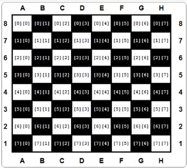
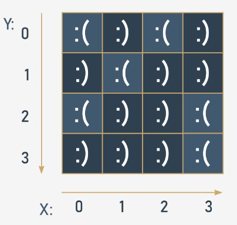
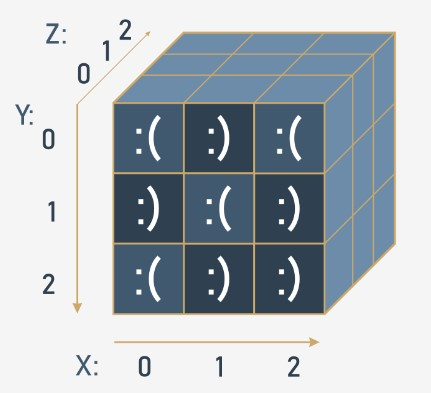

## 3.7.1.1 Listas em aplicações avançadas

## Listas em listas

As listas podem consistir em escalares (nomeadamente números) e elementos de uma estrutura muito mais complexa (já viu exemplos como strings, booleanos, ou mesmo outras listas nas lições do Resumo da Seção anterior). Vamos analisar mais de perto o caso em que **os elementos de uma lista são apenas listas**.

Encontramos frequentemente tais **arrays** (matrizes) nas nossas vidas. Provavelmente o melhor exemplo disto é um **tabuleiro de xadrez**.

Um tabuleiro de xadrez é composto por linhas e colunas. Existem oito linhas (em inglês, rows) e oito colunas. Cada coluna é marcada com as letras de A a H. Cada linha é marcada com um número de um a oito.

A localização de cada campo é identificada por pares de letras-dígitos. Assim, sabemos que o canto inferior esquerdo do tabuleiro (o que tem a torre branca) é A1, enquanto que o canto oposto é H8.


Vamos assumir que somos capazes de utilizar os números selecionados para representar qualquer peça de xadrez. Podemos também assumir que **cada linha do tabuleiro de xadrez é uma lista**.

Veja o código abaixo:
```
row = []

for i in range(8):
    row.append(WHITE_PAWN)
```

Constrói uma lista contendo oito elementos que representam a segunda linha do tabuleiro de xadrez - a que está cheia de peões (suponha que `WHITE_PAWN` é um símbolo **pré-definido** que representa um peão branco).
<hr>

O mesmo efeito pode ser alcançado através de uma **compreensão de lista**, a sintaxe especial utilizada por Python para preencher listas massivas.

Uma compreensão de lista é na realidade uma lista, mas **criada durante a execução do programa, e não é descrita estaticamente**.

Veja o snippet:

`row = [WHITE_PAWN for i in range(8)]`


A parte do código colocada dentro dos parêntesis retos especifica:

* os dados a utilizar para preencher a lista (`WHITE_PAWN`)
* a cláusula que especifica quantas vezes os dados ocorrem dentro da lista (`for i in range(8)`)
<hr>

Deixe-nos mostrar-lhe alguns outros `exemplos de compreensão de lista`:

**Exemplo #1:**

`squares = [x ** 2 for x in range(10)]`

O snippet produz uma lista de dez elementos preenchida com quadrados de dez números inteiros começando do zero (0, 1, 4, 9, 16, 25, 36, 49, 64, 81)

**Exemplo #2:**

`twos = [2 ** i for i in range(8)]`


O snippet cria um array de oito elementos contendo as primeiras oito potências de dois (1, 2, 4, 8, 16, 32, 64, 128)

**Exemplo #3:**

`odds = [x for x in squares if x % 2 != 0 ]`


O snippet faz uma lista apenas com os elementos ímpares da lista `squares` .

## 3.7.1.2 Listas em aplicações avançadas | Arrays

## Listas em listas: arrays bidimensionais

Vamos também assumir que um símbolo **pré-definido** chamado `EMPTY` designa um campo vazio no tabuleiro de xadrez.

Assim, se quisermos criar uma lista de listas representando todo o tabuleiro de xadrez, isso pode ser feito da seguinte forma:
```
board = []

for i in range(8):
    row = [EMPTY for i in range(8)]
    board.append(row)

```

Nota:

* a parte interior do loop cria uma linha composta por oito elementos (cada um deles igual a `EMPTY`) e anexa-o à lista `board` ;
* a parte externa repete-o oito vezes;
* no total, a lista `board` consiste em 64 elementos (todos iguais a `EMPTY`)

Este modelo imita perfeitamente o verdadeiro tabuleiro de xadrez, que é de fato uma lista de oito elementos, sendo todos eles filas únicas. Vamos resumir as nossas observações:

* os elementos das filas são campos, oito deles por fila;
* os elementos do tabuleiro de xadrez são linhas, oito delas por tabuleiro de xadrez.

A variável `board` é agora um **array bidimensional**. Também é chamada, por analogia aos termos algébricos, uma **matriz**.

Como as compreensões de lista podem ser **nested**, podemos encurtar a criação do tabuleiro da seguinte forma:

`board = [[EMPTY for i in range(8)] for j in range(8)]`

A parte interior cria uma fila, e a parte exterior constrói uma lista de filas.

## 3.7.1.3 Listas em aplicações avançadas | Arrays

## Listas em listas: arrays bidimensionais - continuação

O acesso ao campo selecionado do tabuleiro requer dois índices - o primeiro seleciona a linha; o segundo - o número do campo dentro da linha, que é de fato um número de coluna.

Dê uma olhada no tabuleiro de xadrez. Cada campo contém um par de índices que devem ser dados para aceder ao conteúdo do campo:




Olhando para a figura mostrada acima, vamos colocar algumas peças de xadrez no tabuleiro. Primeiro, vamos adicionar todas as torres (em inglês, rooks):
```
board[0][0] = ROOK
board[0][7] = ROOK
board[7][0] = ROOK
board[7][7] = ROOK
```

Se quiser acrescentar um cavaleiro (knight) ao C4, faça-o da seguinte forma:

`board[4][2] = KNIGHT`


E agora um peão (pawn) para E5:

`board[3][4] = PAWN`


E agora - experimente o código no editor.

```
EMPTY = "-"
ROOK = "ROOK"
board = []

for i in range(8):
    row = [EMPTY for i in range(8)]
    board.append(row)

board[0][0] = ROOK
board[0][7] = ROOK
board[7][0] = ROOK
board[7][7] = ROOK
for i in board:
    print(i)
#print(board)
```

## 3.7.1.4 Listas em aplicações avançadas | Arrays

## Natureza multidimensional das listas: aplicações avançadas

Vamos aprofundar a natureza multidimensional das listas. Para encontrar qualquer elemento de uma lista bidimensional, é preciso utilizar duas _coordenadas_:

* uma vertical (número da fila)
* e uma horizontal (número da coluna).

Imagine que desenvolve uma peça de software para uma estação meteorológica automática. O dispositivo regista a temperatura do ar numa base horária e fá-lo ao longo de todo o mês. Isto dá-lhe um total de 24 & vezes; 31 = 744 valores. Vamos tentar criar uma lista capaz de armazenar todos estes resultados.

Primeiro, tem de decidir que tipo de dados serão adequados para esta aplicação. Neste caso, um `float` seria melhor, uma vez que este termômetro é capaz de medir a temperatura com uma precisão de 0,1 ℃.

Em seguida, toma uma decisão arbitrária de que as filas registarão as leituras de hora em hora (por isso a fila terá 24 elementos) e que cada uma das filas será atribuída a um dia do mês (vamos supor que cada mês tem 31 dias, por isso precisa de 31 filas). Aqui está o par apropriado de compreensões (`h` é para hora, `d` para dia):

`temps = [[0.0 for h in range(24)] for d in range(31)]`


Toda a matriz está agora preenchida com zeros. Pode assumir que é atualizada automaticamente utilizando agentes especiais de hardware. O que tem de fazer é esperar que a matriz seja preenchida com medições.
<hr>

Agora é hora de determinar a temperatura média mensal ao meio-dia. Some todas as 31 leituras registadas ao meio-dia e divida a soma por 31. Pode assumir que a temperatura à meia-noite é armazenada em primeiro lugar. Aqui está o código relevante:
```
temps = [[0.0 for h in range(24)] for d in range(31)]
#
# The matrix is magically updated here.
#

total = 0.0

for day in temps:
    total += day[11]

average = total / 31

print("Average temperature at noon:", average)

```

Nota: a variável `day` usada pelo loop `for` não é um escalar - cada passagem através da matriz `temps` atribui-a com as linhas subsequentes da matriz; portanto, é uma lista. Tem que ser indexado com `11` para aceder ao valor da temperatura medida ao meio-dia.
<hr>

Agora encontre a temperatura mais alta durante todo o mês - veja o código:
```
temps = [[0.0 for h in range(24)] for d in range(31)]
#
# The matrix is magically updated here.
#

highest = -100.0

for day in temps:
    for temp in day:
        if temp > highest:
            highest = temp

print("The highest temperature was:", highest)

```
Nota:

* a keyword `day` itera através de todas as linhas na matriz `temps` ;
* a variável `temp` itera através de todas as medições efetuadas num dia.
<hr>

Agora conte os dias em que a temperatura ao meio-dia era de pelo menos 20 ℃:
```
temps = [[0.0 for h in range(24)] for d in range(31)]
#
# The matrix is magically updated here.
#

hot_days = 0

for day in temps:
    if day[11] > 20.0:
        hot_days += 1

print(hot_days, "days were hot.")
```

## 3.7.1.5 Listas em aplicações avançadas | Arrays

## Arrays tridimensionais

O Python não limita a profundidade da inclusão list-in-list. Aqui pode ver um exemplo de um array tridimensional:

Imagine um hotel. É um enorme hotel constituído por três edifícios, com 15 andares cada um. Há 20 quartos em cada andar. Para tal, é necessário um array que possa recolher e processar informações sobre os quartos ocupados/livres.

Primeiro passo - o tipo de elementos do array. Neste caso, um valor booleano (`True`/`False`) caberia.

Segundo passo - análise calma da situação. Resumir a informação disponível: três edifícios, 15 andares, 20 quartos.

Agora pode criar o array:

`rooms = [[[False for r in range(20)] for f in range(15)] for t in range(3)]`


O primeiro index (`0` através `2`) seleciona um dos edifícios; o segundo (`0` através `14`) seleciona o andar, o terceiro (`0` através `19`) seleciona o número do quarto. Todos os quartos estão inicialmente livres.

Agora pode reservar um quarto para dois recém-casados: no segundo edifício, no décimo andar, quarto 14:

`rooms[1][9][13] = True`


e libertar o segundo quarto no quinto andar, localizado no primeiro edifício:

`rooms[0][4][1] = False`


Verifique se há vagas no 15º andar do terceiro edifício:
```
vacancy = 0

for room_number in range(20):
    if not rooms[2][14][room_number]:
        vacancy += 1
```

A variável `vacancy` contém `0` se todos os quartos estiverem ocupados, ou o número de quartos disponíveis, caso contrário.


Parabéns! Conseguiu chegar ao fim do módulo. Continue com o bom trabalho!

## 3.7.1.6 RESUMO DA SEÇÃO

## Key takeaways

1. **A compreensão de lista** permite-lhe criar novas listas a partir de listas existentes de uma forma concisa e elegante. A sintaxe de uma compreensão de lista é a seguinte:

`[expression for element in list if conditional]`


que é na verdade um equivalente ao seguinte código:
```
for element in list:
    if conditional:
        expression
```

Eis um exemplo de compreensão de uma lista - o código cria uma lista de cinco elementos preenchida com os primeiros cinco números naturais elevados à potência de 3:

cubed = [num ** 3 for num in range(5)]
print(cubed)  # outputs: [0, 1, 8, 27, 64]


2. Pode usar listas nested em Python para criar matrizes (ou seja, listas bidimensionais). Por exemplo:


```
# A four-column/four-row table - a two dimensional array (4x4)

table = [[":(", ":)", ":(", ":)"],
         [":)", ":(", ":)", ":)"],
         [":(", ":)", ":)", ":("],
         [":)", ":)", ":)", ":("]]

print(table)
print(table[0][0])  # outputs: ':('
print(table[0][3])  # outputs: ':)'

```


3. Pode fazer nest de quantas lists-in-lists quiser, e portanto criar listas n-dimensionais, por exemplo, três, quatro ou mesmo sessenta e quatro arrays dimensionais. Por exemplo:


```
# Cube - a three-dimensional array (3x3x3)

cube = [[[':(', 'x', 'x'],
         [':)', 'x', 'x'],
         [':(', 'x', 'x']],

        [[':)', 'x', 'x'],
         [':(', 'x', 'x'],
         [':)', 'x', 'x']],

        [[':(', 'x', 'x'],
         [':)', 'x', 'x'],
         [':)', 'x', 'x']]]

print(cube)
print(cube[0][0][0])  # outputs: ':('
print(cube[2][2][0])  # outputs: ':)'
```
## 3.7.1.7 Conclusão do Módulo

## Parabéns! Completou o Módulo 3.

Muito bem! Chegou ao fim do Módulo 3 e completou um marco importante na sua educação em programação Python. Aqui está um breve resumo dos objetivos que abordou e com os quais se familiarizou no Módulo 3:

* Valores booleanos para comparar diferentes valores e controlar os caminhos de execução usando as instruções `if` e `if-else` ;
* a utilização de loops (`while` e `for`) e como controlar o seu comportamento usando as instruções `break` e `continue` ;
* a diferença entre as operações lógicas e as operações bitwise;
* o conceito de listas e processamento de listas, incluindo a iteração fornecida pelo loop `for` , e slicing;
* a ideia de arrays multidimensionais.

Está agora pronto para fazer o quiz do módulo e tentar o desafio final: Teste do módulo 3, que o ajudará a avaliar o que aprendeu até agora.