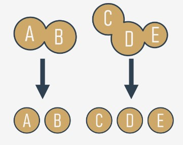
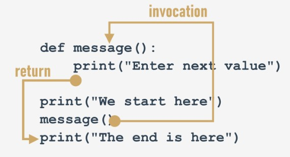

## 4.1.1.0 Python Essentials 1: Módulo 4

## Python Essentials 1:
## Módulo 4

**Funções, Tuples, Dicionários e Processamento de Dados**

Este módulo, cobrirá os seguintes tópicos:

* estruturação de códigos e o conceito de função;
* invocação de função e devolução do resultado de uma função;
* scopes do nome e sombreamento variável;
* tuplas e o seu propósito, construção e utilização de tuplas;
* dicionários e o seu propósito, construção e utilização de dicionários.
 
## 4.1.1.1 Funções

## Porque é que precisamos de funções?

Já se deparou com **funções** muitas vezes até agora, mas a opinião sobre os seus méritos que lhe demos tem sido bastante unilateral. Apenas invocou as funções utilizando-as como ferramentas para facilitar a vida, e para simplificar tarefas demoradas e enfadonhas.

Quando se pretende que alguns dados sejam impressos no console, utiliza-se `print()`. Quando se quer ler o valor de uma variável, usa `input()`, juntamente com `int()` ou `float()`.

Também fez uso de alguns **métodos**, que de fato funcionam, mas que são declarados de uma forma muito específica.

Agora aprenderá a escrever as suas próprias funções, e como utilizá-las. Escreveremos em conjunto várias funções, desde as muito simples até às bastante complexas, o que exigirá a sua concentração e atenção.

Acontece frequentemente que uma determinada peça de código é **repetida muitas vezes no seu programa**. Repete-se literalmente, ou com apenas algumas pequenas modificações, consistindo na utilização de outras variáveis no mesmo algoritmo. Acontece também que um programador não resiste a simplificar o trabalho, e começa a clonar tais peças de código utilizando as operações de clipboard e de copiar-colar.

Pode acabar por ser tão frustrante quando de repente se descobre que houve um erro no código clonado. O programador terá muito trabalho para encontrar todos os sítes que necessitam de correções. Há também um risco elevado de as correções causarem erros.

Podemos agora definir a primeira condição que pode ajudá-lo a decidir quando começar a escrever as suas próprias funções: **se um determinado fragmento do código começar a aparecer em mais do que um lugar, considerar a possibilidade de o isolar sob a forma de uma função** invocada a partir dos pontos onde o código original foi colocado anteriormente.

Pode acontecer que o algoritmo que vai implementar seja tão complexo que o seu código comece a crescer de uma forma descontrolada, e de repente note que já não é capaz de navegar através dele tão facilmente.

Pode tentar lidar com a questão comentando extensivamente o código, mas em breve descobrirá que isto piora dramaticamente a sua situação - **demasiados comentários tornam o código maior e mais difícil de ler**. Alguns dizem que **uma função bem escrita deve ser vista inteiramente num só relance**.

Um bom e atento programador **divide o código** (ou mais precisamente: o problema) em peças bem isoladas, e **codifica cada uma delas sob a forma de uma função**.

Isto simplifica consideravelmente o trabalho do programa, porque cada peça de código pode ser codificada separadamente, e testada separadamente. O processo aqui descrito é muitas vezes chamado **decomposição**.




Podemos agora afirmar a segunda condição: **se um pedaço de código se torna tão grande que a sua leitura e compreensão podem causar um problema, considere dividi-lo em problemas separados, menores, e implemente cada um deles sob a forma de uma função separada.**

Esta decomposição continua até se obter um conjunto de funções curtas, fáceis de compreender e de testar.

## 4.1.1.2 Funções

## Decomposição

Acontece frequentemente que o problema é tão grande e complexo que não pode ser atribuído a um único programador, e uma **equipe de programadores** tem de trabalhar sobre ele. O problema deve ser dividido entre vários programadores de forma a assegurar a sua cooperação eficiente e sem descontinuidades.


Parece inconcebível que mais do que um programador escreva a mesma peça de código ao mesmo tempo, pelo que o trabalho tem de ser disperso entre todos os membros da equipa.

Este tipo de decomposição tem um propósito diferente do descrito anteriormente - não se trata apenas de **partilhar o trabalho**, mas também de **partilhar a responsabilidade** entre város programadores.

Cada um deles escreve um conjunto claramente definido e descrito de funções, que quando **combinado no módulo** (falaremos sobre isto um pouco mais tarde) dará o produto final.

Isto leva-nos diretamente à terceira condição: se vai dividir o trabalho entre vários programadores, **decomponha o problema para permitir que o produto seja implementado como um conjunto de funções escritas em separado, embaladas em diferentes módulos.**

## De onde vêm as funções?

Em geral, as funções vêm de pelo menos três lugares:

* do próprio Python - inúmeras funções (como `print()`) são **parte integrante do Python**, e estão sempre disponíveis sem qualquer esforço adicional em nome do programador; chamamos estas funções de **funções integradas**;
* dos **módulos pré-instalados** de Python - muitas funções, muito úteis, mas utilizadas com menos frequência do que as integradas, estão disponíveis em vários módulos instalados juntamente com o Python; a utilização destas funções requer alguns passos adicionais do programador para as tornar totalmente acessíveis (falaremos sobre isto em breve);
* **diretamente do seu código** - pode escrever as suas próprias funções, colocá-las dentro do seu código, e utilizá-las livremente;
* existe uma outra possibilidade, mas está ligada às classes, por isso vamos omiti-la por agora.

## 4.1.1.3 Escrever funções

## A sua primeira função

Veja o snippet no editor.
```
print("Enter a value: ")
a = int(input())

print("Enter a value: ")
b = int(input())

print("Enter a value: ")
c = int(input())
```

É bastante simples, mas queremos apenas que seja um exemplo de **transformação de uma parte repetida de um código numa função.**

As mensagens enviadas para o console pela função `print()` são sempre as mesmas. Claro que não há nada de muito mau num código destes, mas tente imaginar o que teria de fazer se o seu chefe lhe pedisse para alterar a mensagem para a tornar mais educada, por exemplo, para a iniciar com a frase `"Please,"`.

Parece que teria de passar algum tempo alterando todas as ocorrências da mensagem (utilizaria uma área de transferência, claro, mas isso não facilitaria muito a sua vida). É óbvio que provavelmente cometeria alguns erros durante o processo de emenda, e você (e o seu chefe) ficariam um pouco frustrados.


É possível separar uma parte do código que pode ser repetida, nomeá-la e torná-la reutilizável? Significaria que **uma mudança feita uma vez num só local seria propagada a todos os locais onde é utilizada.**

É claro que tal código só deve funcionar quando é explicitamente lançado.

Sim, é possível. É exatamente para isto que servem as funções.

## 4.1.1.4 Escrever funções

## A sua primeira função

Como se faz tal função?

É preciso **defini-la**. A palavra *definir* é significativa aqui.

Este é o aspeto da definição mais simples da função:
```
def function_name():
    function_body
```

* Começa sempre com a **keyword** `def` (para definir)
* a seguir a `def` vai o **nome da função** (as regras para nomear funções são exatamente as mesmas que para nomear variáveis)
* após o nome da função, há um lugar para um par de **parêntesis** (não contêm nada aqui, mas isso irá mudar em breve)
* a linha tem de ser terminada com **dois pontos**;
* a linha imediatamente a seguir a `def` começa o **corpo da função** - um par (pelo menos um) de **instruções necessariamente nested**, que serão executadas sempre que a função for invocada; nota: **a função termina onde termina o nesting**, por isso é preciso ter cuidado.

Estamos prontos para definir a nossa função de **prompting**. Vamos nomeá-la `message` - aqui está:
```
def message():
    print("Enter a value: ")
```

A função é extremamente simples, mas totalmente **utilizável**. Demos-lhe o nome `message`, mas pode rotulá-la a seu gosto. Vamos usá-la.

O nosso código contém agora a definição da função:
```
def message():
    print("Enter a value: ")

print("We start here.")
print("We end here.")
```

Nota: não utilizamos de todo a função - não há nenhuma **invocação** dentro do código.

Quando a executa, vê o seguinte output:
```
output
We start here.
We end here.

```

Isto significa que o Python lê as definições da função e lembra-se delas, mas não as lança sem a sua permissão.
<hr>

Modificámos o código agora - inserimos a **invocação da função** entre as mensagens de início e fim:
```
def message():
    print("Enter a value: ")

print("We start here.")
message()
print("We end here.")
```

O output parece diferente agora:
```
output
We start here.
Enter a value: 
We end here.

```

Teste o código, modifique-o, experimente com ele.

```
def my_function():
    # function body
```

## 4.1.1.5 Funções

## Como funcionam as funções

Veja a imagem abaixo:



## Ela tenta mostrar-lhe todo o processo:

* quando se **invoca** uma função, o Python lembra-se do local onde aconteceu e salta para a função invocada;
* o corpo da função é então **executado**;
* chegar ao fim da função força o Python a **regressar** ao local diretamente após o ponto de invocação.

Há dois, muito importantes, senão. Aqui está o primeiro deles:

**Não se deve invocar uma função que não seja conhecida no momento da invocação.**

Lembre-se - o Python lê o seu código de cima para baixo. Não vai olhar em frente para encontrar uma função que se esqueceu de colocar no lugar certo ("certo" significa "antes da invocação").

Inserimos um erro neste código - consegue ver a diferença?
```
print("We start here.")
message()
print("We end here.")


def message():
    print("Enter a value: ")
```

Movemos a função para o final do código. O Python é capaz de encontrá-la quando a execução atinge a invocação?

Não, não é. A mensagem de erro lerá:
```
output
NameError: name 'message' is not defined

```

Não tente forçar o Python a procurar por funções que não entregou na altura certa.

O segundo senão soa um pouco mais simples:

**Não se deve ter uma função e uma variável com o mesmo nome.**

O seguinte snippet está errado:
```
def message():
    print("Enter a value: ")

message = 1
```

Atribuir um valor à mensagem do nome faz com que o Python esqueça o seu papel anterior. A função chamada `message` torna-se indisponível.

Felizmente, é livre de **misturar o seu código com funções** - não é obrigado a colocar todas as suas funções no topo do seu source file.

Veja o snippet:
```
print("We start here.")


def message():
    print("Enter a value: ")

message()

print("We end here.")

```

Pode parecer estranho, mas está completamente correto, e funciona como pretendido.


Voltemos ao nosso exemplo principal, e utilizemos a função para o trabalho certo, como aqui:
```
def message():
    print("Enter a value: ")

message()
a = int(input())
message()
b = int(input())
message()
c = int(input())
```

Modificar a mensagem de solicitação é agora fácil e claro - pode fazê-lo **alterando o código num só lugar** - dentro do corpo da função.

Abra a sandbox e tente fazê-lo você mesmo.

## 4.1.1.6 RESUMO DA SECÇÃO

## Key takeaways

1. Uma **função** é um bloco de código que executa uma tarefa específica quando a função é chamada (invocada). Pode utilizar funções para tornar o seu código reutilizável, mais bem organizado e mais legível. As funções podem ter parâmetros e valores de retorno.

2. Existem pelo menos quatro tipos básicos de funções em Python:

* **funções incorporadas** que são parte integrante do Python (tais como a função `print()` ). Pode ver uma lista completa de funções Python incorporadas em https://docs.python.org/3/library/functions.html.
* as que vêm de **módulos pré-instalados** (aprenderá sobre eles no curso Python Essentials 2)
* **funções definidas pelo utilizador** que são escritas por utilizadores para utilizadores - pode escrever as suas próprias funções e utilizá-las livremente no seu código,
* as funções **lambda** (aprenderá sobre elas no curso Python Essentials 2.)

3. Pode definir a sua própria função usando a keyword `def` e a seguinte sintaxe:
```
def your_function(optional parameters):
    # the body of the function
```

Pode definir uma função que não aceita quaisquer argumentos, por exemplo:
```
def message():    # defining a function
    print("Hello")    # body of the function

message()    # calling the function
```

Pode definir uma função que também aceita argumentos, tal como a função de um parámetro abaixo:
```
def hello(name):    # defining a function
    print("Hello,", name)    # body of the function


name = input("Enter your name: ")

hello(name)    # calling the function
```

Na próxima seção, falaremos mais sobre as funções parametrizadas. Não se preocupe.

**Exercício 1**

A função `input()` é um exemplo de uma:

a) função definida pelo utilizador
b) função incorporada

Verifique
**b** - é uma função incorporada

**Exercício 2**

O que acontece quando se tenta invocar uma função antes de a definir? Exemplo:
```
hi()

def hi():
    print("hi!")
```

Verifique
É lançada uma exceção (a exceção NameError para sermos mais precisos)

**Exercício 3**

O que acontecerá quando executar o código abaixo?
```
def hi():
    print("hi")

hi(5)
```

Verifique
É lançada uma exceção (a exceção `TypeError` para sermos mais precisos) - a função `hi()` não toma quaisquer argumentos

