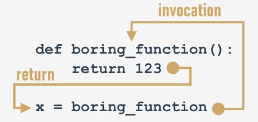

## 4.3.1.1 Devolver um resultado de uma função

## Efeitos e resultados: a instrução return .

Todas as funções anteriormente apresentadas têm algum tipo de efeito - produzem algum texto e enviam-no para o console.

Claro que as funções - tal como os seus irmãos matemáticos - podem ter resultados.

Para fazer com que as **funções devolvam um valor** (mas não apenas para este fim) usa-se a instrução `return` .

Esta palavra dá-lhe uma imagem completa das suas capacidades. Nota: é uma **keyword** Python.

A instrução `return` tem **duas variantes diferentes** - vamos considerá-las separadamente.

## return sem uma expressão

A primeira consiste na própria keyword, sem nada a seguir.

Quando utilizada dentro de uma função, provoca a **terminação imediata da execução da função, e uma devolução (em inglês, return) imediata (daí o nome) ao ponto de invocação.**

Nota: se uma função não se destina a produzir um resultado, **utilizar a instrução** `return` **não é obrigatório** - será executada implicitamente no final da função.

De qualquer modo, pode utilizá-la para **terminar as atividades de uma função a pedido**, antes de o controle chegar à última linha da função.
<hr>

Consideremos a seguinte função:
```
def happy_new_year(wishes = True):
    print("Three...")
    print("Two...")
    print("One...")
    if not wishes:
        return
    
    print("Happy New Year!")

```

Quando invocada sem argumentos:

`happy_new_year()`

A função causa um pequeno ruído - o output terá este aspeto:
```
Three...
Two...
One...
Happy New Year!
```

Fornecer `False` como um argumento:

`happy_new_year(False)`

irá modificar o comportamento da função - a instrução `return` causará a sua terminação imediatamente antes dos wishes - este é o resultado atualizado:
```
Three...
Two...
One...
```

## return com uma expressão

A segunda variante `return` é **estendida com uma expressão**:
```
def function():
    return expression
```

Há duas consequências da sua utilização:

* provoca a **terminação imediata da execução da função** (nada de novo em comparação com a primeira variante)
* além disso, a função **avaliará o valor da expressão e devolverá (daí o nome, mais uma vez) como resultado da função.**

Sim, nós já sabemos - este exemplo não é realmente sofisticado:
```
def boring_function():
    return 123

x = boring_function()

print("The boring_function has returned its result. It's:", x)
```

O snippet grava o seguinte texto no console:

`The boring_function has returned its result. It's: 123`

Vamos investigá-lo durante algum tempo.



A instrução `return` , enriquecida com a expressão (a expressão é muito simples aqui), "transporta" o valor da expressão para o local onde a função foi invocada.

O resultado pode ser livremente utilizado aqui, por exemplo, para ser atribuído a uma variável.

Também pode ser completamente ignorado e perdido sem deixar rastro.


Note, não estamos sendo muito educados aqui - a função devolve um valor, e ignoramos (não o utilizamos de forma alguma):
```
def boring_function():
    print("'Boredom Mode' ON.")
    return 123

print("This lesson is interesting!")
boring_function()
print("This lesson is boring...")
```

O programa produz o seguinte output:
```
output
This lesson is interesting!
'Boredom Mode' ON.
This lesson is boring...
```

É punível? De modo algum.

A única desvantagem é que o resultado foi irremediavelmente perdido.

Não se esqueça:

* Sempre é **permitido ignorar o resultado da função**, e ficar satisfeito com o efeito da função (se a função tiver algum)
* se uma função se destina a devolver um resultado útil, deve conter a segunda variante da instrução `return` .


Espere um minuto - isto significa que também há resultados inúteis? Sim - de certa forma.

## 4.3.1.2 Devolver um resultado de uma função

## Algumas palavras sobre None

Deixe-nos apresentar-lhe um valor muito curioso (para sermos honestos, um valor nulo), chamado `None`.

Os seus dados não representam nenhum valor razoável - na verdade, não é um valor de todo; portanto, *não deve tomar parte em nenhuma expressão.*

Por exemplo, um snippet como este:

`print(None + 2)`

causará um erro de runtime, descrito pela seguinte mensagem de diagnóstico:

output  

`TypeError: unsupported operand type(s) for +: 'NoneType' and 'int'`


Nota: `None` é uma **keyword**.

Existem apenas dois tipos de circunstâncias onde `None` pode ser utilizado em segurança:

* quando o **atribui a uma variável** (ou o devolve como o **resultado de uma função**)
* quando o **compara com uma variável** para diagnosticar o seu estado interno.

Tal como aqui:
```
value = None
if value is None:
    print("Sorry, you don't carry any value")
```

Não se esqueça disto: se uma função não devolver um determinado valor usando uma `return` cláusula de expressão, supõe-se que ela **devolve implicitamente** `None`.

Vamos testá-lo.

## 4.3.1.3 Devolver um resultado de uma função

## Algumas palavras sobre None: continuação

Veja o código no editor.

```
def strange_function(n):
    if(n % 2 == 0):
        return True
```

É óbvio que a função `strangeFunction` devolve `True` quando o seu argumento é par.

O que devolve de outra forma?

Podemos utilizar o seguinte código para o verificar:
```
print(strange_function(2))
print(strange_function(1))
```

Isto é o que vemos no console:

output

```
True
None
```

Não fique surpreendido da próxima vez que vir `None` como resultado de uma função - pode ser o sintoma de um erro sutil dentro da função.

## 4.3.1.4 Devolver um resultado de uma função

## Efeitos e resultados: listas e funções

Há duas questões adicionais que devem ser respondidas aqui.

A primeira é: **pode uma lista ser enviada para uma função como argumento?**

Claro que pode! Qualquer entidade reconhecível pelo Python pode desempenhar o papel de um argumento de função, embora tenha de ter a certeza de que a função é capaz de lidar com ela.

Assim, se passar uma lista a uma função, a função tem de lidar com ela como uma lista.

Uma função como esta aqui:
```
def list_sum(lst):
    s = 0
    
    for elem in lst:
        s += elem
    
    return s
```

e invocada assim:

`print(list_sum([5, 4, 3]))`


irá devolver `12` como resultado, mas deve esperar problemas se a invocar desta forma arriscada:

`print(list_sum(5))`

A resposta do Python será inequívoca:

output

`TypeError: 'int' object is not iterable`

Isto é causado pelo fato de que **um único valor inteiro não deve ser iterado pelo loop** `for` .

## 4.3.1.5 Devolver um resultado de uma função

## Efeitos e resultados: listas e funções - continuação

A segunda questão é: **pode uma lista ser um resultado de uma função?**

Sim, claro! Qualquer entidade reconhecível por Python pode ser um resultado de uma função.

Veja o código no editor. O output do programa será assim:
```
def strange_list_fun(n):
    strange_list = []
    
    for i in range(0, n):
        strange_list.insert(0, i)
    
    return strange_list

print(strange_list_fun(5))
```
output

`[4, 3, 2, 1, 0]`


Agora pode escrever funções com e sem resultados.

Vamos mergulhar um pouco mais fundo nas questões ligadas às variáveis das funções. Isto é essencial para a criação de funções eficazes e seguras.

## 4.3.1.6 LAB: Um ano bissexto: escrever as suas próprias funções
## 4.3.1.7 LAB: Quantos dias: escrever e usar as suas próprias funções
## 4.3.1.8 LAB: Dia do ano: escrever e utilizar as suas próprias funções
## 4.3.1.9 LAB: Números primos - como encontrá-los
## 4.3.1.10 LAB: Conversão do consumo de combustível
## 4.3.1.11 RESUMO DA SECÇÃO

## Key takeaways

1. Pode utilizar a keyword `return` para dizer a uma função para devolver algum valor. A declaração `return` sai da função, por exemplo:
```
def multiply(a, b):
    return a * b

print(multiply(3, 4))    # outputs: 12


def multiply(a, b):
    return

print(multiply(3, 4))    # outputs: None
```

2. O resultado de uma função pode ser facilmente atribuído a uma variável, por exemplo:
```
def wishes():
    return "Happy Birthday!"

w = wishes()

print(w)    # outputs: Happy Birthday!
```
Veja a diferença no output dos dois exemplos a seguir:
```
# Example 1
def wishes():
    print("My Wishes")
    return "Happy Birthday"

wishes()    # outputs: My Wishes


# Example 2
def wishes():
    print("My Wishes")
    return "Happy Birthday"

print(wishes())

# outputs: My Wishes
#          Happy Birthday
```

3. Pode utilizar uma lista como argumento de uma função, por exemplo:
```
def hi_everybody(my_list):
    for name in my_list:
        print("Hi,", name)

hi_everybody(["Adam", "John", "Lucy"])
```

4. Uma lista também pode ser o resultado de uma função, por exemplo:
```
def create_list(n):
    my_list = []
    for i in range(n):
        my_list.append(i)
    return my_list

print(create_list(5))
```


Exercício 1

Qual é o output do seguinte snippet?
```
def hi():
    return
    print("Hi!")

hi()
```

Verifique

a função devolverá um implícito `None` valor

Exercício 2
```
Qual é o output do seguinte snippet?

def is_int(data):
    if type(data) == int:
        return True
    elif type(data) == float:
        return False

print(is_int(5))
print(is_int(5.0))
print(is_int("5"))
```

Verifique
```
True
False
None
```

Exercício 3

Qual é o output do seguinte snippet?
```
def even_num_lst(ran):
    lst = []
    for num in range(ran):
        if num % 2 == 0:
            lst.append(num)
    return lst

print(even_num_lst(11))
```

Verifique

`[0, 2, 4, 6, 8, 10]`


Exercício 4

Qual é o output do seguinte snippet?
```
def list_updater(lst):
    upd_list = []
    for elem in lst:
        elem **= 2
        upd_list.append(elem)
    return upd_list

foo = [1, 2, 3, 4, 5]
print(list_updater(foo))
```
Verifique

`[1, 4, 9, 16, 25]`