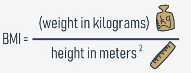
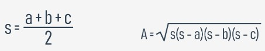
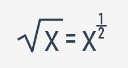

## 4.5.1.1 Criação de funções | funções de dois parâmetros

## Algumas funções simples: avaliar o IMC

Vamos começar com uma função para avaliar o Índice de Massa Corporal (IMC).



Como pode ver, a fórmula obtém dois valores:

* peso (originalmente em quilogramas)
* altura (originalmente em metros)

Parece que esta nova função terá **dois parâmetros**. O seu nome será `bmi` (IMC), mas se preferir qualquer outro nome, use-o.

Vamos codificar a função:
```
def bmi(weight, height):
    return weight / height ** 2


print(bmi(52.5, 1.65))
```

O resultado produzido pela invocação da amostra tem o seguinte aspecto:

output

`19.283746556473833`


A função cumpre as nossas expetativas, mas é um pouco simples - assume que os valores de ambos os parâmetros são sempre significativos. Vale definitivamente a pena verificar se são dignos de confiança.

Vamos verificar os dois e devolver `None` se algum deles parecer suspeito.

## 4.5.1.2 Criação de funções | funções de dois parâmetros

## Algumas funções simples: avaliação do IMC (em inglês, BMI) e conversão de unidades imperiais em unidades métricas

Veja o código no editor. Há duas coisas a que temos de prestar atenção.

```
def bmi(weight, height):
    if height < 1.0 or height > 2.5 or \
    weight < 20 or weight > 200:
        return None

    return weight / height ** 2


print(bmi(352.5, 1.65))
```

Primeiro, a invocação de teste assegura que a **proteção** funciona corretamente - o output é:

`None`

Em segundo lugar, observe na forma como o símbolo da **barra invertida** (`\`) é usado. Se o utilizar em código Python e terminar uma linha com ele, dirá ao Python para continuar a linha de código na próxima linha de código.

Pode ser particularmente útil quando se tem de lidar com longas linhas de código e se gostaria de melhorar a legibilidade do código.

Está bem, mas há algo que omitimos com demasiada facilidade - as medidas imperiais. Esta função não é muito útil para pessoas acostumadas a libras, pés e polegadas.

O que pode ser feito por elas?

Podemos escrever duas funções simples para **converter unidades imperiais em unidades métricas**. Vamos começar com as libras.

É um fato bem conhecido que `1 lb = 0.45359237 kg`. Utilizaremos isto na nossa nova função.

Esta é a nossa função auxiliar, chamada `lb_to_kg`:
```
def lb_to_kg(lb):
    return lb * 0.45359237


print(lb_to_kg(1))
```

O resultado da invocação do teste parece bom:

output

`0.45359237`

E agora é altura para os pés e polegadas: `1 ft = 0.3048 m`, e `1 in = 2.54 cm = 0.0254 m`.

A função que escrevemos é chamada `ft_and_inch_to_m`:
```
def ft_and_inch_to_m(ft, inch):
    return ft * 0.3048 + inch * 0.0254


print(ft_and_inch_to_m(1, 1))
```

O resultado de um teste rápido é:

output

`0.3302`


Parece como o esperado.

Nota: queríamos nomear o segundo parâmetro apenas `in`, não `inch`, mas não podíamos. Sabe porquê?

`in` é uma **keyword** Python - não pode ser usada como um nome.

Vamos converter seis pés em metros:

`print(ft_and_inch_to_m(6, 0))`

E esta é o output:

`1.8288000000000002`


É bem possível que por vezes se queira usar apenas os pés sem polegadas. O Python vai ajudá-lo? Claro que vai.

Modificámos um pouco o código:
```
def ft_and_inch_to_m(ft, inch = 0.0):
    return ft * 0.3048 + inch * 0.0254


print(ft_and_inch_to_m(6))
```

Agora o parâmetro `inch` tem o seu valor padrão igual a `0.0`.

O código produz o seguinte output - isto é o que é esperado:

`1.8288000000000002`


Finalmente, o código é capaz de responder à pergunta: qual é o IMC de uma pessoa com 1,75 m de altura e pesando 176 lbs?

Este é o código que construímos:
```
def ft_and_inch_to_m(ft, inch = 0.0):
    return ft * 0.3048 + inch * 0.0254


def lb_to_kg(lb):
    return lb * 0.45359237


def bmi(weight, height):
    if height < 1.0 or height > 2.5 or weight < 20 or weight > 200:
        return None
    
    return weight / height ** 2


print(bmi(weight = lb_to_kg(176), height = ft_and_inch_to_m(5, 7)))
```

E a resposta é:

`27.565214082533313`

Execute o código e teste-o. 

## 4.5.1.3 Criar funções | funções de três parâmetros

## Algumas funções simples: continuação

Vamos agora brincar com triângulos. Vamos começar com uma função para verificar se três lados de determinados comprimentos podem construir um triângulo.

Um triângulo com lados iguais

Sabemos da escola que a soma de dois lados arbitrários tem de ser maior do que o terceiro lado.

Não será um desafio difícil. A função terá **três parâmetros** - um para cada lado.

Ela vai devolver `True` se os lados puderem construir um triângulo, e `False` caso contrário. Neste caso, `is_a_triangle` é um bom nome para tal função.


Veja o código no editor. Pode encontrar aí a nossa função. Execute o programa.
```
def is_a_triangle(a, b, c):
    if a + b <= c:
        return False
    if b + c <= a:
        return False
    if c + a <= b:
        return False
    return True


print(is_a_triangle(1, 1, 1))
print(is_a_triangle(1, 1, 3))
```

Parece que funciona bem - estes são os resultados:

output

```
True
False
```

Podemos torná-lo mais compacto? Parece um pouco palavroso.

Esta é uma versão mais compacta:
```
def is_a_triangle(a, b, c):
    if a + b <= c or b + c <= a or c + a <= b:
        return False
    return True


print(is_a_triangle(1, 1, 1))
print(is_a_triangle(1, 1, 3))
```

Podemos compactá-lo ainda mais?

Sim, podemos - veja:
```
def is_a_triangle(a, b, c):
    return a + b > c and b + c > a and c + a > b


print(is_a_triangle(1, 1, 1))
print(is_a_triangle(1, 1, 3))
```

Negámos a condição (invertemos os operadores relacionais e substituímos `or` por `and`, recebendo uma expressão **universal para testar triângulos**).

Vamos instalar a função num programa maior. Vai pedir ao utilizador três valores e fará uso da função.

## 4.5.1.4 Criar funções | testar triângulos

## Algumas funções simples: triângulos e o teorema de Pitágoras

Veja o código no editor. Ele pede ao utilizador três valores. Em seguida, faz uso da função `is_a_triangle` . O código está pronto a ser executado.
```
def is_a_triangle(a, b, c):
    return a + b > c and b + c > a and c + a > b


a = float(input('Enter the first side\'s length: '))
b = float(input('Enter the second side\'s length: '))
c = float(input('Enter the third side\'s length: '))

if is_a_triangle(a, b, c):
    print('Yes, it can be a triangle.')
else:
    print('No, it can\'t be a triangle.'
```

No segundo passo, tentaremos assegurar que um certo triângulo é um **triângulo de ângulo reto.**

Precisamos de utilizar o **teorema de Pitágoras**:

**c<sup>2</sup> = a<sup>2</sup> + b<sup>2</sup>**

Como reconhecer qual dos três lados é a hipotenusa?

**A hipotenusa é o lado mais longo**.

Aqui está o código:
```
def is_a_triangle(a, b, c):
    return a + b > c and b + c > a and c + a > b


def is_a_right_triangle(a, b, c):
    if not is_a_triangle(a, b, c):
        return False
    if c > a and c > b:
        return c ** 2 == a ** 2 + b ** 2
    if a > b and a > c:
        return a ** 2 == b ** 2 + c ** 2


print(is_a_right_triangle(5, 3, 4))
print(is_a_right_triangle(1, 3, 4))
```

Veja como testamos a relação entre a hipotenusa e os restantes lados - escolhemos o lado mais longo, e aplicamos o **teorema de Pitágoras** para verificar se tudo está certo. Isto requer três verificações no total.

## 4.5.1.5 Criar funções | triângulos retângulo

## Algumas funções simples: avaliar a área de um triângulo

Também podemos avaliar a área de um triângulo. A **fórmula de Heron** será útil aqui:



```
s = (a + b + c) / 2
A = raiz quadrada de s(s - a)(s - b)(s - c)
```


Vamos usar o operador de exponenciação para encontrar a raiz quadrada - pode parecer estranho, mas funciona:



A raiz quadrada de x = x à potência de 1/2


Este é o código resultante:
```
def is_a_triangle(a, b, c):
    return a + b > c and b + c > a and c + a > b


def heron(a, b, c):
    p = (a + b + c) / 2
    return (p * (p - a) * (p - b) * (p - c)) ** 0.5


def area_of_triangle(a, b, c):
    if not is_a_triangle(a, b, c):
        return None
    return heron(a, b, c)


print(area_of_triangle(1., 1., 2. ** .5))
```

Tentamos com um triângulo retângulo como metade de um quadrado com um lado igual a 1. Isto significa que a sua área deve ser igual a 0,5.

É estranho - o código produz o seguinte output:

`0.49999999999999983`


É muito perto de 0,5, mas não é exatamente 0,5. O que significa isto? É um erro?

Não, não é. Estas são **as especificidades dos cálculos de floating-point**. Em breve, falaremos mais sobre o assunto.

## 4.5.1.6 Criar funções | factorials

## Algumas funções simples: factorials

Outra função que estamos prestes a escrever é a **fatorials**. Lembra-se de como um fatorial é definido?

0! = 1 (sim! é verdade)
1! = 1
2! = 1 * 2
3! = 1 * 2 * 3
4! = 1 * 2 * 3 * 4
:
:
n! = 1 * 2 ** 3 * 4 * ... * n-1 * n

É marcado com um **ponto de exclamação**, e é igual ao **produto** de todos os números naturais de um até ao seu argumento.

Vamos escrever o nosso código. Vamos criar uma função e chamá-la `factorial_function`. Aqui está o código:
```
def factorial_function(n):
    if n < 0:
        return None
    if n < 2:
        return 1
    
    product = 1
    for i in range(2, n + 1):
        product *= i
    return product


for n in range(1, 6):  # testing
    print(n, factorial_function(n))
```

Observe como espelhamos passo a passo a definição matemática, e como usamos o loop `for` para **encontrar o produto.**

Adicionamos um código de teste simples, e estes são os resultados que obtemos:
```
1 1
2 2
3 6
4 24
5 120
```

## 4.5.1.7 Criar funções | Números de Fibonacci

## Algumas funções simples: números de Fibonacci

Está familiarizado com os números de **Fibonacci**?

São uma **sequência de números inteiros** construída usando uma regra muito simples:

* o primeiro elemento da sequência é igual a um **(Fib1 = 1)**
* o segundo também é igual a um **(Fib2 = 1)**
* cada número subsequente é a soma dos dois números anteriores:
**(Fibi = Fibi-1 + Fibi-2)**

Aqui estão alguns dos primeiros números de Fibonacci:

fib_1 = 1
fib_2 = 1
fib_3 = 1 + 1 = 2
fib_4 = 1 + 2 = 3
fib_5 = 2 + 3 = 5
fib_6 = 3 + 5 = 8
fib_7 = 5 + 8 = 13

O que pensa da **implementação disto como uma função?**

Vamos criar a nossa função `fib` e testá-la. Aqui está:

def fib(n):
    if n < 1:
        return None
    if n < 3:
        return 1

    elem_1 = elem_2 = 1
    the_sum = 0
    for i in range(3, n + 1):
        the_sum = elem_1 + elem_2
        elem_1, elem_2 = elem_2, the_sum
    return the_sum


for n in range(1, 10):  # testing
    print(n, "->", fib(n))


Analise o corpo do loop `for` cuidadosamente, e descubra como **movemos as** `elem_1` **e** `elem_2` **variáveis através dos números de Fibonacci subsequentes.**

A parte de teste do código produz o seguinte output:
```
1 -> 1
2 -> 1
3 -> 2
4 -> 3
5 -> 5
6 -> 8
7 -> 13
8 -> 21
9 -> 34
```
## 4.5.1.8 Criar funções | recursividade

## Algumas funções simples: recursividade

Há mais uma coisa que queremos mostrar-lhe para tornar tudo completo - é a **recursividade**.

Este termo pode descrever muitos conceitos diferentes, mas um deles é especialmente interessante - o que se refere à programação informática.

Neste campo, a recursividade é uma **técnica em que uma função se invoca a si própria**.

Estes dois casos parecem ser os melhores para ilustrar o fenómeno - os números fatorials e Fibonacci. Especialmente o último.

**A definição dos números Fibonacci é um exemplo claro de recursividade.** Já lhe dissemos isso:

**Fibi = Fibi-1 + Fibi-2**

A definição do número i-<sup>th</sup> refere-se ao número i-1, e assim por diante, até se chegar aos dois primeiros.

Pode ser usado no código? Sim, pode. Pode também tornar o código mais curto e claro.

A segunda versão da nossa função fib() faz uso direto desta definição:

def fib(n):
    if n < 1:
        return None
    if n < 3:
        return 1
    return fib(n - 1) + fib(n - 2)


O código é agora muito mais claro.

Mas é realmente seguro? Isto implica algum risco?

Sim, há de fato um pequeno risco. **Se se esquecer de considerar as condições que podem parar a cadeia de invocações recursivas, o programa pode entrar num loop infinito.** É preciso ter cuidado.

O fatorial tem também um segundo lado **recursivo**. Veja:

n! = 1 × 2 × 3 ×... × n-1 × n


É óbvio que:

1 × 2 × 3 ×... × n-1 = (n-1)!


Então, finalmente, o resultado é:

n! = (n-1)! × n

De fato, esta é uma receita pronta para a nossa nova solução.


Aqui está:
```
def factorial_function(n):
    if n < 0:
        return None
    if n < 2:
        return 1
    return n * factorial_function(n - 1)
```

Funciona? Sim, funciona. Experimente você mesmo.

A nossa curta viagem funcional está quase no fim. A seção seguinte tratará de dois curiosos tipos de dados Python: tuples e dicionários.

## 4.5.1.9 RESUMO DA SEÇÃO

## Key takeaways

1. Uma função pode chamar outras funções ou até a ela própria. Quando uma função se chama a si própria, esta situação é conhecida como **recursividade**, e a função que se chama a si própria e contém uma condição de terminação especificada (ou seja, o caso base - uma condição que não diz à função para fazer mais chamadas para essa função) é chamada de função **recursiva**.

2. Pode usar funções recursivas em Python para escrever um **código limpo e elegante, e dividi-lo em pedaços menores e organizados**. Por outro lado, é preciso ter muito cuidado, pois pode ser **fácil cometer um erro e criar uma função que nunca termina**. Também é preciso lembrar que as **chamadas recursivas consomem muita memória**, e por isso podem por vezes ser ineficientes.

Ao utilizar a recursividade, é necessário ter em consideração todas as suas vantagens e desvantagens.

A função fatorial é um exemplo clássico de como o conceito de recursividade pode ser posto em prática:
```
# Recursive implementation of the factorial function.

def factorial(n):
    if n == 1:    # The base case (termination condition.)
        return 1
    else:
        return n * factorial(n - 1)


print(factorial(4)) # 4 * 3 * 2 * 1 = 24
```


Exercício 1

O que acontecerá quando se tentar executar o seguinte snippet e porquê?
```
def factorial(n):
    return n * factorial(n - 1)


print(factorial(4))
```

Verifique

A função fatorial não tem condição de terminação (sem caso base), pelo que o Python irá levantar uma exceção (`RecursionError: maximum recursion depth exceeded`)

Exercício 2

Qual é o output do seguinte snippet?
```
def fun(a):
    if a > 30:
        return 3
    else:
        return a + fun(a + 3)


print(fun(25))
```

Verifique

`56`
