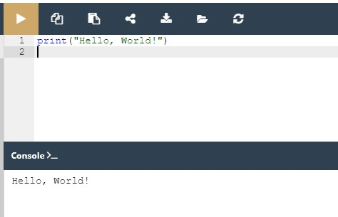
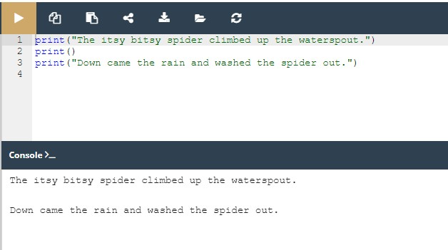
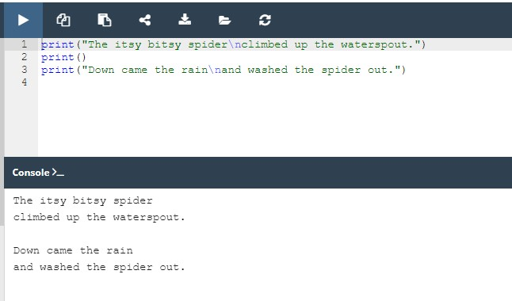
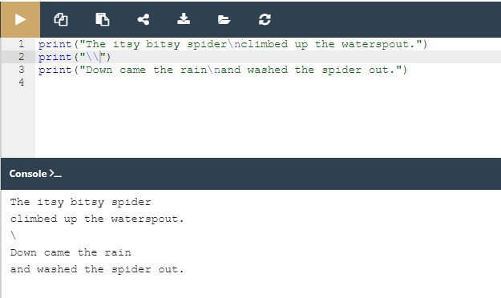
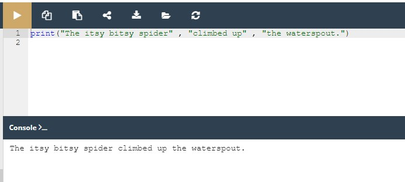
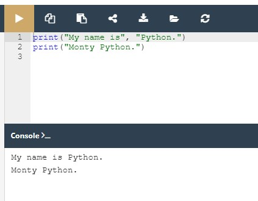
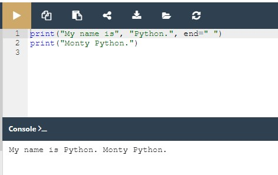
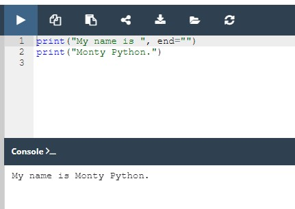
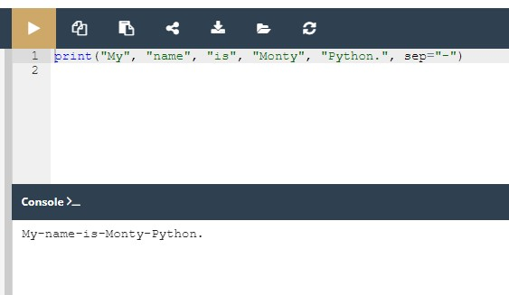

# Python Essentials 1:
# Módulo 2

##Tipos de dados, variáveis, operações básicas de input-output, operadores básicos

Neste módulo, aprenderá:

* como escrever e executar programas simples de Python;
* o que são literais, operadores, e expressões Python;
* o que são as variáveis e quais as regras que as regem;
* como realizar operações básicas de input e output.

## Hello, World!

É tempo de começar a escrever algum **código Python real e funcional**. Vai ser muito simples por enquanto.

Como vamos mostrar-lhe alguns conceitos e termos fundamentais, estes snippets de código não serão sérios ou complexos.

Execute o código na janela do editor à direita. Se tudo correr bem aqui, verá a **linha de texto** na janela da consola.



Em alternativa, lançe o IDLE, crie um novo source file Python, preencha-o com este código, nomeie o ficheiro e guarde-o. Agora execute-o. Se tudo correr bem, verá o texto contido dentro das aspas na janela da consola IDLE. O código que executou deve parecer familiar. Viu algo muito semelhante quando o conduzimos através da criação do ambiente IDLE.

Agora vamos passar algum tempo a mostrar e a explicar-lhe o que está realmente a ver, e porque é que se parece com isto.

Como pode ver, o primeiro programa consiste nas seguintes partes:

* a palavra ```print```;
* um parêntesis de abertura;
* umas aspas;
* uma linha de texto: ```Hello, World!```;
* outras aspas;
* um parêntesis de fecho.

Cada um dos itens acima desempenha um papel muito importante no código.

## A função print()

Veja a linha de código abaixo:

```
print("Hello, World!")
```

A palavra **print** que se pode ver aqui é um **nome de função**. Isso não significa que, onde quer que a palavra apareça, é sempre um nome de função. O significado da palavra vem do contexto em que a palavra foi usada.

Provavelmente já encontrou o termo função muitas vezes antes, durante as aulas de matemática. Provavelmente também pode listar vários nomes de funções matemáticas, como seno ou log.

As funções Python, no entanto, são mais flexíveis e podem conter mais conteúdo do que as suas irmãs matemáticas.

Uma função (neste contexto) é uma parte separada do código do computador capaz de:

* **causar um qualquer efeito** (por exemplo, enviar texto para o terminal, criar um ficheiro, desenhar uma imagem, reproduzir um som, etc.); isto é algo completamente inédito no mundo da matemática;
* **avaliar um valor** (por exemplo, a raiz quadrada de um valor ou o comprimento de um dado texto) e devolvê-lo como o resultado da função; é isto que faz as funções Python serem os parentes dos conceitos matemáticos.

Além disso, muitas das funções Python podem fazer as duas coisas acima juntamente.

De onde vêm as funções?

* Podem vir **do próprio Python**; a função print é uma deste tipo; tal função é um valor acrescentado recebido juntamente com o Python e o seu ambiente (é **incorporada**); não é necessário fazer nada de especial (por exemplo, perguntar a alguém por qualquer coisa) se quiser fazer uso dela;
* podem ser provenientes de um ou mais dos add-ons de Python chamados **módulos**; alguns dos módulos vêm com Python, outros podem requerer instalação separada - seja qual for o caso, todos eles precisam de estar explicitamente ligados ao seu código (mostrar-lhe-emos como fazê-lo em breve);
* pode **escrevê-los você mesmo**, colocando tantas funções quantas quiser e precisar dentro do seu programa para o tornar mais simples, mais claro e mais elegante.

O nome da função deve ser **significativo** (o nome da função print é evidente por si mesmo).

Claro que, se vai fazer uso de qualquer função já existente, não tem influência no seu nome, mas quando começar a escrever as suas próprias funções, deve considerar cuidadosamente a sua escolha de nomes.

## A função print()

Como dissemos antes, uma função pode ter:

* um **efeito**;
* um **resultado**.

Há também uma terceira, muito importante, componente de função - o(s) **argumento(s)**.

As funções matemáticas normalmente aceitam um argumento, por exemplo, sen(x) toma um x, que é a medida de um ângulo.

As funções de Python, por outro lado, são mais versáteis. Dependendo das necessidades individuais, elas podem aceitar qualquer número de argumentos - tantos quantos forem necessários para desempenhar as suas tarefas. Nota: qualquer número inclui zero - algumas funções de Python não precisam de qualquer argumento.

```
print("Hello, World!")
```

Apesar do número de argumentos necessários/fornecidos, as funções Python exigem fortemente a presença de **um par de parêntesis** - de abertura e de fecho, respetivamente.

Se quiser entregar um ou mais argumentos a uma função, coloque-os dentro dos parêntesis. Se for utilizar uma função que não aceita qualquer argumento, ainda assim tem de ter os parêntesis.

Nota: para distinguir palavras comuns de nomes de funções, coloque um **par de parêntesis vazios** após os seus nomes, mesmo que a função correspondente queira um ou mais argumentos. Esta é uma convenção padrão.

A função de que estamos a falar aqui é ``` print() ```.

A função ``` print() ``` no nosso exemplo tem algum argumento?

Claro que sim, mas o que são eles?

## A função print()

O único argumento entregue à função ``` print() ``` neste exemplo é uma **string**:

```
print("Hello, World!")
```

Como pode ver, **a string é delimitada com aspas** - de facto, as aspas fazem a string - cortam uma parte do código e atribuem-lhe um significado diferente.

Pode imaginar que as aspas dizem algo como: o texto entre nós não é código. Não se destina a ser executado, e deve tomá-lo como está.

Quase tudo o que colocar dentro das aspas será tomado literalmente, não como código, mas como **dados**. Tente jogar com esta string em particular - modificá-la, introduzir algum conteúdo novo, apagar algum do conteúdo existente.


Há mais do que uma maneira de especificar uma string dentro do código Python, mas por agora, esta é suficiente.

Até agora, aprendeu sobre duas partes importantes do código: a função e a string. Falámos sobre elas em termos de sintaxe, mas agora é altura de os discutir em termos de semântica

## A função print()

O nome da função (***print*** neste caso) juntamente com os parêntesis e o(s) argumento(s), formam a **invocação da função.**

Discutiremos isto com mais profundidade em breve, mas devemos dar-lhe umas luzes de momento.

```
print("Hello, World!")
```

O que acontece quando o Python encontra uma invocação como esta abaixo?

```
function_name(argument)
```

Vamos ver:

* Primeiro, o Python verifica se o nome especificado é legal (navega nos seus dados internos a fim de encontrar uma função existente com o mesmo nome; se esta pesquisa falhar, o Python aborta o código);
* segundo, o Python verifica se os requisitos da função para o número de argumentos lhe permitem invocar a função desta forma (por exemplo, se uma função específica exigir exatamente dois argumentos, qualquer invocação que apresente apenas um argumento será considerada errada, e abortará a execução do código);
* terceiro, o Python deixa o seu código por um momento e salta para a função que pretende invocar; claro, também leva o(s) seu(s) argumento(s) e passa-o(s) para a função;
* quarto, a função executa o seu código, causa o efeito desejado (se houver um), avalia o(s) resultado(s) desejado(s) (se existir(em)) e termina a sua tarefa;
* finalmente, o Python regressa ao seu código (ao local imediatamente após a invocação) e retoma a sua execução.

Três questões importantes têm de ser respondidas assim que possível:

**1. Qual é o efeito que a função print() causa?**

O efeito é muito útil e muito espetacular. A função:

* toma os seus argumentos (pode aceitar mais do que um argumento e pode também aceitar menos do que um argumento)
* converte-os numa forma legível para o ser humano, se necessário (como pode suspeitar, as strings não requerem esta ação, uma vez que a string já é legível)
* **e envia os dados resultantes para o dispositivo de output** (normalmente a consola); por outras palavras, qualquer coisa que coloque na função print() aparecerá no ecrã.
Não admira, então, que a partir de agora utilize print() muito intensivamente para ver os resultados das suas operações e avaliações.


**2. Que argumentos ``` print() ``` espera?**

Quaisquer. Mostrar-lhe-emos em breve que print() é capaz de operar com virtualmente todos os tipos de dados oferecidos pelo Python. Strings, números, carateres, valores lógicos, objetos - qualquer um destes pode ser passado com sucesso para print().


**3. Que valor é devolvido pela função ``` print() ``` ?**

Nenhum. O seu efeito é suficiente.

## A função print() - instruções

Já viu um **programa** de computador que contém uma invocação de função. Uma invocação de função é um dos muitos tipos possíveis de **instruções** Python.

É claro que qualquer programa complexo contém geralmente muito mais instruções do que uma. A questão é: como se acoplam mais do que uma instrução no código Python?

A sintaxe de Python é bastante específica nesta área. Ao contrário da maioria das linguagens de programação, o Python requer que **não haja mais do que uma instrução numa linha**.

Uma linha pode estar vazia (ou seja, pode não conter qualquer instrução) mas não deve conter duas, três ou mais instruções. Isto é estritamente proibido.

Nota: o Python faz uma exceção a esta regra - permite que uma instrução se espalhe por mais do que uma linha (o que pode ser útil quando o seu código contém construções complexas).

Vamos expandir um pouco o código, pode vê-lo no editor. Execute-o e anote o que vê na consola.

O seu console Python deve agora ter este aspeto:

```
The itsy bitsy spider climbed up the waterspout.
Down came the rain and washed the spider out
```  
output


Esta é uma boa oportunidade para fazer algumas observações:

* o programa **invoca a função ``` print() ``` duas vezes**, e pode ver duas linhas separadas no console - isto significa que ``` print() ``` começa o seu output a partir de uma nova linha cada vez que inicia a sua execução; pode alterar este comportamento, mas também pode utilizá-lo em seu proveito;
* cada invocação ``` print() ``` contém uma string diferente, uma vez que o seu argumento e o conteúdo da consola a refletem - **isto significa que as instruções no código são executadas pela mesma ordem** em que foram colocadas no source file; nenhuma instrução seguinte é executada até que a anterior esteja concluída (há algumas exceções a esta regra, mas pode ignorá-las por agora)

Mudamos um pouco o exemplo - acrescentámos uma invocação de função vazia print() . Chamamos-lhe vazia porque não apresentámos quaisquer argumentos para a função.

Pode vê-lo na janela do editor. Execute o código.



O que acontece?

Se tudo correr bem, deverá ver algo como isto:

```
The itsy bitsy spider climbed up the waterspout.

Down came the rain and washed the spider out.
output
```

Como pode ver, a invocação vazia ``` print() ``` não é tão vazia como se poderia esperar - produz uma linha vazia, ou (esta interpretação também é correta) o seu output é apenas uma newline.

Esta não é a única forma de produzir uma **newline** na consola de output. Vamos agora mostrar-lhe outra forma.

## A função print() - os carateres de escape e de newline

Modificamos novamente o código. Olhe com atenção.



Há duas mudanças muito subtis - inserimos um estranho par de carateres dentro da rima. Têm este aspeto: ``` \n ```.

Curiosamente, enquanto **se pode ver dois carateres, o Python vê um**.

A barra invertida (```\```) tem um significado muito especial quando usado dentro de strings - a isto chama-se o **caratere de escape.**

A palavra escape deve ser entendida especificamente - significa que a série de carateres na string escapa por um momento (um momento muito curto) para introduzir uma inclusão especial.

Por outras palavras, a barra invertida não significa nada em si, mas é apenas uma espécie de anúncio de que o próximo caratere após a barra invertida também tem um significado diferente.

A letra ```n``` colocada após a barra invertida vem da palavra newline (nova linha).

Tanto a barra invertida como o `*n* formam um símbolo especial chamado um **caratere de newline**, que incita a consola a iniciar uma **nova linha de output**.
Execute o código. A sua consola deve agora ter este aspeto:

```
The itsy bitsy spider
climbed up the waterspout.

Down came the rain
and washed the spider out.
output
```

Como pode ver, duas newlines aparecem na canção de embalar, nos locais onde as ```\n``` foram usadas.

Esta convenção tem duas consequências importantes:

1. Se quiser colocar apenas uma barra invertida dentro de uma string, não se esqueça da sua natureza de escape - tem de a duplicar, por exemplo, uma tal invocação causará um erro:

```print("\")```

enquanto esta não o fará:

```print("\\")```

2. Nem todos os pares de escape (a barra invertida acoplada a outro caratere) significam algo.

Experimente o seu código no editor, execute-o e veja o que acontece.



## A função print() - utilizar múltiplos argumentos

Até agora, testamos o comportamento da função ```print()``` sem argumentos, e com um argumento. Também vale a pena tentar alimentar a função print() com mais do que um argumento.

Olhe para a janela do editor. Isto é o que vamos testar agora:

```print("The itsy bitsy spider" , "climbed up" , "the waterspout.")```

Há uma invocação da função ```print()``` , mas contém **três argumentos**. Todos eles são strings.

Os argumentos são separados por vírgulas. Cercamo-los de espaços para os tornar mais visíveis, mas não é realmente necessário, e não o faremos mais.

Neste caso, as vírgulas que separam os argumentos desempenham um papel completamente diferente da vírgula dentro da string. A primeira é uma parte da sintaxe de Python, a segunda destina-se a ser mostrada na consola.

Se voltar a olhar para o código, verá que não há espaços dentro das strings.

Execute o código e veja o que acontece.



A consola deve agora mostrar o seguinte texto:

```The itsy bitsy spider climbed up the waterspout.```
output

Os espaços, removidos das strings, apareceram novamente. Pode explicar porquê?

Duas conclusões emergem deste exemplo:

* a função ```print()``` invocada com mais do que um argumento **faz output de todos eles numa só linha**;
* a função ```print()``` **coloca um espaço entre os argumentos de output**, por sua própria iniciativa.

## A função print() - a forma posicional de passar os argumentos

Agora que sabe um pouco sobre ```print()``` costumes da função, vamos mostrar-lhe como alterá-los.

Deverá ser capaz de prever o output sem correr o código no editor.

A forma como estamos a passar os argumentos para a função print() é a mais comum em Python, e é chamada a forma posicional (este nome vem do facto de o significado do argumento ser ditado pela sua posição, por exemplo, o segundo argumento será produzido após o primeiro, e não o contrário).

Execute o código e verifique se o output corresponde às suas previsões.



## A função print() - os argumentos de keyword

O Python oferece outro mecanismo para a passagem de argumentos, que pode ser útil quando se quer convencer a ```print()``` função a alterar um pouco o seu comportamento.

Não o vamos explicar em profundidade neste momento. Planejamos fazê-lo quando falarmos de funções. Por agora, queremos simplesmente mostrar-lhe como funciona. Sinta-se à vontade para o utilizar nos seus próprios programas.

O mecanismo é chamado **argumentos de keyword**. O nome deriva do facto de o significado destes argumentos ser retirado não da sua localização (posição) mas da palavra especial (keyword) utilizada para os identificar.

A função ```print()``` tem dois argumentos de keyword que pode usar para os seus propósitos. O primeiro deles é nomeado ```end```.

Na janela do editor pode ver um exemplo muito simples da utilização de um argumento de keyword.

Para a sua utilização, é necessário conhecer algumas regras:

* um argumento de keyword consiste em três elementos: uma keyword identificando o argumento (```end``` aqui); um sinal de igual (```=```); e um valor atribuído a esse argumento;
* qualquer argumento de keyword tem de ser colocado após o último argumento posicional (isto é muito importante)

No nosso exemplo, fizemos uso do ```end``` argumento de keyword, e definimo-lo para uma string contendo um espaço.

Execute o código para ver como ele funciona.



O console deve agora mostrar o seguinte texto:

```
My name is Python. Monty Python.
```
output

Como pode ver, o argumento de keyword end determina os carateres que a função print() envia para o output, uma vez que atinge o final dos seus argumentos posicionais.

O comportamento padrão reflete a situação em que o argumento de keyword ```end``` é **implicitamente** usado da seguinte maneira: ```end="\n"```.

E agora é tempo de tentar algo mais difícil.

Se olhar cuidadosamente, verá que utilizámos o argumento ```end``` , mas a string atribuída a ele está vazia (não contém nenhum caratere).

O que vai acontecer agora? Execute o programa no editor para descobrir.



Como o argumento ```end``` foi definido para nada, a função ```print()``` também não produz nenhum output, uma vez que os seus argumentos posicionais foram esgotados.

A consola deve agora mostrar o seguinte texto:

```My name is Monty Python.```
output

Nota: **não foram enviadas newlines para o output.**

A string atribuída ao argumento de keyword ```end``` pode ter qualquer comprimento. Experimente-a se quiser.

Já dissemos anteriormente que a função ```print()``` separa os seus argumentos de output com espaços. Este comportamento também pode ser alterado.

O **argumento de keyword* que pode fazer isto é chamado ```sep``` (como separador).

Veja o código no editor, e execute-o.



O argumento ```sep``` fornece os seguintes resultados:

```My-name-is-Monty-Python.```
output

A função ```print()``` agora utiliza um traço, em vez de um espaço, para separar os argumentos de output.

Nota: o valor do argumento ```sep``` também pode ser uma string vazia. Experimente você mesmo.

Ambos os argumentos de keyword podem ser **misturados numa só invocação**, tal como aqui na janela do editor.

O exemplo não faz muito sentido, mas apresenta visivelmente as interações entre ```end``` e ```sep```.

Consegue prever o output?

Execute o código e veja se corresponde às suas previsões.


Agora que compreende a função ```print()``` , está pronto a considerar como armazenar e processar dados em Python.

Sem ```print()```, não seria capaz de ver nenhum resultado.

## Key takeaways

1. A função ```print()``` é uma função **incorporada**. Imprime/faz output de uma mensagem especificada para a janela do ecrã/consola.

2. As funções incorporadas, ao contrário das funções definidas pelo utilizador, estão sempre disponíveis e não têm de ser importadas. O Python 3.8 vem com 69 funções incorporadas. Pode encontrar a sua lista completa fornecida em ordem alfabética na [Biblioteca Padrão Python](https://docs.python.org/3/library/functions.html).

3. Para chamar uma função (este processo é conhecido como **invocação de função** ou **chamada de função**), é necessário usar o nome da função seguido de parêntesis. Pode passar argumentos para uma função, colocando-os dentro dos parêntesis. Deve separar os argumentos com uma vírgula, por exemplo, ```print("Hello,", "world!")```. Uma função “vazia” ```print()``` faz output de uma linha vazia para o ecrã.

4. As strings de Python são delimitadas com **aspas**, por exemplo, ```"I am a string"``` (aspas duplas), ou ```'I am a string, too'``` (aspas simples).

5. Os programas de computador são coleções de **instruções**. Uma instrução é um comando para executar uma tarefa específica quando executada, por exemplo, para imprimir uma determinada mensagem no ecrã.

6. Em strings de Python a **barra invertida** (```\```) é um caratere especial que anuncia que o próximo caratere tem um significado diferente, por exemplo ```\n``` (the **newline character**) starts a new output line.

7. Os **argumentos posicionais** são aqueles cujo significado é ditado pela sua posição, por exemplo, o segundo argumento é apresentado após o primeiro, o terceiro é apresentado após o segundo, etc.

8. Os **argumentos de keyword** são aqueles cujo significado não é ditado pela sua localização, mas por uma palavra especial (keyword) utilizada para os identificar.

9. Os loops ```end``` e ```sep``` podem ser usados para formatar o output da função ```print()``` . O parâmetro ```sep``` especifica o separador entre os argumentos de output (por exemplo, o parâmetro ```print("H", "E", "L", "L", "O", sep="-")```), enquanto o parâmetro ```end``` especifica o que imprimir no final da declaração print.

