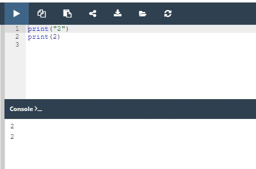
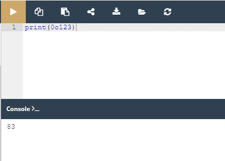
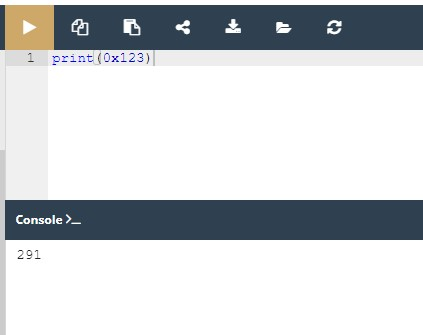

# Python Essentials 1:
# Módulo 2.2

## Literais - os dados em si

Agora que tem um pouco de conhecimento de algumas das poderosas características oferecidas pela função ```print()``` , é hora de aprender sobre algumas novas questões, e um novo termo importante - o **literal**.

**Um literal são dados cujos valores são determinados pelo próprio literal.**

Como este é um conceito difícil de compreender, um bom exemplo pode ser útil.

Dê uma vista de olhos ao seguinte conjunto de dígitos:

`123`

Consegue adivinhar que valor representa? Claro que consegue - é cento e vinte e três.

Mas e quanto a isto:

`c`

Representa algum valor? Talvez. Pode ser o símbolo da velocidade da luz, por exemplo. Também pode ser a constante de integração. Ou mesmo o comprimento de uma hipotenusa no sentido de um teorema de Pitágoras. Existem muitas possibilidades.


Não se pode escolher o certo sem algum conhecimento adicional.

E esta é a pista: `123` é um literal, e `c` não é.

Utiliza literais **para codificar dados e para os colocar no seu código**. Vamos agora mostrar-lhe algumas convenções a que tem de obedecer quando utiliza o Python.

Comecemos com uma simples experiência - veja o snippet no editor.

A primeira linha parece familiar. A segunda parece estar errada devido à visível falta de aspas.

Tente executá-lo.



Se tudo correu bem, deverá agora ver duas linhas idênticas.

O que aconteceu? O que significa isto?

Através deste exemplo, depara-se com dois tipos diferentes de literais:

* uma **string**, que já conhece,
* e um número **inteiro**, algo completamente novo.

A função `print()` apresenta-os exatamente da mesma forma - este exemplo é óbvio, uma vez que a sua representação legível em termos humanos é também a mesma. Internamente, na memória do computador, estes dois valores são armazenados de formas completamente diferentes - a string existe apenas como uma string - uma série de letras.

O número é convertido em representação mecânica (um conjunto de bits). A função `print()` é capaz de mostrar ambos de uma forma legível para os seres humanos.

Vamos agora gastar algum tempo a discutir os literais numéricos e a sua vida interna.

## Inteiros

Pode já saber um pouco sobre como os computadores efetuam cálculos sobre números. Talvez já tenha ouvido falar do **sistema binário**, e saiba que é o sistema que os computadores utilizam para armazenar números, e que eles podem realizar qualquer operação sobre eles.

Não vamos explorar aqui as complexidades dos sistemas de numeração posicional, mas vamos dizer que os números tratados pelos computadores modernos são de dois tipos:

* **inteiros**, isto é, aqueles que são desprovidos da parte fraccionada;
* e números **floating-point** (ou simplesmente **float**), que contêm (ou são capazes de conter) a parte 
fraccionada.

Esta definição não é inteiramente exata, mas suficiente por agora. A distinção é muito importante, e a fronteira entre estes dois tipos de números é muito rigorosa. Ambos os tipos de números diferem significativamente na forma como são armazenados na memória de um computador e no intervalo de valores aceitáveis.

A característica do valor numérico que determina o seu tipo, intervalo, e aplicação, é chamada **type**.

Se codificar um literal e o colocar dentro do código Python, a forma do literal determina a representação (type) que o Python utilizará para **o armazenar na memória**.

Por agora, vamos deixar de lado os números floating-point (voltaremos a eles em breve) e considerar a questão de como o Python reconhece os inteiros.


O processo é quase como escrevê-los com um lápis no papel - é simplesmente uma string de dígitos que compõem o número. Mas há uma reserva - não deve interpor quaisquer carateres que não sejam dígitos dentro do número.

Tomemos, por exemplo, o número onze milhões cento e onze mil cento e onze. Se pegasse agora mesmo num lápis, escreveria o número desta forma: `11,111,111,` ou assim: `11.111.111,` ou mesmo assim: `11 111 111`.

É evidente que esta disposição facilita a leitura, especialmente quando o número é composto por muitos dígitos. No entanto, o Python não aceita coisas como estas. É proibido. O que o Python permite, no entanto, é a utilização de **underscores** em literais numéricos.*

Por conseguinte, pode escrever este número desta forma: `11111111`, ou assim: `11_111_111`.

NOTA *Python 3.6 introduziu underscores em letras numéricas, permitindo a colocação de underscores únicos entre dígitos e após especificadores de base para melhorar a legibilidade. Este recurso não está disponível em versões mais antigas de Python.


E como codificamos números negativos em Python? Como de costume - adicionando um menos. Pode escrever: `-11111111`, ou `-11_111_111`.

Os números positivos não precisam de ser precedidos pelo sinal de mais, mas é permitido, se o desejar fazer. As linhas a seguir descrevem o mesmo número: `+11111111` e `11111111`.

## Inteiros: números octais e hexadecimais

Há duas convenções adicionais em Python que são desconhecidas no mundo da matemática. A primeira permite-nos utilizar números numa representação octal.

Se um número inteiro for precedido por um `0O` ou `0o` prefixo (zero-o), ele será tratado como um valor octal. Isto significa que o número deve conter apenas dígitos retirados do intervalo [0..7].

`0o123` é um número **octal** com um valor (decimal) igual a 83.

A classe `print()` faz a conversão automaticamente. Experimente isto:

`print(0o123)`



A segunda convenção permite-nos utilizar números hexadecimais. Estes números devem ser precedidos pelo prefixo `0x` ou `0X` (zero-x).

`0x123` é um número **hexadecimal** com um valor (decimal) igual a `291`. A função `print()` também pode gerir estes valores. Experimente isto:

`print(0x123)`



## Floats

Agora é hora de falar de outro tipo, que foi concebido para representar e armazenar os números que (como diria um matemático) têm uma **fração decimal não vazia**.

São os números que têm (ou podem ter) uma parte fracionada após o ponto decimal, e embora tal definição seja muito pobre, é certamente suficiente para o que desejamos discutir.

Sempre que utilizamos um termo como dois e meio ou menos zero ponto quatro, pensamos em números que o computador considera números de **floating-point**:

```
2.5
-0.4
```

Nota: dois e meio parece normal quando se escreve num programa, embora se a sua língua materna preferir usar uma vírgula em vez de um ponto no número, deve assegurar-se de que o seu **número não contém quaisquer vírgulas**.

O Python não aceitará isso, ou (em casos muito raros mas possíveis) pode interpretar mal as suas intenções, uma vez que a própria vírgula tem o seu significado reservado em Python.

Se quiser usar apenas um valor de dois e meio, deve escrevê-lo como mostrado acima. Nota mais uma vez - há um ponto entre 2 e 5 - não uma vírgula.

Como provavelmente pode imaginar, o valor de zero ponto quatro pode ser escrito em Python como:

`0.4`

Mas não se esqueça desta regra simples - pode omitir o zero quando é o único dígito em frente ou após o ponto decimal.

Em essência, pode escrever o valor `0.4` como:

```
.4
```

Por exemplo: o valor de `4.0` pode ser escrito como:

```
4.
```
Isto não mudará nem o seu tipo nem o seu valor.

## Ints vs. floats

O ponto decimal é essencialmente importante no reconhecimento de números de floating-point em Python.

Veja estes dois números:

```
4
4.0
```

Pode pensar que eles são exatamente os mesmos, mas o Python vê-os de uma forma completamente diferente.

`4` é um número **inteiro**, enquanto que `4.0` é um número **floating-point**.

O ponto é o que faz um float.

Por outro lado, não são apenas os pontos que fazem um float. Também pode utilizar a letra `e`.

Quando quiser usar números muito grandes ou muito pequenos, pode usar **notação científica**.

Tome, por exemplo, a velocidade da luz, expressa em metros por segundo. Escrito diretamente, ficaria assim: `300000000`.

Para evitar escrever tantos zeros, os livros de física utilizam uma forma abreviada, que provavelmente já viu: 3 x 10<sup>8</sup>.

Lê-se: três vezes dez à potência de oito.

Em Python, o mesmo efeito é conseguido de uma forma ligeiramente diferente - veja:

`3E8`

A letra `E` (também pode utilizar a letra minúscula `e` - vem da palavra **expoente**) é um registo conciso da frase vezes dez à potência de.

Nota:

o **expoente** (o valor após o E) deve ser um número inteiro;
a **base** (o valor à frente do E) pode ser um inteiro.

## Codificação de floats

Vejamos como esta convenção é utilizada para registar números que são muito pequenos (no sentido do seu valor absoluto, que está próximo de zero).

Uma constante física chamada constante de Planck (e denotada com um h), de acordo com os manuais escolares, tem o valor de: **6.62607 x 10<sup>-34</sup>**.

Se quiser utilizá-la num programa, deve escrevê-la desta forma:

```
6.62607E-34
```

Nota: o fato de ter escolhido uma das formas possíveis de codificação de valores float não significa que o Python o apresente da mesma forma.

O Python pode, por vezes, escolher uma **notação diferente** da sua.


Por exemplo, digamos que decidiu usar o seguinte float literal:

```
0.0000000000000000000001
```

Quando executa este literal através do Python:

```
print(0.0000000000000000000001)
```

este é o resultado:

```
1e-22
```

O Python escolhe sempre **a forma mais económica de apresentação do número**, e deve ter isto em consideração ao criar literais.

## Strings

Strings são utilizadas quando é necessário processar texto (como nomes de todos os tipos, endereços, romances, etc.), não números.

Já sabe um pouco sobre elas. Por exemplo, que as **strings precisam de aspas** da mesma forma que floats precisam de pontos.

Esta é uma string muito típica: `"I am a string."`

No entanto, há um senão. O senão é como codificar uma aspa dentro de uma string que já está delimitada por aspas.

Vamos supor que queremos imprimir uma mensagem muito simples dizendo:

```
I like "Monty Python"
```

Como fazemos isto sem gerar um erro? Existem duas soluções possíveis.

A primeira baseia-se no conceito que já conhecemos do **caratere de escape**, que como se deve lembrar é representado pela **barra invertida**. A barra invertida também pode escapar às aspas. Uma aspa precedida por uma barra invertida muda o seu significado - não é um delimitador, mas apenas uma aspa. Isto funcionará como pretendido:

```
print("I like \"Monty Python\"")
```

Nota: existem duas aspas escapadas dentro da string - consegue vê-las?

A segunda solução pode ser um pouco surpreendente. O Python pode utilizar **uma apóstrofe em vez de uma aspa**. Qualquer um destes carateres pode delimitar strings, mas deve ser **consistente**.

Se abrir uma string com uma aspa, tem de fechá-la com uma aspa.

Se começar uma string com uma apóstrofe, tem de a acabar com uma apóstrofe.

Este exemplo também funcionará:

```
print('I like "Monty Python"')
```

Nota: não precisa de fazer nenhum escape aqui.

## Codificar strings

Agora, a questão seguinte é: como incorporar uma apóstrofe numa string colocada entre apóstrofes?

Já deve saber a resposta, ou, para ser mais preciso, as duas respostas possíveis.

Tente imprimir uma string contendo a seguinte mensagem:

I'm Monty Python.

Sabe como fazê-lo? Verifique abaixo para ver:
```
print('I\'m Monty Python.')
```
ou
```
print("I'm Monty Python.")
```
Como pode ver, a barra invertida é uma ferramenta muito poderosa - pode escapar não só às aspas, mas também às apóstrofes.

Já o mostrámos, mas queremos enfatizar mais uma vez este fenómeno - **uma string pode estar vazia** - pode não conter quaisquer carateres.

Uma string vazia ainda assim permanece uma string:

```
''
""
```

## Valores Booleanos

Para concluir com os literais de Python, existem mais dois.

Não são tão óbvios como os anteriores, uma vez que são usados para representar um valor muito abstrato - **truthfulness** (veracidade).

Cada vez que pergunta ao Python se um número é maior que outro, a pergunta resulta na criação de alguns dados específicos - um valor **Booleano**.

O nome vem de George Boole (1815-1864), autor da obra fundamental, As Leis do Pensamento, que contém a definição de **álgebra Booleana** - uma parte da álgebra que faz uso de apenas dois valores distintos: `True` e `False`, denotado como `1` e `0`.

Um programador escreve um programa, e o programa faz perguntas. O Python executa o programa, e fornece as respostas. O programa deve ser capaz de reagir de acordo com as respostas recebidas.

Felizmente, os computadores conhecem apenas dois tipos de respostas:

* Sim, isto é verdade;
* Não, isto é falso.
Nunca obterá uma resposta como: *Não sei* ou *Provavelmente sim*, *mas não sei ao certo*.

O Python, então, é um réptil **binário**.

Estes dois valores Booleanos têm denotações rigorosas em Python:
```
True
False
```
Não se pode mudar nada - é preciso tomar estes símbolos tal como eles são, incluindo case-sensitivity.

Desafio: Qual será o output do seguinte snippet de código?
```
print(True > False)
print(True < False)
```

Execute o código na Sandbox para verificar. Consegue explicar o resultado?

## Key takeaways

1. Os **literais** são notações para representar alguns valores fixos em código. O Python tem vários tipos de literais - por exemplo, um literal pode ser um número (literais numéricos, por exemplo, `123`), ou uma string (literais de string, por exemplo, “Eu sou um literal.“).

2. O **sistema binário** é um sistema de números que emprega 2 como base. Portanto, um número binário é composto apenas por 0s e 1s, por exemplo, `1010` é 10 em decimal.

Os sistemas de numeração octal e hexadecimal, do mesmo modo, empregam 8 e 16 como suas bases, respetivamente. O sistema hexadecimal utiliza os números decimais e seis letras extra.
3. **Inteiros** (ou simplesmente **int**s) são um dos tipos numéricos suportados pelo Python. São números escritos sem um componente fracionário, por exemplo, `256`, ou `-1` (inteiros negativos).

4. Números de **floating-point** (ou simplesmente **float**s) são outro dos tipos numéricos suportados pelo Python. São números que contêm (ou são capazes de conter) um componente fracionário, por exemplo `1.27`.

5. Para codificar uma apóstrofe ou uma aspa dentro de uma string, pode usar o caratere de escape, por exemplo, `'I\'m happy.'`, ou abrir e fechar a string utilizando um conjunto de símbolos opostos aos que deseja codificar, por exemplo `"I'm happy."` codificar uma apóstrofe, e `'He said "Python", not "typhoon"'` para codificar umas aspas (duplas).

6. **Valores booleanos** são os dois objetos constantes `True` e `False` usado para representar valores de verdade (em contextos numéricos `1` é `True`, enquanto `0` é `False`.

EXTRA

Há mais um literal especial que é usado em Python: o literal `None` . Este literal é um chamado `NoneType` objeto, e é utilizado para representar **a ausência de um valor**. Em breve, contar-lhe-emos mais sobre isso.

**Exercício 1**

Que tipos de literais são os dois exemplos seguintes?

`"Hello ", "007"`

Verifique
Ambos são strings/literais de strings.


**Exercício 2**

Que tipos de literais são os quatro exemplos seguintes?

`"1.5", 2.0, 528, False`

Verifique
O primeiro é uma string, o segundo é um literal numérico (um float), o terceiro é um literal numérico (um inteiro), e o quarto é um literal booleano.


**Exercício 3**

Qual é o valor decimal do seguinte número binário?

`1011`

Verifique
É 11, porque (2**0) + (2**1) + (2**3) = 11


