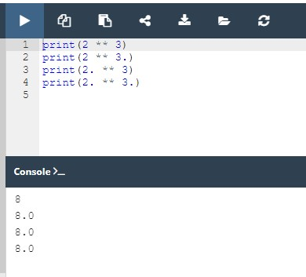
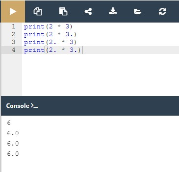
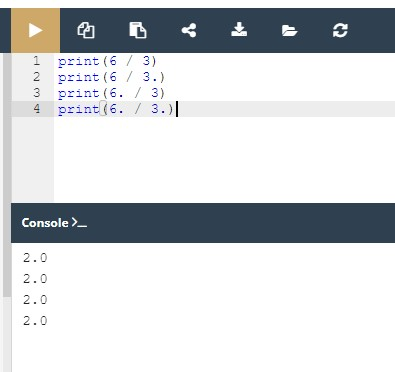
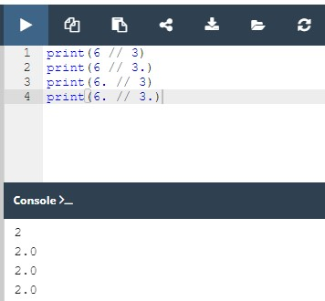
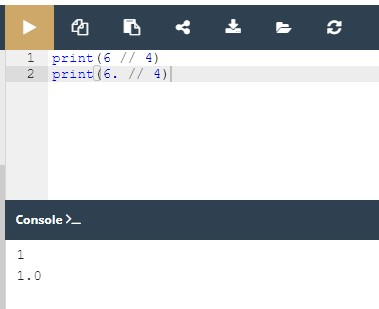
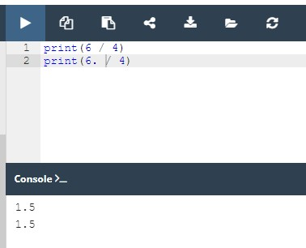
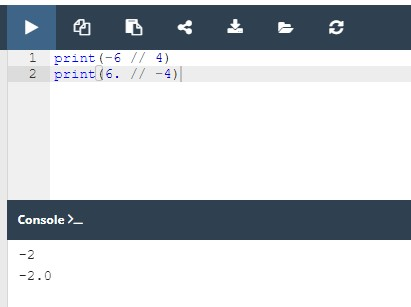

## 2.3.1.1 Operadores - ferramentas de manipulação de dados

## Python como uma calculadora

Agora, vamos mostrar-lhe um lado completamente novo da função print(). Já sabe que a função é capaz de lhe mostrar os valores dos literais que lhe são transmitidos pelos argumentos.

Na verdade, pode fazer algo mais. Dê uma vista de olhos no snippet:

```
print(2+2)
```

Digite novamente o código no editor e execute-o. Consegue adivinhar o output?

Deve ver o número quatro. Sinta-se à vontade para experimentar com outros operadores.

Sem levar isto demasiado a sério, acabou de descobrir que o Python pode ser usado como calculadora. Não é muito útil, e definitivamente não é de bolso, mas é uma calculadora.

Levando-o mais a sério, estamos agora entrando na província dos **operadores** e das **expressões**.

## Operadores básicos

Um **operador** é um símbolo da linguagem de programação, que é capaz de operar sobre os valores.

Por exemplo, tal como na aritmética, o sinal `+` (mais) é o operador que é capaz de **adicionar** dois números, dando o resultado da adição.

Mas nem todos os operadores Python são tão óbvios como o sinal de mais, por isso vamos analisar alguns dos operadores disponíveis em Python, e explicaremos que regras regem a sua utilização, e como interpretar as operações que realizam.

Começaremos pelos operadores que estão associados às operações aritméticas mais amplamente reconhecidas:

```
+, -, *, /, //, %, **
```

A ordem do seu aparecimento não é acidental. Falaremos mais sobre o assunto depois de termos passado por todos eles.

**Lembre-se**: Os dados e os operadores, quando ligados entre si, formam **expressões**. A expressão mais simples é um literal em si.

## Operadores aritméticos: exponenciação

Um sinal `**` (duplo asterisco) é um operador de **exponenciação** (potência). O seu argumento esquerdo é a **base**, o seu direito, o **expoente**.

A matemática clássica prefere a notação com sobrescrito, tal como esta: 2<sup>3</sup>. Os editores de texto puro não aceitam isso, por isso o Python usa `**` ao invés, por exemplo, ``2 ** 3``.

Dê uma vista de olhos aos nossos exemplos na janela do editor.



Nota: rodeamos os asteriscos duplos com espaços nos nossos exemplos. Não é obrigatório, mas melhora a **legibilidade** do código.

Os exemplos mostram uma característica muito importante de praticamente todos os **operadores numéricos** de Python.

Execute o código e veja cuidadosamente os resultados que produz. Consegue ver alguma regularidade aqui?


**Lembre-se**: É possível formular as seguintes regras com base neste resultado:

* quando **ambos** os argumentos `**` são inteiros, o resultado é também um inteiro;
* quando **pelo menos um** argumento `**` é um float, o resultado é também um float.

Esta é uma distinção importante a lembrar.

## Operadores aritméticos: multiplicação

Um sinal `*` (asterisco) é um **operador de multiplicação**.

Execute o código abaixo e verifique se a nossa regra de inteiro vs. float ainda está a funcionar.

```
print(2 * 3)
print(2 * 3.)
print(2. * 3)
print(2. * 3.)
```



## Operadores aritméticos: divisão

O sinal `/` (barra) é um **operador de divisão**.

O valor em frente da barra é um **dividendo**, o valor por detrás da barra, um *divisor*.

Execute o código abaixo e analise os resultados.

```
print(6 / 3)
print(6 / 3.)
print(6. / 3)
print(6. / 3.)
```



Deve ver que existe uma exceção à regra.

**O resultado produzido pelo operador da divisão é sempre um float**, independentemente de o resultado parecer ou não ser um float à primeira vista: `1 / 2`, ou se se parecer com um inteiro puro: `2 / 1`.

Isto é um problema? Sim, é. Acontece por vezes que é realmente necessária uma divisão que forneça um valor inteiro, não um float.

Felizmente, o Python pode ajudá-lo com isso.

## Operadores aritméticos: divisão inteira

Um sinal `//` (dupla barra) é um operador de **divisão inteira**. Difere do operador padrão `/` em dois detalhes:

* o seu resultado não tem a parte fracionada - está ausente (para inteiros), ou é sempre igual a zero (para floats); isto significa que **os resultados são sempre arredondados**;
* está em conformidade com a regra inteiro vs. float.
  
Execute o exemplo abaixo e veja os resultados:

```
print(6 // 3)
print(6 // 3.)
print(6. // 3)
print(6. // 3.)
```

Como se pode ver, a divisão inteiro por inteiro dá um resultado inteiro. Todos os outros casos produzem floats.



Vamos fazer alguns testes mais avançados.

Veja o seguinte snippet:

```
print(6 // 4)
print(6. // 4)
```



Imagine que usámos `/` em vez de `//` - consegue prever os resultados?

Sim, seria `1.5` em ambos os casos. Isso é claro.

Mas que resultados devemos esperar com `//` divisão?

Execute o código e veja por si mesmo.



O que obtemos são dois uns - um inteiro e um float.

O resultado da divisão inteira é sempre arredondado para o valor inteiro mais próximo, que é inferior ao resultado real (não arredondado).

Isto é muito importante: **o arredondamento vai sempre para o número inteiro menor**.

Veja o código abaixo e tente prever os resultados mais uma vez:

```
print(-6 // 4)
print(6. // -4)
```



Nota: alguns dos valores são negativos. Isto irá obviamente afetar o resultado. Mas como?

O resultado são dois dois negativos. O resultado real (não arredondado) é `-1.5` em ambos os casos. No entanto, os resultados são sujeitos a arredondamento. **O arredondamento vai para o menor valor inteiro**, e o menor valor inteiro é `-2`, logo: `-2` e `-2.0`.

NOTA

A divisão inteira também pode ser chamada **floor division**. Definitivamente, no futuro, deparar-se-á com este termo.

## Operadores: remainder (modulo)

O próximo operador é bastante peculiar, visto não ter equivalente entre os operadores aritméticos tradicionais.

A sua representação gráfica em Python é o sinal % (percentagem), o que pode parecer um pouco confuso.

Tente pensar nisto como uma barra (operador de divisão) acompanhada por dois pequenos círculos engraçados.

O resultado do operador é um remainder (resto) deixado após a divisão inteira.

Por outras palavras, é o valor que sobrou depois de dividir um valor por outro para produzir um quociente inteiro.

Nota: o operador às vezes é chamado modulo noutras linguagens de programação.

Dê uma vista de olhos no snippet - tente prever o seu resultado e, em seguida, execute-o:

print(14 % 4)


Como pode ver, o resultado é dois. Esta é a razão:

14 // 4 dá 3 → este é o quociente inteiro;
3 * 4 dá 12 → como resultado da multiplicação de quocientes e divisores;
14 - 12 dá 2 → este é o resto.

Este exemplo é um pouco mais complicado:

`print(12 % 4.5)`

Qual é o resultado?

Verifique

`3,0` - não `3` mas `3.0` (a regra ainda funciona: `12 // 4.5` dá `2.0`; `2.0 * 4.5` dá `9.0`; `12 - 9.0` dá `3.0`)

## Operadores: como não dividir

Como provavelmente sabe, **a divisão por zero não funciona**.

**Não** tente:

* executar uma divisão por zero;
* executar uma divisão inteira por zero;
* encontrar um remainder de uma divisão por zero.
  
finalizado
2.3.1.5 Operadores - ferramentas de manipulação de dados

iniciar a partir do 
2.3.1.6 Operadores - ferramentas de manipulação de dados
