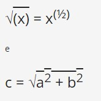
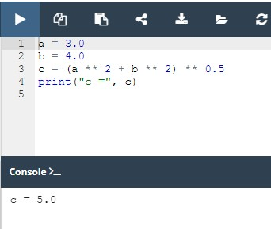

## 2.4.1.1 Variáveis - caixas data-shaped

## O que são variáveis?

Parece bastante óbvio que o Python deveria permitir-lhe codificar literais transportando valores de número e texto.

Já sabe que pode fazer algumas operações aritméticas com estes números: adicionar, subtrair, etc. Fá-lo-á muitas vezes.

Mas é uma questão bastante normal de perguntar como **armazenar os resultados** destas operações, a fim de os utilizar noutras operações, e assim por diante.

Como guardar os resultados intermediários, e utilizá-los novamente para produzir os resultados subsequentes?

O Python irá ajudá-lo nisso. Oferece "caixas" especiais (em inglês, containers) para esse fim, e estas caixas são chamadas **variáveis** - o próprio nome sugere que o conteúdo destes containers pode ser variado em (quase) qualquer forma.

O que tem cada variável Python?

* um nome;
* um valor (o conteúdo do container)

Comecemos com as questões relacionadas com o nome de uma variável.

As variáveis não aparecem automaticamente num programa. Como programador, deve decidir quantas e quais as variáveis a utilizar nos seus programas.

Deve também nomeá-las.


Se quiser **dar um nome a uma variável**, deve seguir algumas regras estritas:

* o nome da variável deve ser composto por letras maiúsculas ou minúsculas, dígitos e o caratere `_` (underscore)
* o nome da variável deve começar com uma letra;
* o caratere underscore é uma letra;
* letras maiúsculas e minúsculas são tratadas como diferentes (um pouco diferente do que no mundo real - Alice e ALICE são os mesmos nomes próprios, mas em Python são dois nomes de variáveis diferentes, e consequentemente, duas variáveis diferentes);
* o nome da variável não deve ser nenhuma das palavras reservadas de Python (as keywords - explicaremos mais sobre isto em breve).

## Nomes de variável corretos e incorretos

Note-se que as mesmas restrições se aplicam a nomes de funções.

O Python não impõe restrições ao comprimento dos nomes de variáveis, mas isto não significa que um nome de variável longo seja sempre melhor do que um curto.

Aqui estão alguns nomes de variáveis corretos, mas nem sempre convenientes:

`MyVariable`, `i`, `t34`, `Exchange_Rate`, `counter`, `days_to_christmas`, `TheNameIsSoLongThatYouWillMakeMistakesWithIt`, `_`.

Além disso, o Python permite-lhe utilizar não só letras latinas mas também carateres específicos de línguas que utilizam outros alfabetos.

Estes nomes de variáveis também estão corretos:

`Adiós_Señora`, `sûr_la_mer`, `Einbahnstraße`, `переменная`.

E agora alguns nomes incorretos:

`10t` (não começa com uma letra), `Exchange Rate` (contém um espaço)

NOTA
O PEP 8 — [Style Guide for Python Code](https://peps.python.org/pep-0008/) recomenda a seguinte convenção de nomenclatura para variáveis e funções em Python:

* os nomes de variáveis devem ser minúsculas, com palavras separadas por underscores para melhorar a legibilidade (por exemplo, `var`, `my_variable`)
* os nomes de funções seguem a mesma convenção que os nomes de variáveis (por exemplo, `fun`, `my_function`)
* também é possível utilizar um caso misto (por exemplo, `myVariable`), mas apenas em contextos onde esse já é o estilo predominante, para manter a retrocompatibilidade com a convenção adotada.

## Keywords

Dê uma olhada na lista de palavras que desempenham um papel muito especial em todos os programa Python.

```
['False', 'None', 'True', 'and', 'as', 'assert', 'break', 'class', 'continue', 'def', 'del', 'elif', 'else', 'except', 'finally', 'for', 'from', 'global', 'if', 'import', 'in', 'is', 'lambda', 'nonlocal', 'not', 'or', 'pass', 'raise', 'return', 'try', 'while', 'with', 'yield']
```

São chamadas **keywords** ou (mais precisamente) **reserved keywords**. (keywords reservadas) São reservadas porque **não deve utilizá-las como nomes**: nem para as suas variáveis, nem para as suas funções, nem para quaisquer outras entidades nomeadas que queira criar.

O significado da palavra reservada é **predefinido**, e não deve ser alterado de forma alguma.

Felizmente, devido ao fato do Python ser sensível a maiúsculas e minúsculas, pode modificar qualquer uma destas palavras alterando qualquer letra como maiúscula ou minúscula, criando assim uma nova palavra que já não está reservada.

Por exemplo - **não pode nomear** a sua variável desta forma:

`import`

Não se deve ter uma variável assim nomeada - é proibido. Mas, em vez disso, pode fazer isto:

`Import`

Estas palavras podem ser um mistério para si agora, mas em breve aprenderá o seu significado.

## Criar variáveis

O que se pode colocar dentro de uma variável?

Qualquer coisa.

Pode utilizar uma variável para armazenar qualquer valor de qualquer um dos tipos já apresentados, e muitos mais dos que ainda não lhe mostrámos.

O valor de uma variável é o que lhe foi atribuído. Pode variar com a frequência que precisar ou desejar. Pode ser um inteiro num momento, e um float um momento a seguir, acabando por se tornar uma string.

Falemos agora de duas coisas importantes - **como as variáveis são criadas**, e **como colocar valores dentro delas** (ou melhor - como dar ou **passar valores** a elas).

**LEMBRE-SE**

**Uma variável passa a existir como o resultado da atribuição de um valor a ela**. Ao contrário de outras linguagens, não precisa de a declarar de nenhuma forma especial.

Se atribuir qualquer valor a uma variável inexistente, a variável será **automaticamente criada**. Não precisa de fazer mais nada.

A criação (ou de outra forma - a sua sintaxe) é extremamente simples: **basta usar o nome da variável desejada, depois o sinal de igual (=) e o valor que se pretende colocar na variável**.

Dê uma vista de olhos no snippet:

```
var = 1
print(var)
```

Consiste em duas instruções simples:

* A primeira delas cria uma variável chamada `var`, e atribui um literal com um valor inteiro igual a `1`.
* A segunda imprime o valor da variável recentemente criada para a consola.

Nota: `print()` tem ainda outro lado - também pode tratar de variáveis. Sabe qual será o output do snippet?

Verifique
`1`

Dê uma vista de olhos no snippet:

var = 1
print(var)


Consiste em duas instruções simples:

A primeira delas cria uma variável chamada var, e atribui um literal com um valor inteiro igual a 1.
A segunda imprime o valor da variável recentemente criada para a consola.

Nota: print() tem ainda outro lado - também pode tratar de variáveis. Sabe qual será o output do snippet?

Verifique
1

## Utilização de variáveis

É-lhe permitido utilizar tantas declarações de variáveis quantas forem necessárias para atingir o seu objetivo, como esta:

```
var = 1
account_balance = 1000.0
client_name = 'John Doe'
print(var, account_balance, client_name)
print(var)
```

**Não lhe é permitido utilizar uma variável que não existe** (por outras palavras, uma variável à qual não foi atribuído um valor).

Este exemplo irá **causar um erro**:

```
var = 1
print(Var)
```

Tentamos usar uma variável chamada `Var`, que não tem qualquer valor (nota: `var` e `Var` são entidades diferentes, e não têm nada em comum no que diz respeito ao Python).

**LEMBRE-SE**

Pode utilizar a função `print()` e combinar texto e variáveis usando o operador `+` para fazer output de strings e variáveis, por exemplo:

```
var = "3.8.5"
print("Python version: " + var)
```

Consegue adivinhar o output do snippet acima?

Verifique
`Python version: 3.8.5`

## Atribuição de um novo valor a uma variável já existente

Como se atribui um novo valor a uma variável já criada? Da mesma forma. Basta usar o sinal de igualdade.

O sinal de igualdade é, de fato, um **operador de atribuição**. Embora isto possa parecer estranho, o operador tem uma sintaxe simples e uma interpretação inequívoca.

Atribui o valor do seu argumento direito para a esquerda, enquanto que o argumento direito pode ser uma expressão arbitrariamente complexa envolvendo literais, operadores e variáveis já definidas.

Veja o código abaixo:
```
var = 1
print(var)
var = var + 1
print(var)
```

O código envia duas linhas para o console:
```
1
2
```
A primeira linha do snippet cria **uma nova variável** chamada `var` e atribui `1` a ela.

A declaração diz: atribui um valor de `1` a uma variável chamada `var`.

Podemos dizê-lo duma forma mais curta: atribui `1` até `var`.

Alguns preferem ler uma declaração como esta: `var` torna-se `1`.

A terceira linha **atribui a mesma variável com o novo valor** retirado da própria variável, somado com `1`. Ao ver um registo como este, um matemático provavelmente protestaria - nenhum valor pode ser igual a si mesmo mais um. Isto é uma contradição. Mas o Python trata o sinal `=` não como igual a, mas como atribuir um valor.

Então, como se lê um tal registo no programa?

Tome o valor atual da variável `var`, adicione-lhe `1` e armazene o resultado na variável `var`.

Na verdade, o valor da variável `var` foi **incrementado** por um, o que nada tem a ver com a comparação da variável com qualquer valor.


Sabe qual será o output do seguinte snippet?
```
var = 100
var = 200 + 300
print(var)
```

Verifique

`500` - porquê? Bem, primeiro, a variável `var` é criada e é-lhe atribuído um valor de 100. Depois, é atribuído um novo valor à mesma variável: o resultado da adição de 200 a 300, que é 500.

## Resolução de problemas matemáticos simples
Agora deverá ser capaz de construir um programa curto que resolva problemas matemáticos simples, como o teorema de Pitágoras:

*O quadrado da hipotenusa é igual à soma dos quadrados dos catetos.*

O código seguinte avalia o comprimento da hipotenusa (ou seja, o lado mais longo de um triângulo retângulo, o oposto ao ângulo reto) usando o teorema de Pitágoras:
```
a = 3.0
b = 4.0
c = (a ** 2 + b ** 2) ** 0.5
print("c =", c)
```

Nota: precisamos de fazer uso do operador `**` para avaliar a raiz quadrada como:



Consegue adivinhar o output do código?

Verifique abaixo e execute o código no editor para confirmar as suas previsões.

Verifique
`c = 5.0`

## Operadores de atalho

Chegou a hora do próximo conjunto de operadores que facilitam a vida de um programador.

Muito frequentemente, queremos utilizar uma e a mesma variável tanto para o lado direito como para o esquerdo do `=` operador.

Por exemplo, se precisarmos de calcular uma série de valores sucessivos de potências de 2, podemos utilizar uma peça como esta:

`x = x * 2`

Pode usar uma expressão como esta se não conseguir adormecer e estiver a tentar lidar com ela usando alguns métodos bons e antiquados:

`sheep = sheep + 1`

O Python oferece-lhe uma forma abreviada de escrever operações como estas, que podem ser codificadas como se segue:
```
x *= 2
sheep += 1
```

Vamos tentar apresentar uma descrição geral para estas operações.

Se `op` é um operador de dois argumentos (esta é uma condição muito importante) e o operador é utilizado no seguinte contexto:

`variable = variable op expression`

Pode ser simplificado e mostrado da seguinte forma:

`variable op= expression`

Verifique os exemplos abaixo. Certifique-se de que os compreende a todos.

`i = i + 2 * j` ⇒ `i += 2 * j`

`var = var / 2` ⇒ `var /= 2`

`rem = rem % 10` ⇒ `rem %= 10`

`j = j - (i + var + rem)` ⇒ `j -= (i + var + rem)`

`x = x ** 2` ⇒ `x **= 2`

## Key takeaways

1. Uma **variável** é um local nomeado, reservado para armazenar valores na memória. Uma variável é criada ou inicializada automaticamente quando se lhe atribui um valor pela primeira vez. (2.1.4.1)

2. Cada variável deve ter um nome exclusivo - um **identificador**. Um nome de identificador válido deve ser uma sequência não vazia de carateres, deve começar com o underscore (`_`), ou uma letra, e não pode ser uma keyword de Python. O primeiro caratere pode ser seguido por underscores, letras e dígitos. Os identificadores em Python diferenciam entre maiúsculas e minúsculas (são case-sensitive). (2.1.4.1)

3. O Python é uma **linguagem dinamicamente datilografada**, o que significa que não precisa de declarar variáveis nela contidas. (2.1.4.3) Para atribuir valores a variáveis, pode-se utilizar um operador de atribuição simples na forma do sinal (`=`) igual, ou seja, `var = 1`.

4. Também pode utilizar **operadores de atribuição composta** (operadores de atalho) para modificar valores atribuídos a variáveis, por exemplo, `var += 1`, ou `var /= 5 * 2`. (2.1.4.8)

5. Pode atribuir novos valores a variáveis já existentes, utilizando o operador de atribuição ou um dos operadores compostos, por exemplo: (2.1.4.5)
```
var = 2
print(var)

var = 3
print(var)

var += 1
print(var)
```

6. Pode combinar texto e variáveis utilizando o operador `+` , e utilizar a função `print()` para fazer output de strings e variáveis, por exemplo: (2.1.4.4)
```
var = "007"
print("Agent " + var)
```

**Exercício 1**

Qual é o output do seguinte snippet?
```
var = 2
var = 3
print(var)
```

Verifique
`3`

**Exercício 2**

Quais dos seguintes nomes de variáveis são inválidos em Python?
```
my_var
m
101
averylongvariablename
m101
m 101
Del
del
```
Verifique
```
my_var
m
101 # incorrect (starts with a digit)
averylongvariablename
m101
m 101 # incorrect (contains a space)
Del
del # incorrect (is a keyword)
```
**Exercício 3**

Qual é o output do seguinte snippet?
```
a = '1'
b = "1"
print(a + b)
```

Verifique
`11`

**Exercício 4**

Qual é o output do seguinte snippet?

a = 6
b = 3
a /= 2 * b
print(a)


Verifique
`1.0`

2 * b = 6
a = 6 → 6 / 6 = 1.0

