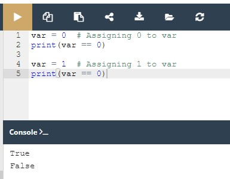
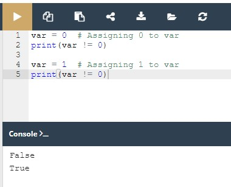

## Python Essentials 1:
## Módulo 3

**Valores Booleanos, Execução Condicional, Loops, Listas e Processamento de Lista, Operações Lógicas e Bitwise**

Neste módulo, serão abordados os seguintes tópicos:

* o tipo de dados Booleano;
* operadores relacionais;
* tomar decisões em Python (if, if-else, if-elif, else)
* como repetir a execução de código utilizando loops (while, for)
* como executar operações lógicas e bitwise em Python;
* listas em Python (construção, indexação e slicing; manipulação de conteúdo)
* como classificar uma lista usando algoritmos de bubble-sort;
* listas multidimensionais e suas aplicações.

## 3.1.1.1 Tomar decisões em Python
## Perguntas e respostas

Um programador escreve um programa e **o programa faz perguntas**.

Um computador executa o programa e **fornece as respostas**. O programa deve ser capaz de **reagir de acordo com as respostas recebidas**.

Felizmente, os computadores conhecem apenas dois tipos de respostas:

* sim, isto é verdade;
* não, isto é falso.

Nunca obterá uma resposta como Deixe-me pensar...., Não sei, ou Provavelmente sim, mas não tenho a certeza.

**Para fazer perguntas, o Python utiliza um conjunto de operadores muito especiais**. Vamos analisá-los um após outro, ilustrando os seus efeitos em alguns exemplos simples.


## Comparação: operador de igualdade

Pergunta: **são dois valores iguais?**

Para fazer esta pergunta, utiliza o operador `==` (igual igual).

Não se esqueça desta importante distinção:

* `=` é um **operador de atribuição**, por exemplo, `a = b` atribui `a` com o valor de `b`;
* `==` é a questão são estes valores iguais?; `a == b` **compara** `a` e `b`.
  
É um **operador binário com ligação do lado esquerdo**. Precisa de dois argumentos e **verifica se são iguais.**

**Exercícios**
Agora vamos fazer algumas perguntas. Tente adivinhar as respostas.

Pergunta #1: Qual é o resultado da seguinte comparação?

`2 == 2`    Verifique

`True` - claro, 2 é igual a 2. O Python responderá `True` (lembre-se deste par de literais predefinidos, `True` e `False` - são também keywords de Python).

Pergunta #2: Qual é o resultado da seguinte comparação?

2 == 2.    Verifique

Esta questão não é tão fácil quanto a primeira. Felizmente, o Python é capaz de converter o valor inteiro no seu verdadeiro equivalente, e consequentemente, a resposta é `True`.

Pergunta #3: Qual é o resultado da seguinte comparação?

`1 == 2`    Verifique

Esta deve ser fácil. A resposta será (ou melhor, será sempre) `False`.

## 3.1.1.2 Fazer decisões em Python
## Igualdade: o operador igual a (==)

A função `==` (igual a) compara os valores de dois operandos. Se forem iguais, o resultado da comparação é `True`. Se eles não forem iguais, o resultado da comparação é `False`.

Veja a comparação de igualdade abaixo - qual é o resultado desta operação?

`var == 0`

Note que não podemos encontrar a resposta se não soubermos qual o valor atualmente armazenado na variável `var`.

Se a variável tiver sido alterada muitas vezes durante a execução do seu programa, ou o seu valor inicial for inserido a partir da consola, a resposta a esta pergunta pode ser dada apenas pelo Python, e apenas em runtime.

Agora imagine um programador que sofre de insónias, e que tem de contar ovelhas pretas e brancas separadamente enquanto houver exatamente o dobro das ovelhas pretas do que das brancas.

A questão será a seguinte:

`black_sheep == 2 * white_sheep`

Devido à baixa prioridade do operador `==` , a questão deve ser tratada como equivalente a esta:

`black_sheep == (2 * white_sheep)`

<hr>
Então, vamos praticar a sua compreensão do operador `==` - consegue adivinhar o output do código abaixo?

```
var = 0  # Assigning 0 to var
print(var == 0)

var = 1  # Assigning 1 to var
print(var == 0)
```

Execute o código e verifique se estava certo.



## Desigualdade: o operador não igual a (!=)

A função `!=` (não igual) também compara os valores de dois operandos. Aqui está a diferença: se eles forem iguais, o resultado da comparação é `False`. Se eles não forem iguais, o resultado da comparação é `True`.

Agora dê uma vista de olhos na comparação de desigualdade em baixo - consegue adivinhar o resultado desta operação?
```
var = 0  # Assigning 0 to var
print(var != 0)

var = 1  # Assigning 1 to var
print(var != 0)
```

Execute o código e verifique se estava certo.



## 3.1.1.3 Tomar decisões em Python
## Operadores de comparação: maior que

Pode também fazer uma pergunta de comparação usando o operador `>` (maior que).

Se quiser saber se há mais ovelhas pretas do que brancas, pode escrevê-lo da seguinte forma:

`black_sheep > white_sheep  # Greater than`

`True` confirma-o; `False` nega-o.

## Operadores de comparação: maior que ou igual a

O operador maior que tem outra variante especial, **não estrita**, mas é denotada de forma diferente da notação aritmética clássica: `>=` (maior que ou igual a)

Existem dois sinais subsequentes, não um.

Ambos os operadores (estritos e não-estritos), bem como os outros dois discutidos na próxima sessão, são operadores **binários com ligação à esquerda**, e a sua **prioridade é maior do que a mostrada por** `==` **e** `!=`.

Se quisermos descobrir se temos ou não de usar um chapéu quente, fazemos a seguinte pergunta:

`centigrade_outside ≥ 0.0  # Greater than or equal to`

## Operadores de comparação: menor que ou igual a

Como já deve ter adivinhado, os operadores utilizados neste caso são: o `<` (less than) operator and its non-strict sibling: `<=` (menor que ou igual a).

Veja este exemplo simples:
```
current_velocity_mph < 85  # Less than
current_velocity_mph ≤ 85  # Less than or equal to
```

Vamos verificar se existe o risco de ser multado pela polícia rodoviária (a primeira pergunta é rigorosa, a segunda não).

## Fazer uso das respostas

O que pode fazer com a resposta (ou seja, o resultado de uma operação de comparação) que obtém do computador?

Há pelo menos duas possibilidades: primeiro, pode memorizá-la (**armazená-la numa variável**) e utilizá-la mais tarde. Como se faz isso? Bem, utilizaria uma variável arbitrária como esta:

`answer = number_of_lions >= number_of_lionesses`

O conteúdo da variável dar-lhe-á a resposta à pergunta feita.

A segunda possibilidade é mais conveniente e muito mais comum: pode usar a resposta que obtém para **tomar uma decisão sobre o futuro do programa**.

Precisa de uma instrução especial para este fim, e discutiremos isso muito em breve.

Agora precisamos de atualizar a nossa **tabela de prioridades** e colocar todos os novos operadores na mesma. Agora parece-se com o seguinte:

|Prioridade|Operador||
|---|---|---|	
|1	|`+`, `-`	|unário|
|2	|`**`	||
|3	|`*`, `/`, `//`, `%`||
|4	|`+`, `-`	|binário|
|5	|`<`, `<=`, `>`, `>=`||	
|6	|`==`, `!=`||

## 3.1.1.4 LAB: Perguntas e respostas
## 3.1.1.5 Tomar decisões em Python
## Condições e execução condicional

Já sabe como fazer perguntas ao Python, mas ainda não sabe como fazer um uso razoável das respostas. Tem de ter um mecanismo que lhe permita fazer algo **se uma condição for cumprida, e não o fazer se não o for**.

É como na vida real: faz-se ou não certas coisas quando uma condição específica é cumprida ou não, por exemplo, vai-se passear se o tempo estiver bom, ou fica-se em casa se estiver a chover e a fazer frio.

Para tomar tais decisões, o Python oferece uma instrução especial. Devido à sua natureza e à sua aplicação, chama-se **instrução condicional** (ou declaração condicional).

Existem várias variantes da mesma. Vamos começar com a mais simples, aumentando a dificuldade lentamente.

A primeira forma de uma declaração condicional, que pode ver abaixo, é escrita de forma muito informal mas figurativa:
`
if true_or_not:
    do_this_if_true
`

Esta declaração condicional consiste nos seguintes elementos, estritamente necessários, apenas nesta e nesta ordem:

* a keyword `if` ;
* um ou mais espaços em branco;
* uma expressão (uma pergunta ou uma resposta) cujo valor será interpretado unicamente em termos de `True` (quando o seu valor é diferente de zero) e `False` (quando é igual a zero);
* um **dois pontos** seguido de uma newline;
* uma instrução **indentada** ou conjunto de instruções (pelo menos uma instrução é absolutamente necessária); a **indentação** pode ser conseguida de duas maneiras - inserindo um determinado número de espaços (a recomendação é utilizar **quatro espaços de indentação**), ou utilizando o caratere tab; nota: se houver mais de uma instrução na parte indentada, a indentação deve ser a mesma em todas as linhas; mesmo que possa parecer a mesma se usar tabs misturados com espaços, é importante fazer todas as indentações **exatamente iguais** - o Python 3 **não permite a mistura de espaços e tabs** para indentação.

Como funciona essa declaração?

* Se a expressão `true_or_not` **representa a verdade** (ou seja, o seu valor não é igual a zero), **a(s) declaração(ões) indentada(s) será(ão) executada(s);**
* se a expressão `true_or_not` **não representa a verdade** (ou seja, o seu valor é igual a zero), **a(s) declaração(ões) indentada(s) será(ão) omitida(s)** (ignoradas), e a próxima instrução executada será a que se segue ao nível da indentação original.

Na vida real, expressamos frequentemente um desejo:

se o tempo estiver bom, vamos dar um passeio

depois, vamos almoçar


Como se pode ver, almoçar **não é uma atividade condicional** e não depende do tempo.

Sabendo que condições influenciam o nosso comportamento, e assumindo que temos as funções sem parâmetros `go_for_a_walk()` e `have_lunch()`, podemos escrever o seguinte snippet:
```
if the_weather_is_good:
    go_for_a_walk()
have_lunch()
```

## 3.1.1.6 Tomar decisões em Python
## Execução condicional: a declaração if .

Se um certo programador de Python insonioso acabar por adormecer enquanto conta 120 ovelhas, e se este procedimento de indução do sono pudesse ser implementado como uma função especial chamada `sleep_and_dream()`, todo o código assumiria a seguinte forma:
```
if sheep_counter >= 120: # Evaluate a test expression
    sleep_and_dream() # Execute if test expression is True
```	

Pode lê-lo como: se `sheep_counter` é maior que ou igual a `120`, então, adormecer e sonhar (ou seja, executar a função `sleep_and_dream` .)

Dissemos que `as declarações executadas condicionalmente têm de ser indentadas`. Isto cria uma estrutura muito legível, demonstrando claramente todos os caminhos de execução possíveis no código.

Dê uma vista de olhos no seguinte código:
```
if sheep_counter >= 120:
    make_a_bed()
    take_a_shower()
    sleep_and_dream()
feed_the_sheepdogs()
```

Como pode ver, fazer a cama, tomar um banho, e adormecer e sonhar, são todos **executados condicionalmente** - quando se `sheep_counter` atinge o limite desejado.

Alimentar os cães de ovelha, no entanto, é **sempre feito** (ou seja, a função `feed_the_sheepdogs()` não é indentada e não pertence ao bloco `if` , o que significa que é sempre executada.)

Agora, vamos discutir outra variante da declaração condicional, que também lhe permite executar uma ação adicional quando a condição não for cumprida.

## Execução condicional: a declaração if-else .
Começámos com uma frase simples, que diz: Se o tempo estiver bom, vamos dar um passeio.

Nota - não há uma palavra sobre o que irá acontecer se o tempo estiver mau. Nós apenas sabemos que não vamos para o exterior, mas o que poderíamos fazer em vez disso não é conhecido. Podemos querer planear algo em caso de mau tempo, também.

Podemos dizer, por exemplo: Se o tempo estiver bom, vamos dar uma caminhada, caso contrário, vamos a um teatro.

Agora sabemos o que iremos fazer **se as condições forem cumpridas**, e sabemos o que iremos fazer **se nem tudo correr à nossa maneira**. Por outras palavras, temos um “Plano B”.

O Python permite-nos expressar estes planos alternativos. Isto é feito com uma segunda forma, ligeiramente mais complexa, da declaração condicional, a declaração if-else:
```
if true_or_false_condition:
    perform_if_condition_true
else:
    perform_if_condition_false
```

Assim, há uma nova palavra: `else` - Esta é uma **keyword**.

A parte do código que começa com `else` diz o que fazer se a condição especificada para o `if` não for cumprida (observe os **dois pontos** após a palavra).

A execução if-else é feita da seguinte forma:

* se a condição for avaliada como **True** (o seu valor não é igual a zero), a declaração `perform_if_condition_true` é executada, e a declaração condicional chega ao fim;
* se a condição for avaliada como **False** (o seu valor é igual a zero), a declaração `perform_if_condition_false` é executada, e a declaração condicional chega ao fim.

## 3.1.1.7 Tomar decisões em Python
## A declaração if-else : execução mais condicional

Ao utilizar esta forma de declaração condicional, podemos descrever os nossos planos da seguinte forma:
```
if the_weather_is_good:
    go_for_a_walk()
else:
    go_to_a_theater()
have_lunch()
```

Se o tempo estiver bom, vamos dar uma volta. Caso contrário, iremos a uma peça de teatro. Não importa se o tempo estiver bom ou mau, almoçaremos depois (depois do passeio ou depois de irmos ao teatro).

Tudo o que dissemos sobre a indentação funciona da mesma forma dentro **do ramo else**:
```
if the_weather_is_good:
    go_for_a_walk()
    have_fun()
else:
    go_to_a_theater()
    enjoy_the_movie()
have_lunch()
```

## Declarações if-else nested

Agora vamos discutir dois casos especiais da declaração condicional.

Primeiro, considere o caso em que a **instrução colocada após a** `if` **é outra** `if`.

Leia o que temos planeado para este domingo. Se o tempo estiver bom, vamos dar uma volta. Se encontrarmos um bom restaurante, almoçaremos lá. Caso contrário, comemos uma sandes. Se o tempo estiver mau, vamos ao teatro. Se não houver bilhetes, iremos às compras no centro comercial mais próximo.

Vamos escrever o mesmo em Python. Considere cuidadosamente o código aqui:
```
if the_weather_is_good:
    if nice_restaurant_is_found:
        have_lunch()
    else:
        eat_a_sandwich()
else:
    if tickets_are_available:
        go_to_the_theater()
    else:
        go_shopping()
```

Aqui estão dois pontos importantes:

* este uso da declaração `if` é conhecido como **nesting**; lembre-se que cada `else` refere-se ao `if` que se situa **ao mesmo nível de indentação**; é preciso saber isto para determinar como os ifs e elses se emparelham;
* considere como a **indentação melhora a legibilidade**, e torna o código mais fácil de compreender e rastrear.

## A declaração elif .

O segundo caso especial introduz outra nova keyword de Python: **elif**. Como provavelmente suspeitará, é uma forma mais curta de **else if**.

`elif` é usado para **verificar mais do que uma condição**, e para **parar** quando a primeira afirmação que é verdadeira é encontrada.

O nosso próximo exemplo assemelha-se a nesting, mas as semelhanças são muito ligeiras. Mais uma vez, vamos mudar os nossos planos e expressá-los como se segue: Se o tempo estiver bom, iremos dar um passeio, caso contrário, se conseguirmos bilhetes, iremos ao teatro, caso contrário, se houver mesas livres no restaurante, iremos almoçar; se tudo o resto falhar, regressaremos a casa e jogaremos xadrez.

Já reparou quantas vezes utilizámos as palavras caso contrário? Esta é a fase em que a keyword `elif` desempenha o seu papel.

Vamos escrever o mesmo cenário usando Python:
```
if the_weather_is_good:
    go_for_a_walk()
elif tickets_are_available:
    go_to_the_theater()
elif table_is_available:
    go_for_lunch()
else:
    play_chess_at_home()
```

A forma de reunir as declarações subsequentes if-elif-else é por vezes chamada de **cascade** (cascata).

Repare novamente como a indentação melhora a legibilidade do código.

Neste caso, deve ser dada alguma atenção adicional:

* **não deve usar** `else` **sem um precedente** `if`;
* `else` é sempre o **último ramo da cascade**, independentemente de ter utilizado `elif` ou não;
* `else` é uma parte opcional da **cascade**, e pode ser omitida;
* se houver um else ramo na cascade, apenas um de todos os ramos é executado;
* se não houver nenhum else ramo, é possível que nenhuma das ramificações disponíveis seja executada.

Isto pode parecer um pouco confuso, mas esperemos que alguns exemplos simples ajudem a lançar mais luz.

## 3.1.1.8 Fazer decisões em Python
## Análise de amostras de código

Agora vamos mostrar-lhe alguns programas simples mas completos. Não os explicaremos em detalhe, porque consideramos os comentários (e os nomes das variáveis) dentro do código guias suficientes.

Todos os programas resolvem o mesmo problema - eles encontram **o maior de vários números e imprimem-no**.

**Exemplo 1**:

Vamos começar com o caso mais simples - **como identificar o maior de dois números**:
```
# Read two numbers
number1 = int(input("Enter the first number: "))
number2 = int(input("Enter the second number: "))

# Choose the larger number
if number1 > number2:
    larger_number = number1
else:
    larger_number = number2

# Print the result
print("The larger number is:", larger_number)
```

O snippet acima deve ser claro - ele lê dois valores inteiros, compara-os e descobre qual é o maior.
<hr>

**Exemplo 2**:

Agora vamos mostrar-lhe um fato intrigante. O Python tem uma característica interessante, veja o código abaixo:
```
# Read two numbers
number1 = int(input("Enter the first number: "))
number2 = int(input("Enter the second number: "))

# Choose the larger number
if number1 > number2: larger_number = number1
else: larger_number = number2

# Print the result
print("The larger number is:", larger_number)
```

Nota: se algum dos ramos if-elif-else contiver apenas uma instrução, pode codificá-la de uma forma mais abrangente (não precisa de fazer uma linha indentada após a keyword, mas apenas continuar a linha após os dois pontos).

Este estilo, contudo, pode ser enganador, e não o vamos utilizar nos nossos futuros programas, mas vale definitivamente a pena saber se quiser ler e compreender os programas de outra pessoa.

Não há outras diferenças no código.
<hr>

**Exemplo 3**:

É altura de complicar o código - vamos encontrar o maior de três números. Será que vai ampliar o código? Um pouco.

Assumimos que o primeiro valor é o maior. Em seguida, verificamos essa hipótese com os dois valores restantes.

Veja o código abaixo:
```
# Read three numbers
number1 = int(input("Enter the first number: "))
number2 = int(input("Enter the second number: "))
number3 = int(input("Enter the third number: "))

# We temporarily assume that the first number
# is the largest one.
# We will verify this soon.
largest_number = number1

# We check if the second number is larger than current largest_number
# and update largest_number if needed.
if number2 > largest_number:
    largest_number = number2

# We check if the third number is larger than current largest_number
# and update largest_number if needed.
if number3 > largest_number:
    largest_number = number3

# Print the result
print("The largest number is:", largest_number)
```

Este método é significativamente mais simples do que tentar encontrar o maior número ao mesmo tempo, comparando todos os pares de números possíveis (ou seja, o primeiro com o segundo, o segundo com o terceiro, o terceiro com o primeiro). Tente reconstruir o código por si mesmo.

## 3.1.1.9 Tomar decisões em Python
## Pseudo-código e introdução aos loops

Deverá agora ser capaz de escrever um programa que encontre o maior de quatro, cinco, seis, ou mesmo dez números.

Já conhece o esquema, pelo que alargar a dimensão do problema não será particularmente complexo.

Mas o que acontece se lhe pedirmos para escrever um programa que encontre o maior de duzentos números? Consegue imaginar o código?

Vai precisar de duzentas variáveis. Se duzentas variáveis não for suficientemente mau, tente imaginar a procura do maior de um milhão de números.

Imagine um código que contém 199 declarações condicionais e duzentas invocações da função `input()` . Felizmente, não precisa de lidar com isso. Há uma abordagem mais simples.

Vamos ignorar os requisitos da sintaxe Python por agora, e tentar analisar o problema sem pensar na programação real. Por outras palavras, vamos tentar escrever o **algoritmo**, e quando estivermos satisfeitos com ele, vamos implementá-lo.

Neste caso, utilizaremos uma espécie de notação que não é uma linguagem de programação real (não pode ser compilada nem executada), mas que é formalizada, concisa e legível. Chama-se **pseudo-código**.

Vejamos o nosso pseudo-código abaixo:
```
largest_number = -999999999
number = int(input())
if number == -1:
    print(largest_number)
    exit()
if number > largest_number:
    largest_number = number
# Go to line 02
```

O que está a acontecer nele?

Em primeiro lugar, podemos simplificar o programa se, logo no início do código, atribuirmos a variável `largest_number` com um valor que será menor do que qualquer um dos números introduzidos. Vamos usar `-999999999` para esse fim.

Em segundo lugar, assumimos que o nosso algoritmo não saberá antecipadamente quantos números serão entregues ao programa. Esperamos que o utilizador introduza quantos números quiser - o algoritmo funcionará bem com cem e com mil números. Como é que fazemos isso?

Fazemos um acordo com o utilizador: quando o valor `-1` é introduzido, será um sinal de que não há mais dados e que o programa deve terminar o seu trabalho.

Caso contrário, se o valor introduzido não for igual a `-1`, o programa irá ler outro número, e assim por diante.

O truque baseia-se no pressuposto de que qualquer parte do código pode ser executada mais do que uma vez - precisamente, tantas vezes quantas forem necessárias.

A execução de uma determinada parte do código mais do que uma vez é chamada um **loop**. O significado deste termo é provavelmente óbvio para si.

Linhas `02` através `08` fazem um loop. **Passaremos por eles tantas vezes quantas forem necessárias** para rever todos os valores introduzidos.

Pode usar uma estrutura semelhante num programa escrito em Python? Sim, pode.

**Informação Extra**

O Python vem muitas vezes com muitas funções incorporadas que farão o trabalho por si. Por exemplo, para encontrar o maior número de todos, pode usar uma função integrada Python chamada `max()`. Pode utilizá-la com múltiplos argumentos. Analise o código abaixo:
```
# Read three numbers.
number1 = int(input("Enter the first number: "))
number2 = int(input("Enter the second number: "))
number3 = int(input("Enter the third number: "))

# Check which one of the numbers is the greatest
# and pass it to the largest_number variable.

largest_number = max(number1, number2, number3)

# Print the result.
print("The largest number is:", largest_number)
```

Da mesma forma, pode usar a função `min()` para devolver o menor número. Pode reconstruir o código acima e fazer experiências com ele na Sandbox.

Vamos falar sobre estas (e muitas outras) funções em breve. Por enquanto, o nosso foco será colocado na execução condicional e nos loops para lhe permitir ganhar mais confiança na programação e ensinar-lhe as competências que lhe permitirão compreender e aplicar plenamente os dois conceitos no seu código. Portanto, por agora, não vamos por atalhos.

## 3.1.1.10 LAB: Operadores de comparação e execução condicional
## 3.1.1.11 LAB: Fundamentos da declaração if-else
## 3.1.1.12 LAB: Fundamentos da declaração if-elif-else
## 3.1.1.13 RESUMO DA SECÇÃO (1/2)
## Key takeaways

1. Os operadores de comparação (ou os chamados relacionais) são usados para comparar valores. A tabela abaixo ilustra como os operadores de comparação funcionam, assumindo que `x = 0`, `y = 1`, e `z = 0`:

|Operador	|Descrição	|Exemplo|
|---|---|---|
|`==`|retorna se os valores dos operandos forem iguais,<br> e `False` caso contrário|`x == y  # False`<br> `x == z  # True`|
|`!=`|retorna `True` se os valores dos operandos não forem iguais, <br>e `False` caso contrário|`x != y  # True`<br> `x != z  # False`|
|`>`|`True` se o valor do operando esquerdo for maior que o valor do operando direito,<br> e `False` caso contrário|`x > y  # False` <br> `y > z  # True`|
|`<`|`True` se o valor do operando esquerdo for inferior ao valor do operando direito,<br> e `False` caso contrário|`x < y  # True` <br> `y < z  # False`|
|`≥`|`True` se o valor do operando esquerdo for maior ou igual ao valor do operando direito,<br> e `False` caso contrário|`x >= y  # False` <br>`x >= z  # True`<br>`y >= z  # True`|
|`≤`|`True` se o valor do operando esquerdo for inferior ou igual ao valor do operando direito,<br> e `False` caso contrário|`x <= y  # True`<br>`x <= z  # True`<br>`y <= z  # False`|

1. Quando quiser executar algum código apenas se uma determinada condição for cumprida, pode usar uma **declaração condicional**:

* uma única `if` declaração, por exemplo:
```
x = 10

if x == 10: # condition
    print("x is equal to 10")  # Executed if the condition is True.
```

* uma série de `if` declarações, por exemplo:
```
x = 10

if x > 5: # condition one
    print("x is greater than 5")  # Executed if condition one is True.

if x < 10: # condition two
    print("x is less than 10")  # Executed if condition two is True.

if x == 10: # condition three
    print("x is equal to 10")  # Executed if condition three is True.
```  

Cada `if` declaração é testada separadamente.
 
* uma `if-else` declaração, por exemplo:
```
x = 10

if x < 10:  # Condition
    print("x is less than 10")  # Executed if the condition is True.

else:
    print("x is greater than or equal to 10")  # Executed if the condition is False.
```

* uma série de `if` declarações seguidas por um else, por exemplo:
```
x = 10

if x > 5:  # True
    print("x > 5")

if x > 8:  # True
    print("x > 8")

if x > 10:  # False
    print("x > 10")

else:
    print("else will be executed")
```

Cada `if` é testado separadamente. O corpo de `else` é executado se o último `if` for `False`.

* A `if-elif-else` declaração, por exemplo:
```
x = 10

if x == 10:  # True
    print("x == 10")

if x > 15:  # False
    print("x > 15")

elif x > 10:  # False
    print("x > 10")

elif x > 5:  # True
    print("x > 5")

else:
    print("else will not be executed")
```

Se a condição `if` for `False`, o programa verifica as condições dos `elif` blocos subsequentes - o primeiro `elif` bloco que `True` é executado. Se todas as condições forem `False`, o `else` bloco será executado.

* Declarações condicionais nested, por exemplo:
```
x = 10

if x > 5:  # True
    if x == 6:  # False
        print("nested: x == 6")
    elif x == 10:  # True
        print("nested: x == 10")
    else:
        print("nested: else")
else:
    print("else")
```

## 3.1.1.14 RESUMO DA SECÇÃO (2/2)
## Key takeaways: continuação

**Exercício 1**

Qual é o output do seguinte snippet?
```
x = 5
y = 10
z = 8

print(x > y)
print(y > z)
```

Verifique
```
False
True
output
```

**Exercício 2**

Qual é o output do seguinte snippet?
```
x, y, z = 5, 10, 8

print(x > z)
print((y - 5) == x)

```
Verifique
```
False
True
output
```

**Exercício 3**

Qual é o output do seguinte snippet?
```
x, y, z = 5, 10, 8
x, y, z = z, y, x

print(x > z)
print((y - 5) == x)

```
Verifique
```
True
False
output
```

**Exercício 4**

Qual é o output do seguinte snippet?
```
x = 10

if x == 10:
    print(x == 10)
if x > 5:
    print(x > 5)
if x < 10:
    print(x < 10)
else:
    print("else")
```

Verifique
```
True
True
else
output
```

**Exercício 5**

Qual é o output do seguinte snippet?
```
x = "1"

if x == 1:
    print("one")
elif x == "1":
    if int(x) > 1:
        print("two")
    elif int(x) < 1:
        print("three")
    else:
        print("four")
if int(x) == 1:
    print("five")
else:
    print("six")
```

Verifique
```
four
five
output
```

**Exercício 6**

Qual é o output do seguinte snippet?
```
x = 1
y = 1.0
z = "1"

if x == y:
    print("one")
if y == int(z):
    print("two")
elif x == y:
    print("three")
else:
    print("four")
```

Verifique
`one
two`