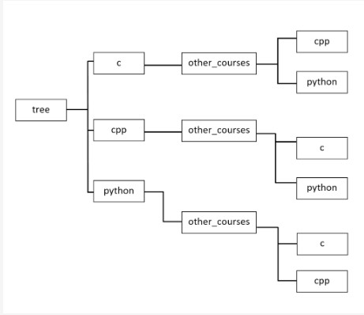

## 4.4.1.8 O módulo os: LAB

## Tempo estimado
15-30 min

## Nível de dificuldade
Fácil

## Objetivos
* Melhorar as competências do aluno em interagir com o sistema operativo;
* uso prático de funções conhecidas fornecidas pelo módulo os.

## Cenário
Escusado será dizer que os sistemas operativos permitem-lhe procurar ficheiros e diretorias. Ao estudar esta parte do curso aprendeu sobre as funções do módulo os, que têm tudo o que precisa para escrever um programa que procurará diretorias num determinado local.

Para facilitar a sua tarefa, preparámos-lhe uma estrutura de diretoria de teste:




O seu programa deve cumprir os seguintes requisitos:

1. Escreve uma função ou método chamado find que toma dois argumentos chamados path e dir. O argumento path deve aceitar um caminho relativo ou absoluto para uma diretoria onde a pesquisa deve começar, enquanto o argumento dir deve ser o nome de uma diretoria que deseje encontrar no caminho dado. O seu programa deve exibir os caminhos absolutos se encontrar uma diretoria com o nome fornecido.
1. A pesquisa de diretoria deve ser feita recursivamente. Isto significa que a pesquisa também deve incluir todas as subdiretorias no caminho dado.

**Exemplo de input:**

`path="./tree", dir="python"`

**Exemplo de output:**

```
.../tree/python
.../tree/cpp/other_courses/python
.../tree/c/other_courses/python
```

