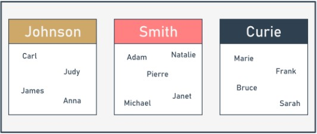

## Python Essentials 2 - Módulo 1

## Python Essentials 2:
## Módulo 1

Módulos, Pacotes e PIP

Neste módulo, aprenderá sobre:

* importação e utilização de módulos Python;
* utilização de alguns dos módulos de biblioteca padrão Python mais úteis;
* construção e utilização de pacotes Python;
* PIP (Python Installation Package) e como utilizá-lo para instalar e desinstalar pacotes prontos a usar do PyPI.

## 1.1.1.1 Módulos

## O que é um módulo?

O código de programação tem uma tendência para crescer. Podemos dizer que o código que não cresce é provavelmente completamente inutilizável ou abandonado. Um código real, procurado e amplamente utilizado desenvolve-se continuamente, à medida que tanto as exigências dos utilizadores como as expetativas dos utilizadores se desenvolvem nos seus próprios ritmos.

Um código que não seja capaz de responder às necessidades dos utilizadores será rapidamente esquecido, e imediatamente substituído por um código novo, melhor e mais flexível. Esteja preparado para isto, e nunca pense que algum dos seus programas acabe por ser concluído. A conclusão é um estado de transição e normalmente passa rapidamente, após o primeiro relatório de bug. O próprio Python é um bom exemplo de como a regra atua.

Código em crescimento é, de fato, um problema em crescimento. Um código maior significa sempre uma manutenção mais dura. A procura de bugs é sempre mais fácil onde o código é menor (tal como encontrar uma quebra mecânica é mais simples quando a maquinaria é mais simples e pequena).

Além disso, quando se espera que o código a ser criado seja realmente grande (pode usar um número total de source lines como uma medida útil, mas não muito precisa, do tamanho de um código) pode querer (ou melhor, será forçado a) dividi-lo em muitas partes, implementado em paralelo por alguns, uma dúzia, várias dúzias, ou mesmo várias centenas de programadores individuais.

É claro que isto não pode ser feito utilizando um grande source file, que é editado por todos os programadores ao mesmo tempo. Isto conduziria certamente a um desastre espetacular.


Se deseja que tal projeto de software seja concluído com êxito, tem de ter os meios que lhe permitam fazê-lo:

* dividir todas as tarefas entre os programadores;
* juntar todas as partes criadas num só todo funcional.

Por exemplo, um determinado projeto pode ser dividido em duas partes principais:

* a interface do utilizador (a parte que comunica com o utilizador utilizando widgets e um ecrã gráfico)
* a lógica (a parte que processa dados e produz resultados)

Cada uma destas partes pode ser (muito provavelmente) dividida em partes menores, e assim por diante. Tal processo é muitas vezes chamado **decomposição**.

Por exemplo, se lhe pedissem para organizar um casamento, não faria tudo sozinho - encontraria um número de profissionais e dividiria a tarefa entre todos eles.

Como se divide um software em partes separadas mas cooperantes? Esta é a questão. Os **módulos** são a resposta.

## 1.1.1.2 Utilizar Módulos

## Como fazer uso de um módulo?

Então, o que é um módulo? O [Tutorial Python](https://docs.python.org/3/tutorial/modules.html) define-o como **um arquivo contendo definições e declarações Python**, que pode ser posteriormente importado e utilizado quando necessário.

A manipulação de módulos consiste em duas questões diferentes:

* o primeiro (provavelmente o mais comum) acontece quando se pretende utilizar um módulo já existente, escrito por outra pessoa, ou criado por si próprio durante o seu trabalho em algum projeto complexo - neste caso você é o **utilizador** do módulo;
* o segundo ocorre quando se pretende criar um novo módulo, quer para uso próprio, quer para facilitar a vida a outros programadores - você é o **fornecedor** do módulo.

Vamos discuti-los separadamente.

Em primeiro lugar, um módulo é identificado pelo seu **nome**. Se quiser utilizar qualquer módulo, precisa saber o nome. Um número (bastante grande) de módulos é entregue juntamente com o próprio Python. Pode pensar neles como uma espécie de “equipamento extra de Python”.

Todos estes módulos, juntamente com as funções integradas, formam a **Python standard library** - um tipo especial de biblioteca onde os módulos desempenham o papel de livros (podemos mesmo dizer que as pastas desempenham o papel de prateleiras). Se quiser ver a lista completa de todos os “volumes” recolhidos nessa biblioteca, pode encontrá-la aqui: https://docs.python.org/3/library/index.html.

Cada módulo consiste em entidades (como um livro consiste em capítulos). Estas entidades podem ser funções, variáveis, constantes, classes e objetos. Se souber como acessar a um determinado módulo, pode fazer uso de qualquer uma das entidades que ele armazena.

Vamos começar a discussão com um dos módulos mais usados, chamado `math`. O seu nome fala por si - o módulo contém uma rica coleção de entidades (não apenas funções) que permitem a um programador implementar eficazmente cálculos que exijam o uso de funções matemáticas, como *sin()* ou *log()*.

## 1.1.1.3 Utilizar Módulos

## Importar um módulo

Para tornar um módulo utilizável, deve **importá-lo** (pense nisto como tirar um livro da prateleira). Importar um módulo é feito por uma instrução chamada `import`. Nota: `import` é também uma keyword (com todas as consequências deste fato).

Vamos supor que deseja utilizar duas entidades fornecidas pelo módulo `math` :

* um símbolo (constante) representando um valor preciso (o mais preciso possível usando aritmética de duplo floating-point) de π (embora a utilização de uma letra grega para nomear uma variável seja totalmente possível em Python, o símbolo é nomeado **pi** - é uma solução mais conveniente, especialmente para aquela parte do mundo que não tem nem vai usar um teclado grego)
* uma função chamada `sin()` (o equivalente informático da função matemática *seno*)
  
Ambas as entidades estão disponíveis através do módulo `math` , mas a forma como pode utilizá-los depende fortemente de como a importação foi feita.

A maneira mais simples de importar um módulo específico é utilizar a instrução de importação da seguinte forma:
```
import math
```

A cláusula contém:

* a keyword `import` ;
* o **nome do módulo** que está sujeito a importação.

A instrução pode estar localizada em qualquer parte do seu código, mas deve ser colocada **antes da primeira utilização de qualquer uma das entidades do módulo.**

Se quiser (ou tiver de) importar mais do que um módulo, pode fazê-lo repetindo a cláusula `import` (de preferência):
```
import math
import sys
```

ou listando os módulos após a keyword `import` , como aqui:
```
import math, sys
```

A instrução importa dois módulos, primeiro o chamado `math` e, em seguida, o segundo chamado `sys`.

A lista dos módulos pode ser arbitrariamente longa.

## 1.1.1.4 Utilizar Módulos

## Importar um módulo: continuação

Para continuar, é preciso familiarizar-se com um termo importante: **namespace**. Não se preocupe, não entraremos em grandes detalhes - esta explicação será tão curta quanto possível.

Um **namespace** é um espaço (entendido num contexto não físico) no qual alguns nomes existem, e os nomes não entram em conflito entre si (ou seja, não existem dois objetos diferentes com o mesmo nome). Podemos dizer que cada grupo social é um namespace - o grupo tende a nomear cada um dos seus membros de uma forma única (por exemplo, os pais não dão aos seus filhos os mesmos nomes próprios).



Esta singularidade pode ser conseguida de várias maneiras, por exemplo, utilizando alcunhas juntamente com os nomes próprios (funcionará dentro de um pequeno grupo como uma turma numa escola) ou atribuindo identificadores especiais a todos os membros do grupo (o Número de Segurança Social é um bom exemplo de tal prática).

**Dentro de um determinado namespace, cada nome deve permanecer exclusivo**. Isto pode significar que alguns nomes podem desaparecer, quando qualquer outra entidade de um nome já conhecido entra no namespace. Vamos mostrar-lhe como funciona e como controlá-lo, mas primeiro, vamos voltar às importações.

Se o módulo de um nome especificado **existir e for acessível** (um módulo é, na verdade, um **source file de Python**), o Python importa o seu conteúdo, ou seja, **todos os nomes definidos no módulo tornam-se conhecidos**, mas não entram no namespace do seu código.

Isto significa que pode ter as suas próprias entidades nomeadas `sin` ou `pi` e não serão de forma alguma afetadas pela importação.

A este ponto, poderá estar se perguntando como pode aceder à `pi` vinda do módulo `math` .

Para fazer isso, tem de qualificar o `pi` com o nome do seu módulo original.

## 1.1.1.5 Importar um módulo | math

## importar um módulo: continuação

Olhe para o snippet em baixo. Esta é a forma como se qualifica os nomes de pi e sin com o nome do seu módulo de origem:
```
math.pi
math.sin
```

É simples, coloca:

* o nome do módulo (por exemplo, `math`)
* um **ponto** (i.e., `.`)
* o **nome da entidade** (por exemplo, `pi`)

Tal forma indica claramente o namespace em que o nome existe.

Nota: a utilização desta qualificação é **obrigatória** se um módulo tiver sido importado pela instrução do módulo import . Não importa se algum dos nomes do seu código e do namespace do módulo está ou não em conflito.

Este primeiro exemplo não será muito avançado - queremos apenas imprimir o valor de **sen(½π)**.

Veja o código no editor. É assim que o testamos.
```
import math
print(math.sin(math.pi/2))
```

O código faz output do valor esperado: `1.0`.

Nota: a remoção de qualquer uma das duas qualificações tornará o código errado. Não há outra maneira de introduzir `math` do namespace se fez o seguinte:
```
import math
```

## 1.1.1.6 Importar um módulo | math

## importar um módulo: continuação

Agora vamos mostrar-lhe como os dois namespaces (o seu e o do módulo) podem coexistir.

observe o exemplo na janela do editor.
```
import math


def sin(x):
    if 2 * x == pi:
        return 0.99999999
    else:
        return None


pi = 3.14

print(sin(pi/2))
print(math.sin(math.pi/2))
```

Nós definimos o nosso `pi` e `sin` aqui.

Execute o programa. O código deve produzir o seguinte output:
output
```
0.99999999
1.0
```

Como pode ver, as entidades não se afetam umas às outras.

## 1.1.1.7 Importar um módulo | math

## importar um módulo: continuação

No segundo método, a sintaxe de `import` indica precisamente qual a entidade (ou entidades) do módulo que é aceitável no código:
```
from math import pi
```

A instrução consiste nos seguintes elementos:

* a keyword `from` ;
* O **nome do módulo** a importar (seletivamente);
* a keyword `import` ;
* o **nome ou lista de nomes da entidade/entidades** que estão sendo importadas para o namespace.

A instrução tem este efeito:

* As entidades listadas (e apenas essas) são **importadas do módulo indicado**;
* Os nomes das entidades importadas são **acessíveis sem qualificação**.

Nota: nenhuma outra entidade é importada. Além disso, não se pode importar entidades adicionais utilizando uma qualificação - uma linha como esta:

`print(math.e)`

causará um erro (`e` é o número de Euler: 2.71828...)

Vamos reescrever o script anterior para incorporar a nova técnica.

Aqui está:
```
from math import sin, pi

print(sin(pi/2))
```

O output deve ser o mesmo que anteriormente, pois de fato já utilizámos as mesmas entidades de antes: `1.0`. Copie o código, cole-o no editor e execute o programa.

O código parece mais simples? Talvez, mas o aspecto não é o único efeito deste tipo de importação. Vamos mostrar-lhe.

## 1.1.1.8 Importar um módulo | math

## importar um módulo: continuação

Veja o código no editor. Analise-o com cuidado:
```
from math import sin, pi

print(sin(pi / 2))

pi = 3.14


def sin(x):
    if 2 * x == pi:
        return 0.99999999
    else:
        return None


print(sin(pi / 2))
```

* linha 1: efetuar a importação seletiva;
* linha 3: fazer uso das entidades importadas e obter o resultado esperado (`1.0`)
* linhas 5 a 12: redefinir o significado de `pi` e `sin` - com efeito, substituem as definições originais (importadas) dentro do namespace do código;
linha 15: obter `0.99999999`, que confirma as nossas conclusões.

Vamos fazer outro teste. Veja o código em baixo:
```
pi = 3.14


def sin(x):
    if 2 * x == pi:
        return 0.99999999
    else:
        return None


print(sin(pi / 2))

from math import sin, pi

print(sin(pi / 2))
```

Aqui, revertemos a sequência das operações do código:

* linhas 1 a 8: definir o nosso próprio `pi` e `sin`;
* linha 11: fazer uso deles (`0.99999999` aparece no ecrã)
* linha 13: realizar a importação - os símbolos importados **substituem as suas definições anteriores dentro do namespace**;
* linha 15: obter `1.0` como resultado.

## 1.1.1.9 Importar um módulo | * and as

## Importar um módulo: *

No terceiro método, a sintaxe de `import` é uma forma mais agressiva da apresentada anteriormente:
```
from module import *
```

Como pode ver, o nome de uma entidade (ou a lista de nomes das entidades) é substituído por um único asterisco (`*`).

Tal instrução **importa todas as entidades do módulo indicado.**

Isto é conveniente? Sim, é, pois liberta-o do dever de enumerar todos os nomes de que necessita.

É inseguro? Sim, é - a menos que saiba todos os nomes fornecidos pelo módulo, talvez **não consiga evitar conflito de nomes**. Trate isto como uma solução temporária, e tente não a utilizar em código normal.

## Importação de um módulo: a keyword as .

Se utilizar a variante do módulo de importação e não gostar do nome de um determinado módulo (por exemplo, é o mesmo que uma das suas entidades já definidas, pelo que a qualificação se torna problemática) pode dar-lhe o nome que quiser - a isto chama-se **aliasing**.

Aliasing faz com que o módulo seja identificado com um nome diferente do original. Isto também pode encurtar os nomes qualificados.

A criação de um alias é feita em conjunto com a importação do módulo, e exige a seguinte forma da instrução de importação:
```
import module as alias
```

O “módulo” identifica o nome do módulo original enquanto o “alias” é o nome que deseja utilizar em vez do original.

Nota: `as` é uma keyword.

## 1.1.1.10 Importar um módulo | aliasing

## importar um módulo: continuação

Se precisar de mudar a palavra `math`, pode introduzir o seu próprio nome, tal como no exemplo:
```
import math as m

print(m.sin(m.pi/2))
```

Nota: após a execução bem sucedida de uma importação de um alias (pseudónimo), **o nome original do módulo torna-se inacessível** e não deve ser utilizado.

Por sua vez, quando utiliza a variante `from module import name` e precisa de mudar o nome da entidade, faz um alias para a entidade. Isto fará com que o nome seja substituído pelo alias que escolher.

É assim que pode ser feito:
```
from module import name as alias
```

Como anteriormente, o nome original (unaliased) torna-se inacessível.

A frase `name as alias` pode ser repetida - use vírgulas para separar as frases multiplicadas, como esta:
```
from module import n as a, m as b, o as c
```

O exemplo pode parecer um pouco estranho, mas funciona:
```
from math import pi as PI, sin as sine

print(sine(PI/2))
```

Agora está familiarizado com as noções básicas de utilização de módulos. Deixe-nos mostrar-lhe alguns módulos e algumas das suas entidades úteis.

## 1.1.1.11 RESUMO DA SEÇÃO

## Key takeaways

1. Se quiser importar um módulo como um todo, pode fazê-lo usando a declaração `import module_name` . É-lhe permitido importar mais do que um módulo de uma só vez utilizando uma lista separada por vírgulas. Por exemplo:
```
import mod1
import mod2, mod3, mod4
```

embora esta última forma não seja recomendada devido a razões estilísticas, e é melhor e mais bonito expressar a mesma intenção de uma forma mais clara e explícita, como por exemplo:
```
import mod2
import mod3
import mod4
```

2. Se um módulo for importado da forma acima referida e quiser aceder a qualquer uma das suas entidades, terá de prefixar o nome da entidade utilizando a **notação de ponto**. Por exemplo:
```
import my_module

result = my_module.my_function(my_module.my_data)
```

O snippet faz uso de duas entidades provenientes do módulo `my_module` : uma função chamada `my_function()` e uma variável chamada `my_data`. Ambos os nomes **devem ser prefixados por** `my_module`. Nenhum dos nomes das entidades importadas entra em conflito com os nomes idênticos existentes no espaço de nomes do seu código.

3. É-lhe permitido não só importar um módulo como um todo, mas também importar apenas entidades individuais a partir dele. Neste caso, as entidades importadas **não devem ser prefixadas** quando utilizadas. Por exemplo:
```
from module import my_function, my_data

result = my_function(my_data)
```

A forma acima - apesar da sua atratividade - não é recomendada devido ao perigo de causar conflitos com nomes derivados da importação do namespace do código.


4. A forma mais geral da declaração acima permite importar **todas as entidades** oferecidas por um módulo:
```
from my_module import *

result = my_function(my_data)
```

**Nota:** a variante desta importação não é recomendada pelas mesmas razões que anteriormente (a ameaça de um conflito de nomes é ainda mais perigosa aqui).

5. Pode alterar o nome da entidade importada "on the fly", utilizando a frase `as` do `import`. Por exemplo:
```
from module import my_function as fun, my_data as dat

result = fun(dat)
```

**Exercício 1**

Pretende invocar a função `make_money()` contida no módulo denominado `mint`. O seu código começa com a seguinte linha:
```
import mint
```

Qual é a forma adequada de invocação da função?

Verifique
`mint.make_money()`


**Exercício 2**

Pretende invocar a função `make_money()` contida no módulo denominado `mint`. O seu código começa com a seguinte linha:
```
from mint import make_money
```

Qual é a forma adequada de invocação da função?

Verifique
`make_money()`


**Exercício 3**

Escreveu uma função chamada `make_money` por sua conta. É necessário importar uma função com o mesmo nome do módulo `mint` e não quer renomear nenhum dos seus nomes previamente definidos. Qual a variante da declaração `import` que o pode ajudar com a questão?

Verifique
```
# sample solution
from mint import make_money as make_more_money
```


**Exercício 4**

Que forma de invocação da função make_money é válida se o seu código começar com a seguinte linha?
```
from mint import *
```

Verifique
`make_money()`
