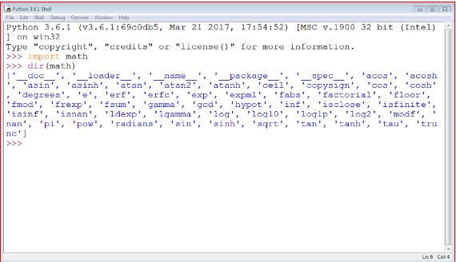
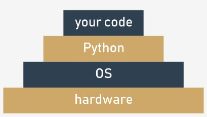

## 1.2.1.1 Módulos Úteis

## Trabalhar com módulos padrão

Antes de começarmos a passar por alguns módulos Python padrão, queremos introduzir-lhe a função `dir()` . Não tem nada a ver com o comando `dir` que conhece de consolas Windows e Unix, visto dir() não mostrar o conteúdo de uma diretoria/pasta de disco, mas não há como negar que faz algo realmente semelhante - é capaz de revelar todos os nomes fornecidos através de um determinado módulo.

Há uma condição: o módulo tem de ter sido previamente importado como um todo (isto é, utilizar a `import module` instrução - `from module` não é suficiente).

A função devolve uma **lista ordenada alfabeticamente** contendo todos os nomes de entidades disponíveis no módulo identificados por um nome passado para a função como argumento:
```
dir(module)
```

Nota: se o nome do módulo tiver sido aliased, deve usar o alias, não o nome original.

A utilização da função dentro de um script regular não faz muito sentido, mas ainda assim é possível.

Por exemplo, pode executar o seguinte código para imprimir os nomes de todas as entidades dentro do `math` módulo:
```
import math

for name in dir(math):
    print(name, end="\t")

```
O código de exemplo deve produzir o seguinte output:


output
```
__doc__	__loader__	__name__	__package__	__spec__	acos	acosh	asin	asinh	atan	atan2	atanh	ceil	copysign	cos	cosh	degrees	e	erf	erfc	exp	expm1	fabs	factorial	floor	fmod	frexp	fsum	gamma	hypot	isfinite	isinf	isnan	ldexp	lgamma	log	log10	log1p	log2	modf	pi	pow	radians	sin	sinh	sqrt	tan	tanh	trunc	
```

Já reparou nestes estranhos nomes que começam com `__` no topo da lista? Falaremos mais sobre eles quando falarmos sobre as questões relacionadas com a escrita dos seus próprios módulos.

Alguns dos nomes podem trazer memórias de lições de matemática, e provavelmente não terá quaisquer problemas em adivinhar o seu significado.

Utilizar a função `dir()` dentro de um código pode não parecer muito útil - normalmente quer saber o conteúdo de um determinado módulo antes de escrever e executar o código.

Felizmente, pode executar a função **diretamente no console Python** (IDLE), sem necessidade de escrever e executar um script separado.

É assim que pode ser feito:
```
import math
dir(math)
```

Deve-se ver algo semelhante a isto:



## 1.2.1.2 Módulos úteis | math

## Funções selecionadas a partir do módulo math .

Vamos começar com uma rápida pré-visualização de algumas das funções fornecidas pelo módulo `math` .
```
from math import pi, radians, degrees, sin, cos, tan, asin

ad = 90
ar = radians(ad)
ad = degrees(ar)

print(ad == 90.)
print(ar == pi / 2.)
print(sin(ar) / cos(ar) == tan(ar))
print(asin(sin(ar)) == ar)
```

Escolhemo-los arbitrariamente, mas isso não significa que as funções que não mencionamos aqui sejam menos significativas. Mergulhe você mesmo nas profundezas dos módulos - não temos aqui espaço nem tempo para falar de tudo em pormenor.

O primeiro grupo das funções de `math` estão relacionadas com **trigonometria**:

* `sin(x)` → o seno de x;
* `cos(x)` → o cosseno de x;
* `tan(x)` → a tangente de x.

Todas estas funções tomam um argumento (uma medição angular expressa em radianos) e devolvem o resultado apropriado (tenha cuidado com `tan()` - nem todos os argumentos são aceites).

Naturalmente, existem também as suas versões invertidas:

* `asin(x)` → o arco-seno de x;
* `acos(x)` → o arco-cosseno de x;
* `atan(x)` → o arco-tangente de x.

Estas funções tomam um argumento (atenção aos domínios) e devolvem uma medida de um ângulo em radianos.

Para operar eficazmente em medições de ângulos, o módulo math fornece-lhe as seguintes entidades:

* `pi` → uma constante com um valor que é uma aproximação de π;
* `radians(x)` → uma função que converte x de graus para radianos;
* `degrees(x)` → atuando na outra direção (dos radianos aos graus)

Agora veja o código no editor. O programa de exemplo não é muito sofisticado, mas consegue prever os seus resultados?

Além das funções circulares (listadas acima) o módulo `math` também contém um conjunto dos seus **análogos hiperbólicos**:

* `sinh(x)` → o seno hiperbólico;
* `cosh(x)` → o cosseno hiperbólico;
* `tanh(x)` → a tangente hiperbólica;
* `asinh(x)` → o arco-seno hiperbólico;
* `acosh(x)` → o arco-cosseno hiperbólico;
* `atanh(x)` → o arco-tangente hiperbólico.

## 1.2.1.3 Módulos úteis | math

## Funções selecionadas a partir do módulo math : continuação

Outro grupo das funções de `math` é formado por funções que estão ligadas à **exponenciação**:

```
from math import e, exp, log

print(pow(e, 1) == exp(log(e)))
print(pow(2, 2) == exp(2 * log(2)))
print(log(e, e) == exp(0))
```

* `e` → uma constante com um valor que é uma aproximação do número de Euler (e)
* `exp(x)` → encontrar o valor de ex;
* `log(x)` → o logaritmo natural de x
* `log(x, b)` → o logaritmo de x para base b
* `log10(x)` → o logaritmo decimal de x (mais preciso do que `log(x, 10)`)
* `log2(x)` → o logaritmo binário de x (mais preciso do que `log(x, 2)`)

Nota: a função `pow()` .

* `pow(x, y)` → encontrar o valor de xy (atenção aos domínios)

Esta é uma função integrada, e não tem de ser importada.

Veja o código no editor. Consegue prever o seu output?

## 1.2.1.4 Módulos úteis | math

## Funções selecionadas a partir do módulo math : continuação

O último grupo é constituído por algumas funções de caráter geral, como por exemplo:

* `ceil(x)` → o teto de x (o menor inteiro maior ou igual a x)
* `floor(x)` → o piso de x (o maior número inteiro menor ou igual a x)
* `trunc(x)` → o valor de x truncado a um número inteiro (tenha cuidado - não é equivalente a um teto ou piso)
* `factorial(x)` → devolve x! (x tem de ser um integral e não um negativo)
* `hypot(x, y)` → devolve o comprimento da hipotenusa de um triângulo de ângulo retângulo com o comprimento das pernas igual a x e y (o mesmo que `sqrt(pow(x, 2) + pow(y, 2)`) mas mais preciso)

Veja o código no editor. Analise o programa com cuidado.

Demonstra as diferenças fundamentais entre `ceil()`, `floor()` e `trunc()`.

Execute o programa e verifique o seu output.

```
from math import ceil, floor, trunc

x = 1.4
y = 2.6

print(floor(x), floor(y))
print(floor(-x), floor(-y))
print(ceil(x), ceil(y))
print(ceil(-x), ceil(-y))
print(trunc(x), trunc(y))
print(trunc(-x), trunc(-y))
``` 

outpuy
```
1 2
-2 -3
2 3
-1 -2
1 2
-1 -2
```

## 1.2.1.5 Módulos Úteis | random

## Existe uma verdadeira aleatoriedade nos computadores?

Outro módulo que vale a pena mencionar é o chamado `random`.

Fornece alguns mecanismos que lhe permitem operar com números **pseudo-aleatórios**.

Note o prefixo **pseudo** - os números gerados pelos módulos podem parecer aleatórios no sentido de que não se pode prever os seus valores subsequentes, mas não se esqueça que todos eles são calculados usando algoritmos muito refinados.

Os algoritmos não são aleatórios - são deterministas e previsíveis. Apenas os processos físicos que estão completamente fora do nosso controle (como a intensidade da radiação cósmica) podem ser utilizados como fonte de dados aleatórios reais. Os dados produzidos por computadores determinísticos não podem ser aleatórios de forma alguma.

Um gerador de números aleatórios toma um valor chamado **seed**, trata-o como um valor de input, calcula um número "aleatório" com base nele (o método depende de um algoritmo escolhido) e produz um **novo valor de seed**.

O comprimento de um ciclo em que todos os valores de seed são únicos pode ser muito longo, mas não é infinito - mais cedo ou mais tarde os valores de seed começarão a repetir-se, e os valores geradores também se repetirão. Isto é normal. É uma característica, não um erro ou um bug.

O valor inicial da seed, definido durante o início do programa, determina a ordem em que os valores gerados aparecerão.

O fator aleatório do processo pode ser **aumentado através da definição da seed com um número retirado da hora atual** - isto pode assegurar que cada lançamento do programa começará a partir de um valor de seed diferente (ou seja, utilizará números aleatórios diferentes).

Felizmente, tal inicialização é feita pelo Python durante a importação do módulo.

## 1.2.1.6 Módulos úteis | random

## Funções selecionadas a partir do módulo random .

#### A função `random` .

A função mais geral chamada `random()` (não confundir com o nome do módulo) **produz um número float** `x` **vindo do intervalo** `(0.0, 1.0)` - por outras palavras: (0,0 <= x < 1,0).

O programa de exemplo abaixo produzirá cinco valores pseudo-aleatórios - como os seus valores são determinados pelo valor atual (bastante imprevisível) da seed, não se pode adivinhá-los:
```
from random import random

for i in range(5):
    print(random())
```

Execute o programa. Isto é o que obtivemos:
output de amostra
```
0.9535768927411208
0.5312710096244534
0.8737691983477731
0.5896799172452125
0.02116716297022092
```

#### A `seed` .

A função `seed()` é capaz de **definir diretamente a seed do gerador**. Vamos mostrar-lhe duas das suas variantes:

* `seed()` - define a seed com a hora atual;
* `seed(int_value)` - define a seed com o valor inteiro `int_value`.

Modificámos o programa anterior - com efeito, removemos qualquer vestígio de aleatoriedade do código:
```
from random import random, seed

seed(0)

for i in range(5):
    print(random())
```

Devido ao fato de a seed ser sempre definida com o mesmo valor, a sequência de valores gerados parece sempre a mesma.

Execute o programa. Isto é o que obtivemos:
output de amostra
```
0.844421851525
0.75795440294
0.420571580831
0.258916750293
0.511274721369
```

E você?

Nota: os seus valores podem ser ligeiramente diferentes dos nossos se o seu sistema utilizar uma aritmética de floating-point mais ou menos precisa, mas a diferença será vista bastante longe do ponto decimal.

## 1.2.1.7 Módulos úteis | random

## Funções selecionadas a partir do módulo random : continuação

#### As funções `randrange` e `randint` .

Se quiser valores inteiros aleatórios, uma das seguintes funções encaixar-se-ia melhor:

* `randrange(end)`
* `randrange(beg, end)`
* `randrange(beg, end, step)`
* `randint(left, right)`

As três primeiras invocações gerarão um número inteiro retirado (pseudo aleatoriamente) do intervalo (respetivamente):

* `range(end)`
* `range(beg, end)`
* `range(beg, end, step)`

Note-se a **exclusão implícita do lado direito!**

A última função é um equivalente a `randrange(left, right+1)` - gera o valor inteiro `i`, que cai no intervalo [esquerda, direita] (sem exclusão do lado direito).

Veja o código no editor. Este programa de amostra produzirá consequentemente uma linha composta por três zeros e um zero ou um no quarto lugar.

```
from random import randrange, randint

print(randrange(1), end=' ')
print(randrange(0, 1), end=' ')
print(randrange(0, 1, 1), end=' ')
print(randint(0, 1))
```

output
`0 0 0 0`

## 1.2.1.8 Módulos úteis | random

## Funções selecionadas a partir do módulo random : continuação

As funções anteriores têm uma desvantagem importante - podem produzir valores repetitivos mesmo que o número de invocações subsequentes não seja maior do que a largura do intervalo especificado.

Veja o código abaixo - o programa produz muito provavelmente um conjunto de números em que alguns elementos não são únicos:
```
from random import randint

for i in range(10):
    print(randint(1, 10), end=',')
```

Isto é o que obtivemos num dos lançamentos:
output de amostra

`9,4,5,4,5,8,9,4,8,4,`

#### A `choice` e `sample` funções

Como pode ver, esta não é uma boa ferramenta para gerar números numa lotaria. Felizmente, existe uma solução melhor do que escrever o seu próprio código para verificar a singularidade dos números "sorteados".

É uma função chamada de uma maneira muito sugestiva - `choice`:

* `choice(sequence)`
* `sample(sequence, elements_to_choose)`

A primeira variante escolhe um elemento "aleatório" a partir da sequência de input e devolve-o.

O segundo constrói uma lista (uma amostra; em inglês, uma sample) que consiste no elemento `elements_to_choose` “sorteado” a partir da sequência de input.

Por outras palavras, a função escolhe (em inglês, chooses) alguns dos elementos de input, devolvendo uma lista com a escolha. Os elementos da amostra são colocados em ordem aleatória. Nota: o `elements_to_choose` não deve ser maior do que o comprimento da sequência de input.

Veja o código abaixo:
```
from random import choice, sample

my_list = [1, 2, 3, 4, 5, 6, 7, 8, 9, 10]

print(choice(my_list))
print(sample(my_list, 5))
print(sample(my_list, 10))
```

Novamente, o output do programa não é previsível. Os nossos resultados foram os seguintes:
```
4
[3, 1, 8, 9, 10]
[10, 8, 5, 1, 6, 4, 3, 9, 7, 2]
```

## 1.2.1.9 Módulos Úteis | platform

Como saber onde se encontra?
Por vezes, pode ser necessário descobrir informações não relacionadas com Python. Por exemplo, pode precisar de saber a localização do seu programa dentro do ambiente maior do computador.

Imagine o ambiente do seu programa como uma pirâmide constituída por uma série de camadas ou plataformas.




As camadas são:

* o seu código (em execução) está localizado na parte superior;
* O Python (mais precisamente - o seu ambiente de runtime) encontra-se diretamente abaixo;
* a camada seguinte da pirâmide é preenchida com o SO - o ambiente Python fornece algumas das suas funcionalidades utilizando os serviços do sistema operativo; o Python, embora muito poderoso, não é omnipotente - é forçado a utilizar muitos ajudantes se for processar ficheiros ou comunicar com dispositivos físicos;
* a camada mais inferior é o hardware - o processador (ou processadores), interfaces de rede, dispositivos de interface humana (ratos, teclados, etc.) e toda a outra maquinaria necessária para fazer funcionar o computador; o sistema operativo sabe como conduzi-lo, e usa muitos truques para conduzir todas as peças num ritmo consistente.

Isto significa que algumas das suas ações (ou melhor, do seu programa) têm de percorrer um longo caminho para serem executadas com sucesso - imagine que:

* **o seu código** quer criar um ficheiro, por isso invoca uma das funções de Python;
* O **Python** aceita a ordem, rearranja-a para cumprir os requisitos do SO local (é como colocar o selo "aprovado" no seu pedido) e envia-a (isto pode lembrá-lo de uma cadeia de comando)
* o **SO** verifica se o pedido é razoável e válido (por exemplo, se o nome do ficheiro está em conformidade com algumas regras de sintaxe) e tenta criar o ficheiro; tal operação, aparentemente muito simples, não é atómica - consiste em muitos pequenos passos dados pelo...
* **hardware**, que é responsável pela ativação de dispositivos de armazenamento (disco rígido, dispositivos de estado sólido, etc.) para satisfazer as necessidades do SO.

Normalmente, não está ciente de todo este alarido - quer que o ficheiro seja criado e pronto.

Mas por vezes deseja-se saber mais - por exemplo, o nome do SO que hospeda o Python, e algumas características que descrevem o hardware que hospeda o SO.

Existe um módulo que fornece alguns meios que lhe permitem saber onde está e que componentes trabalham para si. O módulo é chamado **platform**. Mostrar-lhe-emos algumas das funções que ele lhe proporciona.

## 1.2.1.10 Módulos úteis | platform

## Funções selecionadas a partir do módulo platform .

#### A função `platform` .

A função `platform` permite-lhe aceder aos dados da plataforma subjacente, ou seja, hardware, sistema operativo, e informação da versão do intérprete.

Existe uma função que lhe pode mostrar todas as camadas subjacentes num só relance, denominada `platform`, também. Apenas devolve uma string descrevendo o ambiente; assim, o seu output é mais dirigido ao ser humano do que ao processamento automatizado (vê-lo-á em breve).

É assim que pode invocá-la:
```
platform(aliased = False, terse = False)
```

E agora:

* `aliased` → quando definido para `True` (ou qualquer valor não nulo) pode fazer com que a função apresente os nomes alternativos das camadas subjacentes em vez dos nomes comuns;
* `terse` → quando definido para `True` (ou qualquer valor não nulo) pode convencer a função a apresentar uma forma mais breve do resultado (se possível)

Executamos o nosso programa de amostra utilizando três plataformas diferentes - isto é o que obtivemos:

```
from platform import platform

print(platform())
print(platform(1))
print(platform(0, 1))
```

**Intel x86 + Windows Vista (32 bit):**

output
```
Windows-Vista-6.0.6002-SP2
Windows-Vista-6.0.6002-SP2
Windows-Vista
```

**Intel x86 + Gentoo Linux (64 bits):**
output
```
Linux-3.18.62-g6-x86_64-Intel-R-_Core-TM-_i3-2330M_CPU_@_2.20GHz-with-gentoo-2.3
Linux-3.18.62-g6-x86_64-Intel-R-_Core-TM-_i3-2330M_CPU_@_2.20GHz-with-gentoo-2.3
Linux-3.18.62-g6-x86_64-Intel-R-_Core-TM-_i3-2330M_CPU_@_2.20GHz-with-glibc2.3.4
```

**Raspberry PI2+ Linux Raspbian (32 bits):**
output
```
Linux-4.4.0-1-rpi2-armv7l-with-debian-9.0
Linux-4.4.0-1-rpi2-armv7l-with-debian-9.0
Linux-4.4.0-1-rpi2-armv7l-with-glibc2.9
```

Também pode executar o programa de amostra em IDLE na sua máquina local para verificar qual o output que terá.

## 1.2.1.11 Módulos úteis | platform

## Funções selecionadas a partir do módulo platform : continuação

#### As funções machine .

Por vezes, pode apenas querer saber o nome genérico do processador que executa o seu SO juntamente com o Python e o seu código - uma função chamada `machine()` dir-lhe-á isso. Como anteriormente, a função devolve uma string.

Mais uma vez, executamos o programa de amostra em três plataformas diferentes:

```
from platform import machine

print(machine())
```

**Intel x86 + Windows Vista (32 bit):**
output

```
x86
```

**Intel x86 + Gentoo Linux (64 bits):**
output

```
x86_64
```

**Raspberry PI2+ Linux Raspbian (32 bits):**
output

```
armv7l
```

## 1.2.1.12 Módulos úteis | platform

## Funções selecionadas a partir do módulo platform : continuação

#### As funções `processor` .

A função processor() devolve uma string preenchida com o nome do processador real (se possível).

Mais uma vez, executámos o programa de amostra em três plataformas diferentes:

**Intel x86 + Windows Vista (32 bit):**
output
```
x86
```

**Intel x86 + Gentoo Linux (64 bits):**

output
```
Intel(R) Core(TM) i3-2330M CPU @ 2.20GHz
```

**Raspberry PI2+ Linux Raspbian (32 bits):**
output
```
armv7l
```

Teste isto na sua máquina local.