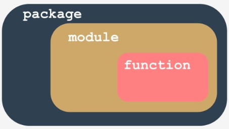

## 1.3.1.1 Módulos e Pacotes

## O que é um pacote?

Escrever os seus próprios módulos não difere muito da escrita de guiões normais.

Há alguns aspetos específicos de que deve estar ciente, mas definitivamente não é ciência de foguetões. Verá isto em breve.

Vamos resumir algumas questões importantes:

* um **módulo é uma espécie de recipiente cheio de funções** - pode embalar tantas funções quantas quiser num único módulo e distribuí-lo pelo mundo inteiro;
* claro, é geralmente uma boa ideia não misturar funções com diferentes áreas de aplicação dentro de um módulo (tal como numa biblioteca - ninguém espera que as obras científicas sejam colocadas entre os livros de banda desenhada), por isso, agrupe as suas funções cuidadosamente e nomeie o módulo que as contém de uma forma clara e intuitiva (por exemplo, não dê o nome `arcade_games` a um módulo contendo funções destinadas a particionar e formatar discos rígidos)
* fazer muitos módulos pode causar uma pequena confusão - mais cedo ou mais tarde vai querer **agrupar os seus módulos** exatamente da mesma forma que anteriormente agrupou funções - existe um recipiente mais geral do que um módulo?
* sim, existe - é um **pacote**; no mundo dos módulos, um pacote desempenha um papel semelhante a uma pasta/diretoria no mundo dos ficheiros.