## 1.4.1.1 Python Package Installer (PIP)

## Ecossistema de empacotamento Python e como utilizá-lo

O Python é um instrumento muito poderoso — esperamos que já o tenha experimentado pessoalmente. Muitas pessoas por todo o mundo pensam assim, e utilizam o Python regularmente para desenvolver o que podem fazer em muitos campos de atividade completamente diferentes. Isto significa que o Python se tornou **uma ferramenta interdisciplinar** empregada em inúmeras aplicações. Não podemos passar por todas as esferas em que o Python mostra brilhantemente as suas habilidades, por isso deixe-nos apenas falar-lhe das mais impressionantes.

Em primeiro lugar, o Python transformou-se num **líder da investigação sobre inteligência artificial**. Data mining, uma das disciplinas científicas modernas mais promissoras, utiliza também Python. Matemáticos, psicólogos, geneticistas, meteorologistas, linguistas — todos eles já usam Python, ou se ainda não o fazem, temos a certeza de que o farão muito em breve. Não há como escapar a esta tendência.

Claro que não faz qualquer sentido fazer com que todos os utilizadores do Python escrevam o seu código a partir do zero, mantendo-os perfeitamente isolados do mundo exterior e das conquistas de outros programadores. Isto seria tão antinatural como contraproducente.

O mais preferível e eficiente é permitir que todos os membros da comunidade Python possam trocar livremente os seus códigos e experiências. Neste modelo, ninguém é forçado a começar a trabalhar do zero, pois há uma elevada probabilidade de que alguém tenha trabalhado no mesmo problema (ou num muito semelhante).

Como sabe, o Python foi criado como um software de open-source, e isto também funciona como um convite para que todos os programadores mantenham todo o ecossistema Python um ambiente aberto, amigável e livre. Para fazer o modelo funcionar e evoluir, algumas ferramentas adicionais devem ser fornecidas, ferramentas que ajudem os criadores a publicar, manter e cuidar do seu código.

Estas mesmas ferramentas devem ajudar os utilizadores a fazer uso do código, tanto o código já existente, como também o novo código que aparece todos os dias. Graças a isto, escrever um novo código para novos desafios não é como construir uma nova casa, começando pelas fundações.

Além disso, o programador é livre de modificar o código de outra pessoa, a fim de adaptá-lo às suas próprias necessidades, e na verdade construir um produto completamente novo que possa ser utilizado por outro programador. O processo parece não ter fim. Felizmente.

Para fazer girar este mundo, duas entidades básicas têm de ser estabelecidas e mantidas em movimento: **um repositório centralizado** de todos os pacotes de software disponíveis; e uma ferramenta que permite aos utilizadores **aceder ao repositório**. Ambas as entidades já existem e podem ser usadas a qualquer momento.

## 1.4.1.2 Python Package Installer (PIP)

## Ecossistema de empacotamento Python e como utilizá-lo: continuação

O repositório (ou repo para abreviar) que mencionámos anteriormente chama-se **PyPI** (abreviação para Python Package Index) e é mantido por um grupo de trabalho chamado Packaging Working Group, uma parte da Python Software Foundation, cuja principal tarefa é apoiar programadores de Python na disseminação eficiente de código.

É possível aceder ao seu website através deste link:
https://wiki.python.org/psf/PackagingWG.


O website do PyPI (administrado pelo PWG) está localizado neste endereço:
https://pypi.org/.


Quando lá fomos por um bocado no início de junho de 2020, descobrimos que o PyPI albergava 237.515 projetos, constituídos por 2.877.545 ficheiros geridos por 427.487 utilizador.

Estes três números por si só mostram claramente a potência da comunidade Python, e a importância da cooperação entre programadores.

PyPI, ficheiro, repositório


Devemos salientar que o PyPI não é o único repositório de Python existente. Pelo contrário, existem muitos deles, criados para projetos e liderados por muitas comunidades de Python, grandes e pequenas. É provável que um dia você e os seus colegas queiram **criar os seus próprios repos.**

De qualquer forma, o PyPI é o repositório de Python mais importante do mundo. Se modificarmos um pouco o ditado clássico, podemos afirmar que “todas as estradas de Python levam ao PyPI”, e isto não é exagero nenhum

## 1.4.1.3 Python Package Installer (PIP)

## O repositório PyPI: the Cheese Shop

O repositório PyPI é por vezes referido como the **Cheese Shop**. A sério.

Isto parece-lhe um pouco estranho? Não se preocupe, é tudo perfeitamente inocente.

Referimo-nos ao repo como uma loja, porque vai lá pelas mesmas razões que vai a outras lojas: para satisfazer as suas necessidades. Se quiser queijo, vai à queijaria. Se quiser uma peça de software, vai à loja de software. Felizmente, a analogia termina aqui - não é preciso dinheiro para tirar algum software da loja de repo.

O PyPI é completamente gratuito, e pode simplesmente escolher um código e usá-lo - não encontrará nem um caixa nem um segurança. Claro, não o absolve de ser educado e honesto. Tem de obedecer a todas as condições de licenciamento, por isso não se esqueça de as ler.

"OK", diz você, "a loja está esclarecida agora, mas o que tem o queijo a ver com o Python"?

The Cheese Shop é um dos mais famosos sketches dos Monty Python. Descreve a aventura surrealista de um inglês a tentar comprar queijo. Infelizmente, a loja que ele visita (imodestamente chamada Ye National Cheese Emporium) não tem nenhum queijo em stock.

Naturalmente, é para ser irónico. Como já sabe, o PyPI tem muito software em stock e está disponível 24/7. Tem todo o direito de se identificar como o *Ye International Python Software Emporium.*

## 1.4.1.4 Python Package Installer (PIP)

## O repositório PyPI: the Cheese Shop (continuação)

O PyPI é uma loja muito específica, não só porque oferece todos os seus produtos gratuitamente. Também requer uma ferramenta especial para a sua utilização.

Felizmente, esta ferramenta também é gratuita, por isso se quiser fazer o seu próprio cheeseburger digital utilizando a mercadoria oferecida pela Loja PyPI, necessitará de uma ferramenta gratuita chamada pip.

Não, não leu mal. Apenas pip. É outro acrónimo, claro, mas a sua natureza é mais complexa do que o anteriormente mencionado PyPI, pois é um exemplo de um acrónimo recorrente, o que significa que o acrónimo se refere a si mesmo, o que significa que explicá-lo é um processo infinito.

Porquê? Porque pip significa *“pip installs packages”*, e o *pip* dentro de *“pip installs packages”* significa *“pip installs packages”* e...

Vamos parar por aqui. Obrigado pela sua cooperação.

A propósito, existem algumas outros acrónimos de recorrência muito famosas. Um deles é o Linux, que pode ser interpretado como *“Linux is Not Unix”.*

## 1.4.1.5 Python Package Installer (PIP)

## Como instalar o pip
A questão que deve ser colocada agora é: como obter uma faca de queijo adequada? Por outras palavras, como assegurar que o pip está instalado e pronto a funcionar?

A resposta mais precisa é “depende”. A sério.

Algumas instalações Python vêm com o pip, outras não. Além disso, não depende apenas do sistema operacional que utiliza, embora este seja um fator muito importante.

Vamos começar com o MS Windows.

## 1.4.1.6 Instalação do pip no MS Windows

## pip no MS Windows

O instalador do MS Windows Python já contém o pip, e por isso não é necessário tomar outras medidas para a sua instalação. Infelizmente, se a variável PATH estiver mal configurada, o pip pode não estar disponível.

Para verificar que não o enganamos, tente fazer isto:

* abra a consola do Windows (CMD ou PowerShell, o que preferir)
* execute o seguinte comando:
```
pip --version
```

* no cenário mais otimista (e nós queremos mesmo que isso aconteça) verá algo como isto:

pip --version, python 3.8

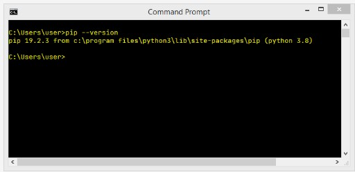

* a ausência desta mensagem pode significar que a variável PATH ou aponta incorretamente para a localização dos binários Python, ou não aponta de todo para ela; por exemplo, a nossa variável PATH contém a seguinte substring:
```
C:\Program Files\Python3\Scripts\;C:\Program Files\Python3\;

```

* a maneira mais fácil de reconfigurar a variável PATH é **reinstalar o Python**, instruindo o instalador a defini-la por si.

## 1.4.1.7 Instalação do pip em Linux

## pip no Linux

Diferentes distribuições de Linux podem comportar-se de forma diferente quando se trata de utilizar o pip. Algumas delas (como o Gentoo), que estão intimamente ligadas ao Python e que o utilizam internamente, podem ter o pip pré-instalado e estão imediatamente prontas a funcionar.

Não esquecer que alguns Linuces podem utilizar mais de uma versão Python simultaneamente, por exemplo, um Python 2 e um Python 3 coexistentes lado a lado. Tais sistemas podem lançar o Python 2 como a versão padrão, e pode ser necessário especificar explicitamente o nome do programa como python3. Neste caso podem haver dois pips diferentes identificados como pip (ou pip2) e pip3. Verifique com cuidado.

Abra a janela do terminal e emita o seguinte comando:

```
pip --version

```

pip —version, python 2.7

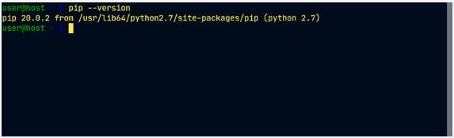


Uma resposta semelhante à apresentada na imagem anterior determina que lançou o pip a partir do Python 2, pelo que a próxima tentativa deverá ser a seguinte:

```
pip3 --version
```


pip —version, python 3.6

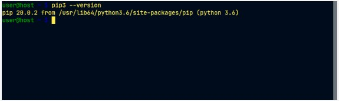

Como pode ver, temos agora a certeza de que estamos a utilizar a versão apropriada do pip.

## 1.4.1.8 Instalação do pip em Linux

## pip no Linux: continuação

Infelizmente, algumas distribuições Linux não têm o pip pré-instalado, mesmo que o próprio Python esteja instalado por padrão (algumas versões do Ubuntu podem-se comportar desta forma). Neste caso, tem duas possibilidades:

* instalar o pip como um pacote de sistema usando um gestor de pacotes dedicado (por exemplo, apt em sistemas tipo Debian)
* instalar o pip usando mecanismos internos do Python.

O primeiro é definitivamente melhor. Embora existam alguns scripts inteligentes que são capazes de descarregar e instalar o pip ignorando o SO, desencorajamo-lo de os usar. Este método pode colocá-lo em apuros.

Veja - tentamos lançar o pip3 e falhamos. O nosso SO (desta vez utilizámos o Ubuntu Budgie) sugeriu a utilização do apt para instalar o pacote chamado python3-pip:

Captura de ecrã do terminal: sudo apt install python3-pip

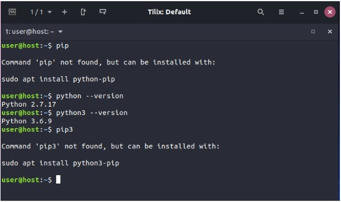

É um bom conselho, e vamos segui-lo, mas precisaremos de direitos administrativos para o fazer. Não se esqueça que diferentes Linuces podem usar diferentes gestores de pacotes (por exemplo, pode ser pacman se usar o Arch Linux, ou yum usado por distribuições derivadas do Red Hat).

De qualquer forma, todos esses métodos devem obter o pip (ou pip3) instalado e a funcionar.

Veja o que aconteceu quando seguimos a sugestão do SO:

Captura de ecrã do terminal: seguindo a sugestão do SO

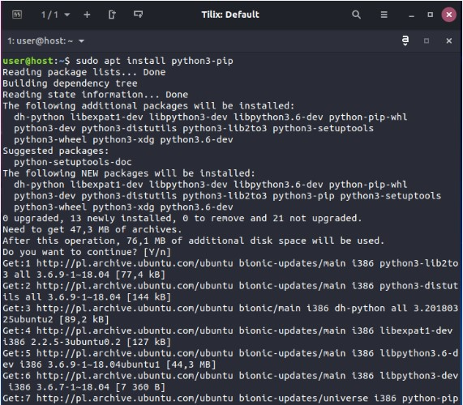

Como pode ver, o SO decidiu instalar não só o próprio pip, mas também um par de componentes adicionais necessários ao pip. Isto é normal - não se alarme.

## 1.4.1.9 Instalação do pip em Linux

## pip no Linux: continuação

Quando o apt termina o seu trabalho, somos finalmente capazes de utilizar o pip3:

Captura de ecrã do terminal 5

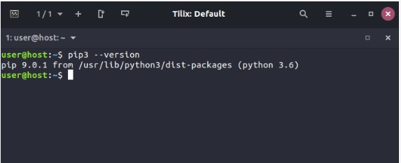

Se for um utilizador de Mac e tiver instalado o Python 3 usando o instalador brew, o pip já está presente no seu sistema e pronto a funcionar. Verifique-o emitindo o comando mencionado anteriormente:

```
pip3 --version
```

e aguarde a resposta.

Isto é o que vimos:

Captura de ecrã do terminal 6


## 1.4.1.10 Dependências

## Dependências

Agora que temos a certeza de que o pip está pronto ao nosso comando, vamos limitar o nosso foco apenas ao MS Windows, uma vez que o seu comportamento é (deve ser) o mesmo em todos os sistemas operacionais, mas antes de começarmos, precisamos de explicar uma questão importante e de lhe falar sobre **dependências**.

Imagine que criou uma brilhante aplicação Python chamada redsuspenders, capaz de prever as taxas da bolsa com uma precisão de 99% (a propósito, se realmente o fizer, contacte-nos imediatamente).

Claro que utilizou algum código existente para atingir este objetivo - por exemplo, a sua aplicação importa um pacote chamado nyse contendo algumas funções e classes cruciais. Além disso, o pacote nyse importa outro pacote chamado wallstreet, enquanto o pacote wallstreet importa outros dois pacotes essenciais chamados bull e bear.

Como já deve ter adivinhado, as ligações entre estes pacotes são cruciais, e se alguém decidir utilizar o seu código (mas lembre-se, já chamámos a atenção para isso) também terá de se assegurar de que todos os pacotes necessários estão no seu lugar.

Para resumir uma longa história, podemos dizer que **a dependência é um fenómeno que aparece sempre que se vai utilizar um pedaço de software que depende de outro software**. Note-se que a dependência pode incluir (e geralmente inclui) mais do que um nível de desenvolvimento de software.

Significa isto que um potencial utilizador de pacotes nyse é obrigado a localizar todas as dependências e instalar manualmente todos os pacotes necessários? Isso seria horrível, não seria?

Sim, é definitivamente horrível, por isso não lhe deve surpreender que o processo de cumprir arduamente todos os requisitos subsequentes tenha o seu próprio nome, e é chamado inferno da dependência.

Como lidamos com isso? Está cada utilizador condenado a visitar o inferno para poder executar o código pela primeira vez?

Felizmente não - o pip pode fazer tudo isto por si. A sério. Ele pode descobrir, identificar e resolver todas as dependências. Além disso, pode fazê-lo da forma mais inteligente, evitando quaisquer downloads e reinstalações desnecessários.

Dependências

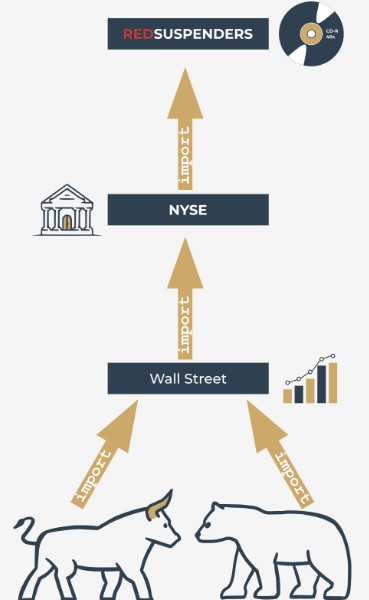

## Como usar o pip

Agora estamos prontos para perguntar ao pip o que pode fazer por nós. Vamos a isso - emita o seguinte comando:
```
pip help
```

e aguarde a respostado pip. É este o seu aspeto:

pip help

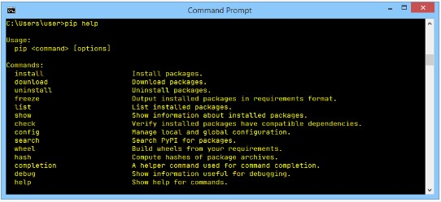

Não se esqueça que poderá ser obrigado a substituir o pip pelo pip3 se o seu ambiente assim o exigir.

A lista produzida pelo pip resume todas as operações disponíveis, e a última delas é help, que já acabámos de utilizar.

Se quiser saber mais sobre qualquer uma das operações listadas, pode utilizar a seguinte forma de invocação do pip:
```
pip help operation
```

Por exemplo, a linha:
```
pip help install
```

irá mostrar-lhe informações detalhadas sobre o uso e parametrização do comando `install` .

Se quiser saber que pacotes Python foram instalados até agora, pode usar a operação `list` — assim:
```
pip list
```

O output que verá é bastante imprevisível. Não fique surpreendido se o seu ecrã acabar por ser preenchido com conteúdos completamente diferentes. O nosso parece-se com o seguinte:

pip list

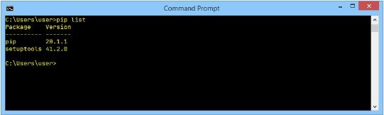

Como pode ver, existem duas colunas na lista, uma que mostra o nome do pacote instalado, e a outra que mostra a versão do pacote. Não podemos prever o estado da sua instalação Python.

A única coisa que sabemos com certeza é que a sua lista contém as duas linhas que vemos na nossa lista: pip e setuptools. Isto acontece porque o SO está convencido de que um utilizador que quer o pip irá muito provavelmente precisar das setuptools em breve. Não está errado.

## 1.4.1.12 Como utilizar o pip

## Como utilizar o pip: continuação

A lista do pip não é muito informativa, e pode não satisfazer a sua curiosidade. Felizmente, existe um comando que lhe pode dizer mais acerca de qualquer um dos pacotes instalados (observe a palavra **installed**). A sintaxe do comando é a seguinte:
```
pip show package_name
```

Vamos usá-lo de uma forma ligeiramente enganadora - queremos convencer o pip a confessar algo sobre si próprio. É assim que o fazemos:
```
pip show pip
```

Parece um pouco estranho, não parece? Apesar disso, funciona bem, e a auto-apresentação do pip parece consistente e atual:

pip show pip

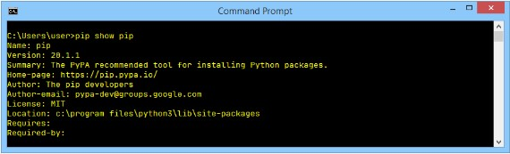

Pode perguntar-se: de onde vêm estes dados? Será o pip realmente tão perspicaz? De modo algum — as informações que aparecem no ecrã são retiradas do interior do pacote que está a ser mostrado. Por outras palavras, o criador do pacote é obrigado a equipá-lo com todos os dados necessários (ou a expressá-los com maior precisão - metadados).

Veja as duas linhas na parte inferior do output. Elas mostram:

* quais os pacotes necessários para utilizar com sucesso o pacote (`Requires:`)
* quais os pacotes que precisam do pacote para serem utilizados com sucesso (`Required-by:`)

Como pode ver, ambas as propriedades estão vazias. Sinta-se à vontade para tentar usar o comando `show` em relação a qualquer outro pacote instalado.

O poder do pip vem do fato de ele ser na realidade uma porta de entrada para o universo do software Python. Graças a isso, é possível navegar e instalar qualquer uma das centenas de pacotes prontos a usar reunidos nos repositórios PyPI. Não se esqueça que o pip não é capaz de armazenar todo o conteúdo PyPI localmente (é desnecessário e não seria rentável).

Com efeito, o pip utiliza a Internet para consultar o PyPI e para descarregar os dados necessários. Isto significa que tem de ter uma ligação de rede a funcionar sempre que quiser pedir ao pip por qualquer coisa que possa envolver interações diretas com a infraestrutura PyPI.

Um destes casos ocorre quando se pretende pesquisar através do PyPI a fim de encontrar um pacote desejado. Este tipo de pesquisa é iniciado pelo seguinte comando:
```
pip search anystring
```

O `anystring` fornecido por si será pesquisado em:

* Os nomes de todos os pacotes;
* as strings sumário de todos os pacotes.

Esteja ciente de que algumas pesquisas podem gerar uma verdadeira avalanche de dados, por isso tente ser o mais específico possível. Por exemplo, uma consulta de aparência inocente como esta:
```
pip search pip
```

produz mais de 100 linhas de resultados (experimente-o você mesmo — não acredite na nossa palavra). A propósito — a pesquisa é case insensitive.

Se não é fã de leitura na consola, pode utilizar a forma alternativa de navegar pelo conteúdo PyPI oferecida por um motor de busca, disponível em https://pypi.org/search.

## 1.4.1.13 Como utilizar o pip

## Como utilizar o pip: continuação

Assumindo que a sua pesquisa é bem sucedida (ou que está determinado a instalar um pacote específico de um nome já conhecido) pode utilizar o pip para instalar o pacote no seu computador.

Dois cenários possíveis podem ser postos em ação agora:

* pretende instalar um novo pacote apenas para si - não estará disponível para qualquer outro utilizador (conta) existente no seu computador; este procedimento é o único disponível se não conseguir elevar as suas permissões e agir como administrador do sistema;
* decidiu instalar um novo sistema de pacotes em todo o sistema - tem direitos administrativos e não tem medo de os utilizar.

Para distinguir entre estas duas ações, pip utiliza uma opção dedicada denominada --user (note o duplo hífen). A presença desta opção instrui o pip a agir localmente em nome do seu utilizador (não-administrativo).

Se não adicionar isto, o pip assume que você é como um administrador do sistema e não fará nada para o corrigir se não o for.

No nosso caso, vamos instalar um pacote chamado pygame — é uma biblioteca extensa e complexa que permite aos programadores desenvolver jogos de computador usando Python.

O projeto está em desenvolvimento desde 2000, por isso é um pedaço de código maduro e fiável. Se quiser saber mais sobre o projeto e sobre a comunidade que o lidera, visite https://www.pygame.org.

Se você é um administrador do sistema, pode instalar o pygame usando o seguinte comando:
```
pip install pygame
```

Se você não é um administrador, ou não quer engordar o seu sistema operativo instalando o sistema pygame em todo o sistema, pode instalá-lo apenas para si:
```
pip install --user pygame
```

Cabe-lhe a si decidir qual dos procedimentos acima referidos quer que se realize.

pip install --user pygame

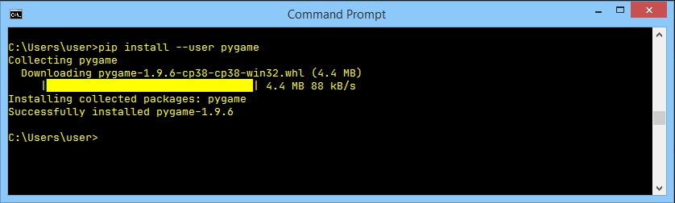

O pip tem o hábito de exibir uma animação textual extravagante indicando o progresso da instalação, por isso veja o ecrã com cuidado - não perca o espetáculo! Se o processo for bem-sucedido, verá algo assim:

Encorajamo-lo a utilizar:

```
pip show pygame
```

e

```
pip list
```

para obter mais informações sobre o que realmente aconteceu.

## 1.4.1.14 Como utilizar o pip

## Como utilizar o pip: um programa de teste simples
Agora que o pygame está finalmente acessível, podemos tentar utilizá-lo num programa de teste muito simples. Vamos comentá-lo brevemente.

```
import pygame

run = True
width = 400
height = 100
pygame.init()
screen = pygame.display.set_mode((width, height))
font = pygame.font.SysFont(None, 48)
text = font.render("Welcome to pygame", True, (255, 255, 255))
screen.blit(text, ((width - text.get_width()) // 2, (height - text.get_height()) // 2))
pygame.display.flip()
while run:
    for event in pygame.event.get():
        if event.type == pygame.QUIT\
        or event.type == pygame.MOUSEBUTTONUP\
        or event.type == pygame.KEYUP:
            run = False

```

* linha 1: importar o pygame e deixá-lo servir-nos;
* linha 3: o programa será executado enquanto a variável `run` for `True`;
* linhas 4 e 5: determinar o tamanho da janela;
* linha 6: inicializar o ambiente do pygame;
* linha 7: preparar a janela de aplicação e definir o seu tamanho;
* linha 8: fazer um objeto representando a fonte padrão de tamanho 48 pontos;
* linha 9: fazer um objeto representando um determinado texto - o texto será anti-aliased (`True`) e branco (`255,255,255`)
* linha 10: inserir o texto no buffer do ecrã (atualmente invisível);
* linha 11: virar os buffers do ecrã para tornar o texto visível;
* linha 12: o loop principal do pygame começa aqui;
* linha 13: obter uma lista de todos os eventos de pygame pendentes;
* linhas 14 a 16: verificar se o utilizador fechou a janela ou clicou em algum lugar dentro dela ou pressionou qualquer tecla;
* linha 15: se sim, parar de executar o código.

## 1.4.1.15 Como utilizar o pip

## Como utilizar o pip: continuação

Isto é o que esperamos do nosso impressionante código:

Command prompt - python testpg.py

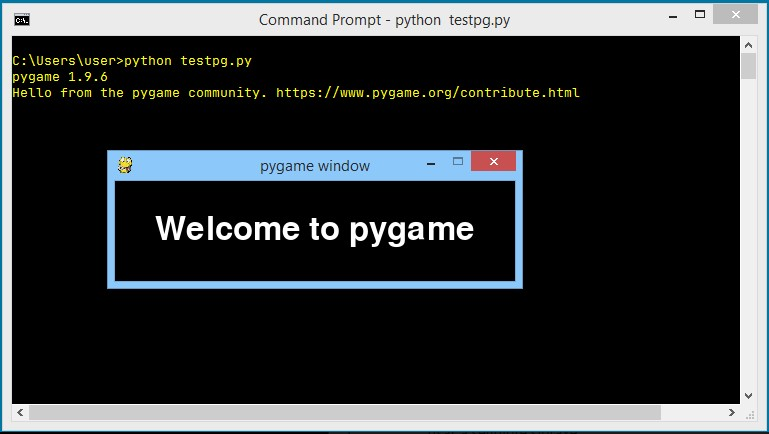


O `pip install` tem duas capacidades adicionais importantes:

* é capaz de atualizar um pacote instalado localmente - por exemplo, se quiser ter a certeza de que está a utilizar a última versão de um determinado pacote, pode executar o seguinte comando:
```
pip install -U package_name
```

onde `-U` significa atualização. Nota: esta forma do comando faz uso da opção `--user` para o mesmo fim que foi apresentado anteriormente;

* é capaz de **instalar uma versão selecionada pelo utilizador** de um pacote (pip instala por defeito a versão **mais recente** disponível); para atingir este objetivo deve usar a seguinte sintaxe:
```
pip install package_name==package_version
```

(note o sinal duplo de igual); por exemplo

```
pip install pygame==1.9.2
```

## 1.4.1.16 Como utilizar o pip

## Como utilizar o pip: continuação

Se algum dos pacotes atualmente instalados **já não for necessário** e quiser ver-se livre deles, o pip também será útil. O seu comando `uninstall` executará todos os passos necessários.

A sintaxe necessária é clara e simples:
```
pip uninstall package_name
```

por isso, se já não quiser o pygame, pode executar o seguinte comando:
```
pip uninstall pygame
```

O pip vai querer saber se tem a certeza sobre a escolha que está a fazer - esteja preparado para dar a resposta certa.

O processo tem este aspeto:

Command prompt - pip uninstall pygame


## 1.4.1.17 Como utilizar o pip

## Use o pip!

As capacidades do pip não terminam aqui, mas o conjunto de comandos que lhe apresentámos é suficiente para começar a gerir com sucesso os pacotes que não fazem parte da instalação Python regular.

Esperamos tê-lo encorajado a realizar as suas próprias experiências com o pip e com o universo dos pacotes Python. O PyPI convida-o a mergulhar nos seus vastos recursos.

Alguns dizem que uma das virtudes mais importantes da programação é a **preguiça**. Não nos interprete mal - não queremos que passe o dia inteiro a dormir no sofá e a sonhar com código Python.

Um programador preguiçoso é um programador que procura as soluções existentes e analisa o código disponível antes de começar a desenvolver o seu próprio software a partir do zero.

É por isto que o PyPI e o pip existem — use-os!

## 1.4.1.18 RESUMO DA SECÇÃO

## Key takeaways

1. Um **repositório** (ou **repo** para abreviar) concebido para recolher e partilhar código Python gratuito existe e funciona sob o nome **Python Package Index (PyPI)** embora também seja provável que o encontre com o nome de nicho **The Cheese Shop**. O site da Loja está disponível em https://pypi.org/.


2. Para fazer uso da The Cheese Shop foi criada a ferramenta especializada chamada pip (pip installs packages enquanto pip significa... ok, não se importe). Como o pip pode não ser implantado como parte da instalação padrão Python, é possível que tenha de o instalar manualmente. O pip é uma ferramenta de consola.


3. Para verificar a versão do pip, devem ser emitidos os seguintes comandos:

```
pip --version
```

ou

```
pip3 --version
```

Verifique você mesmo qual destes funciona para si no ambiente do seu sistema operativo.


4. A lista das principais atividades de pip é a seguinte:

* `pip help operation` - mostra uma breve descrição do pip;
* `pip list` - mostra a lista de pacotes atualmente instalados;
* `pip show package_name` - mostra informações de package_name incluindo as dependências do pacote;
* `pip search anystring` - pesquisa através das diretorias PyPI a fim de encontrar pacotes cujo nome contenha anystring;
* `pip install name` - instala o name em todo o sistema (esperar problemas quando não tem direitos administrativos);
* `pip install --user name` - instala o name apenas para si; nenhum outro utilizador da sua plataforma será capaz de o utilizar;
* `pip install -U name` - atualiza o pacote previamente instalado;
* `pip uninstall name` - desinstala o pacote instalado anteriormente;

**Exercício 1**

De onde vem o nome “The Cheese Shop”?

Verifique

É uma referência a um antigo sketch dos Monty Python com o mesmo nome.


**Exercício 2**

Porque devo assegurar-me de qual dos pip e pip3 funciona para mim?

Verifique

Quando o Python 2 e o Python 3 coexistem no seu SO, é provável que o pip identifique a instância de pip a trabalhar apenas com pacotes Python 2.


**Exercício 3**

Como posso determinar se o meu pip funciona com Python 2 ou Python 3?

Verifique

`pip --version` dir-lhe-á isso.


**Exercício 4**

Infelizmente, não tenho direito administrativo. O que devo fazer para instalar um pacote em todo o sistema?

Verifique

Tem de perguntar ao seu sysadmin - não tente piratear o seu SO!

## 1.4.1.19 Conclusão do Módulo

# Parabéns! Completou o PE2: Módulo 1.

Muito bem! Chegou ao fim do Módulo 1 e completou um marco importante na sua educação em programação Python. Aqui está um breve resumo dos objetivos que abordou e com os quais se familiarizou no Módulo 1:

* trabalhar com módulos Python; importar, criar, e utilizar módulos;
* utilizar módulos STL Python selecionados (math, random e platform)
* construir e utilizar pacotes em Python;
* PIP (Python Package Installer).

Está agora pronto para fazer o quiz do módulo e tentar o desafio final: Teste do Módulo 1, que o ajudará a avaliar o que aprendeu até agora.