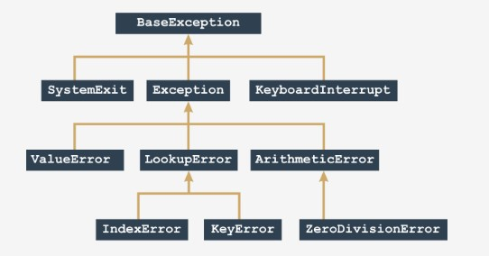

## 2.7.1.1 A anatomia das exceções

## Exceções

O Python 3 define **63 exceções incorporadas**, e todas elas formam uma **hierarquia em forma de árvore**, embora a árvore seja um pouco estranha, uma vez que a sua raiz está localizada no topo.  

Algumas das exceções incorporadas são mais gerais (incluem outras exceções) enquanto outras são completamente concretas (representam-se apenas a si próprias). Podemos dizer que **quanto mais próxima da raiz se encontra uma exceção, mais geral (abstrata) ela é**. Por sua vez, as exceções localizadas nas extremidades dos ramos (podemos chamar-lhes **folhas**) são concretas.

Dê uma vista de olhos à figura:

Mostra uma pequena secção da árvore de exceção completa. Vamos começar a examinar a árvore a partir da ZeroDivisionError folha.

Nota:

* ZeroDivisionError é um caso especial de uma classe de exceção mais geral chamada ArithmeticError;
* ArithmeticError é um caso especial de uma classe de exceção mais geral chamada apenas Exception;
* Exception é um caso especial de uma classe mais geral chamada BaseException;

Podemos descrevê-la da seguinte forma (note-se a direção das setas - apontam sempre para a entidade mais geral):

BaseException

↑

Exception

↑

ArithmeticError

↑

ZeroDivisionError

Vamos mostrar-lhe como funciona esta generalização. Vamos começar com um código realmente simples.