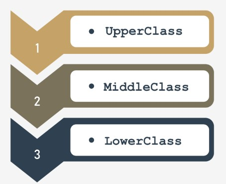
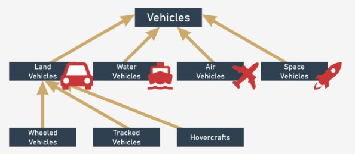
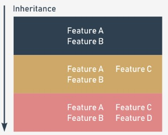
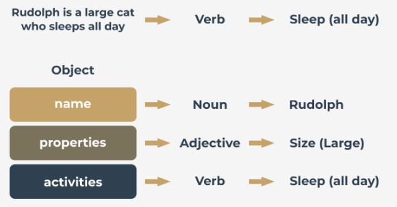

## 3.1.1.0 Python Essentials 2 - Módulo 3

## Python Essentials 2:
## Módulo 3

**Programação orientada a objetos**

Neste módulo, aprenderá sobre:

* Conceitos básicos de programação orientada a objetos (OOP)
* As diferenças entre as abordagens processual e de objecto (motivações e ganhos)
* Classes, objetos, propriedades e métodos;
* Como projetar classes reutilizáveis e criar objetos;
* Herança e polimorfismo;
* Exceções como objetos.

## 3.1.1.1 Os fundamentos da OOP

## Os conceitos básicos da abordagem orientada a objetos

Vamos dar um passo fora da programação informática e dos computadores em geral, e discutir questões de programação de objetos.

Quase todos os programas e técnicas que utilizou até agora enquadram-se no estilo processual de programação. É certo que fez uso de alguns objetos incorporados, mas ao referirmo-nos a eles, acabámos por mencionar o mínimo absoluto.

O estilo processual de programação foi a abordagem dominante no desenvolvimento de software durante décadas do IT, e ainda hoje é utilizado. Além disso, não vai desaparecer no futuro, uma vez que funciona muito bem para tipos específicos de projetos (geralmente, não muito complexos e não grandes, mas há muitas exceções a essa regra).

A abordagem ao objeto é bastante jovem (muito mais jovem do que a abordagem processual) e é particularmente útil quando aplicada a projetos grandes e complexos, realizados por grandes equipas constituídas por vários programadores.

Este tipo de compreensão da estrutura de um projeto facilita muitas tarefas importantes, por exemplo, a divisão do projeto em partes pequenas e independentes, e o desenvolvimento independente de diferentes elementos do projeto.

**O Python é uma ferramenta universal tanto para a programação de objetos como de procedimentos.** Pode ser utilizado com sucesso em ambas as esferas.

Além disso, pode criar muitas aplicações úteis, mesmo que não saiba nada sobre classes e objectos, mas tem de ter em mente que alguns dos problemas (por exemplo, manipulação da interface gráfica do utilizador) podem exigir uma abordagem estrita a objectos.

Felizmente, a programação de objetos é relativamente simples.

## 3.1.1.2 Os fundamentos da OOP

## Abordagem processual vs. orientada a objetos

Na **abordagem processual**, é possível distinguir dois mundos diferentes e completamente separados: **o mundo dos dados, e o mundo do código.** O mundo dos dados é povoado por variáveis de diferentes tipos, enquanto o mundo dos códigos é habitado por códigos agrupados em módulos e funções.

As funções são capazes de usar dados, mas não vice-versa. Além disso, as funções são capazes de abusar de dados, ou seja, de utilizar o valor de forma não autorizada (por exemplo, quando a função seno obtém um saldo de conta bancária como parâmetro).

Dissemos no passado que os dados não podem usar funções. Mas isto é inteiramente verdade? Existem alguns tipos especiais de dados que podem usar funções?

Sim, existem - os chamados métodos. Estes são funções que são invocadas de dentro dos dados, não ao lado deles. Se conseguir ver esta distinção, deu o primeiro passo na programação de objetos.

A **abordagem ao objeto** sugere uma maneira completamente diferente de pensar. Os dados e o código estão juntos no mesmo mundo, divididos em classes.

Cada **classe é como uma receita que pode ser utilizada quando se pretende criar um objeto útil** (é daí que vem o nome da abordagem). Pode produzir tantos objetos quantos forem necessários para resolver o seu problema.

Cada objeto tem um conjunto de características (são chamadas propriedades ou atributos - usaremos ambas as palavras sinonimamente) e é capaz de realizar um conjunto de atividades (que são chamadas métodos).

As receitas podem ser modificadas se forem inadequadas para fins específicos e, com efeito, podem ser criadas novas classes. Estas novas classes herdam propriedades e métodos das originais, e normalmente acrescentam algumas novas, criando ferramentas novas e mais específicas.

**Os objectos são encarnações** de ideias expressas em classes, como um cheesecake no prato é uma encarnação da ideia expressa numa receita impressa num velho livro de receitas.

Os objetos interagem uns com os outros, trocando dados ou ativando os seus métodos. Uma classe devidamente construída (e, portanto, os seus objetos) são capazes de proteger os dados sensíveis e de escondê-los de modificações não autorizadas.

Não existe uma fronteira clara entre dados e código: eles vivem como um em objetos.

Todos estes conceitos não são tão abstratos como se pode suspeitar no início. Pelo contrário, todos eles são retirados de experiências da vida real, e por isso são extremamente úteis na programação de computadores: não criam vida artificial - **refletem factos, relações, e circunstâncias reais.**




## 3.1.1.3 Os fundamentos da OOP

## Hierarquias de classe

A palavra classe tem muitos significados, mas nem todos eles são compatíveis com as ideias que queremos discutir aqui. A classe com a qual estamos preocupados é como uma categoria, como um resultado de semelhanças definidas com precisão.

Vamos tentar apontar algumas classes que são bons exemplos deste conceito.



Vamos olhar por um momento para os veículos. Todos os veículos existentes (e aqueles que ainda não existem) estão **relacionados por uma única característica importante:** a capacidade de se moverem. Também pode argumentar que um cão se move; um cão é um veículo? Não, não é. Temos de melhorar a definição, ou seja, enriquecê-la com outros critérios, distinguir veículos de outros seres e criar uma ligação mais forte. Tomemos em consideração as seguintes circunstâncias: os veículos são entidades artificialmente criadas utilizadas para o transporte, movidas por forças da natureza e dirigidas (conduzidas) por seres humanos.

Com base nesta definição, um cão não é um veículo.

A classe veículos é muito ampla. Demasiado ampla. Temos então de definir algumas **classes mais especializadas**. As classes especializadas são as **subclasses**. A classe veículos será uma **superclasse** para todas elas.

Nota: **a hierarquia cresce de cima para baixo, como as raízes das árvores, não como os galhos**. A classe mais geral, e mais ampla, está sempre no topo (a superclasse), enquanto as suas descendentes estão localizados abaixo (as subclasses).

A esta altura, já poderá provavelmente indicar algumas subclasses potenciais para a superclasse Veículos. Existem muitas classificações possíveis. Escolhemos subclasses com base no ambiente e dizemos que existem (pelo menos) quatro subclasses:

* land vehicles (veículos terrestres);
* water vehicles (veículos aquáticos);
* air vehicles (veículos aéreos);
* space vehicles (veículos espaciais).

Neste exemplo, discutiremos apenas a primeira subclasse - veículos terrestres. Se desejar, pode continuar com as classes restantes.

Os veículos terrestres podem ser ainda divididos, dependendo do método com o qual tocam o solo. Então, podemos enumerar:

* wheeled vehicles (veículos com rodas);
* tracked vehicles (Veículos com lagartas);
* hovercrafts.

A hierarquia que criámos é ilustrada pela figura.

Observe a direção das setas - elas apontam sempre para a superclasse. A classe de nível superior é uma exceção - não tem a sua própria superclasse.

## 3.1.1.4 Os fundamentos da OOP

## Hierarquias de classes: continuação

Outro exemplo é a hierarquia do reino taxonómico dos animais.

Podemos dizer que todos os animais (a nossa classe de nível superior) podem ser divididos em cinco subclasses:

* mamíferos;
* répteis;
* aves;
* peixes;
* anfíbios.

Vamos tomar o primeiro para uma análise mais aprofundada.

Identificamos as seguintes subclasses:

* mamíferos selvagens;
* mamíferos domesticados.


Tente alargar a hierarquia da forma que quiser, e encontre o lugar certo para os seres humanos.

## 3.1.1.5 Os fundamentos da OOP

## O que é um objeto?

Uma classe (entre outras definições) é um **conjunto de objetos**. Um objeto é **um ser pertencente a uma classe.**

Um objeto é **uma encarnação dos requisitos, características e qualidades atribuídas a uma classe específica.** Isto pode parecer simples, mas note-se as seguintes circunstâncias importantes. Classes formam uma hierarquia.

Isto pode significar que um objeto pertencente a uma classe específica pertence a todas as superclasses ao mesmo tempo. Pode também significar que qualquer objeto pertencente a uma superclasse não pode pertencer a nenhuma das suas subclasses.

Por exemplo: qualquer carro pessoal é um objeto pertencente à classe dos veículos de rodas. Significa também que o mesmo carro pertence a todas as superclasses da sua classe de origem; portanto, é também um membro da classe de veículos.

O seu cão (ou o seu gato) é um objeto incluído na classe dos mamíferos domesticados, o que significa explicitamente que também está incluído na classe dos animais.

Cada **subclasse é mais especializada** (ou mais específica) do que a sua superclasse. Inversamente, cada **superclasse é mais geral** (mais abstrata) do que qualquer uma das suas subclasses.

Note-se que presumimos que uma classe pode ter apenas uma superclasse - isto nem sempre é verdade, mas discutiremos este assunto um pouco mais tarde.

## Herança

Vamos definir um dos conceitos fundamentais da programação de objetos, denominado **herança**. Qualquer objeto ligado a um nível específico de uma hierarquia de classes **herda todos os traços (assim como os requisitos e qualidades) definidos dentro de qualquer uma das superclasses.**

A classe de origem do objeto pode definir novos traços (bem como requisitos e qualidades) que serão herdados por qualquer uma das suas subclasses.



Não deverá ter quaisquer problemas em adequar esta regra a exemplos específicos, quer se aplique a animais, quer a veículos.

## 3.1.1.6 Os fundamentos da OOP

## O que tem um objecto?

A convenção de programação de objetos pressupõe que **cada objeto existente pode ser equipado com três grupos de atributos:**

* um objeto tem um **nome** que o identifica de forma única dentro do seu namespace de origem (embora possa haver alguns objetos anónimos, também)
* um objeto tem um **conjunto de propriedades** individuais que o tornam original, único ou excecional (embora seja possível que alguns objetos possam não ter quaisquer propriedades)
* um objeto tem um **conjunto de capacidades para realizar atividades específicas**, capazes de mudar o próprio objeto, ou alguns dos outros objetos.

Há uma dica (embora isto nem sempre funcione) que pode ajudá-lo a identificar qualquer uma das três esferas acima. Sempre que descrever um objeto e utilizar:

* um substantivo - provavelmente define o nome do objeto;
* um adjetivo - provavelmente define a propriedade do objeto;
* um verbo - provavelmente define a atividade do objeto.

Duas frases de amostra devem servir como um bom exemplo:

* A pink Cadillac went quickly.

    Nome do objeto = Cadillac
    Classe mãe = Wheeled vehicles
    Propriedade = Cor (pink)
    Atividade = Go (quickly)

* Max is a large cat who sleeps all day.

    Nome do objeto = Max
    Classe mãe = Cat
    Propriedade = Size (large)
    Atividade = Sleep (all day)




## 3.1.1.7 Os fundamentos da OOP

## A sua primeira classe

A programação de objetos é a **arte de definir e expandir classes**. Uma classe é um modelo de uma parte muito específica da realidade, refletindo propriedades e atividades encontradas no mundo real.

As classes definidas no início são demasiado gerais e imprecisas para cobrir o maior número possível de casos reais.

Não há obstáculo à definição de subclasses novas e mais precisas. Herdarão tudo da sua superclasse, para que o trabalho que foi para a sua criação não seja desperdiçado.

A nova classe pode acrescentar novas propriedades e novas atividades, e por isso pode ser mais útil em aplicações específicas. Obviamente, pode ser utilizada como uma superclasse para qualquer número de subclasses recentemente criadas.

O processo não precisa de ter um fim. Pode criar tantas classes quantas precisar.

A classe que define nada tem a ver com o objeto: **a existência de uma classe não significa que qualquer um dos objetos compatíveis será automaticamente criado**. A própria classe não é capaz de criar um objeto - tem de ser você a criá-lo, e o Python permite-lhe fazer isso.

É tempo de definir a classe mais simples e de criar um objeto. Veja o exemplo abaixo:

```
class TheSimplestClass:
    pass
```

Definimos aí uma classe. A classe é bastante pobre: não tem propriedades nem atividades. Na verdade, está **vazia**, mas isso não importa por agora. Quanto mais simples for a classe, melhor para os nossos propósitos.

A definição começa com a keyword class. A keyword é seguida por um identificador que dará nome à classe (nota: não confundir com o nome do objeto - estas são duas coisas diferentes).

A seguir, acrescenta **dois pontos** (`:`), visto as classes, como as funções, formarem o seu próprio bloco nested. O conteúdo dentro do bloco define todas as propriedades e atividades da classe.

A keyword `pass` preenche a classe com nada. Não contém quaisquer métodos ou propriedades.

## O seu primeiro objeto

A classe recentemente definida torna-se uma ferramenta capaz de criar novos objetos. A ferramenta tem de ser utilizada explicitamente, a pedido.

Imagine que quer criar um (exatamente um) objeto da classe `TheSimplestClass` .

Para tal, é necessário atribuir uma variável para armazenar o objeto recentemente criado dessa classe, e criar um objeto ao mesmo tempo.

Fá-lo da seguinte forma:

`my_first_object = TheSimplestClass()`

Nota:

* o nome da classe tenta fingir que é uma função - consegue ver isto? Discutiremos isso em breve;
* o objeto recentemente criado está equipado com tudo o que a classe traz; como esta classe está completamente vazia, o objeto também está vazio.

O ato de criar um objeto da classe selecionada é também chamado **instanciação** (uma vez que o objeto se torna uma **instância da classe**).

Vamos deixar as classes em paz por um breve momento, pois vamos agora dizer-lhe algumas palavras sobre stacks. Sabemos que o conceito de classes e objetos pode ainda não estar totalmente claro. Não se preocupe, explicaremos tudo muito em breve.

## 3.1.1.8 RESUMO DA SECÇÃO

## Key takeaways

1. Uma **classe** é uma ideia (mais ou menos abstrata) que pode ser usada para criar uma série de encarnações - tal encarnação é chamada um **objeto**.


2. Quando uma classe é derivada de outra classe, a sua relação é denominada **herança**. A classe que deriva da outra classe é nomeada uma **subclasse**. O segundo lado desta relação é denominado **superclasse**. Uma forma de apresentar uma tal relação é com um **diagrama de herança**, onde:

* as superclasses são sempre apresentadas **acima** das suas subclasses;
* relações entre classes são mostradas como setas dirigidas **da subclasse para a sua superclasse.**

3. Os objetos estão equipados com:

* um **nome** que os identifica e que nos permite distingui-los;
* um conjunto de **propriedades** (o conjunto pode estar vazio)
* um conjunto de **métodos** (também pode estar vazio)

4. Para definir uma classe Python, é necessário utilizar a keyword `class` . Por exemplo:

```
class This_Is_A_Class:
     pass
```

5. Para criar um objeto da classe previamente definida, é necessário utilizar a classe como se fosse uma função. Por exemplo:

`this_is_an_object = This_Is_A_Class()`

**Exercício 1**

Se assumíssemos que pitões, víboras e cobras são subclasses da mesma superclasse, como lhe chamaria?

Verifique
Cobra, réptil, vertebrado, animal — todas estas respostas são aceitáveis.


**Exercício 2**

Tente nomear algumas subclasses de classe pitão.

Verifique
Pitão-indiana, pitão-africana, pitão-real, pitão birmanesa - a lista é longa.


Exercício 3

Pode nomear uma das suas classes apenas "classe"?

Verifique
Não, não pode - `class` é uma keyword!