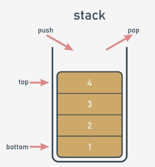
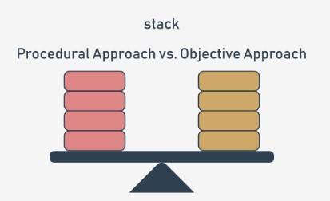

## 3.2.1.1 Uma curta viagem da abordagem processual à abordagem ao objeto

## O que é uma stack?

**Uma stack (pilha) é uma estrutura desenvolvida para armazenar dados de uma forma muito específica**. Imagine uma pilha de moedas. Não se pode colocar uma moeda em mais lado nenhum, a não ser no topo da pilha.

Da mesma forma, não se pode tirar uma moeda da pilha de qualquer outro lugar que não seja do topo da pilha. Se quiser obter a moeda que está no fundo, tem de retirar todas as moedas dos níveis superiores.

O nome alternativo para uma pilha (mas apenas em terminologia de TI) é **LIFO**.

É uma abreviação para uma descrição muito clara do comportamento da pilha: **Last In - First Out**. A moeda que chegou em último lugar à pilha sairá primeiro.

**Uma stack é um objeto** com duas operações elementares, convencionalmente denominadas **push** (quando um novo elemento é colocado no topo) e **pop** (quando um elemento existente é retirado do topo).

As stacks são muitas vezes utilizadas em muitos algoritmos clássicos, e é difícil imaginar a implementação de muitas ferramentas amplamente utilizadas sem o uso de stack.



Vamos implementar uma stack no Python. Esta será uma stack muito simples, e mostrar-lhe-emos como fazê-lo em duas abordagens independentes: processual e objetiva.

Vamos começar com a primeira.

## 3.2.1.2 Uma curta viagem da abordagem processual à abordagem ao objeto

## A stack - a abordagem processual

Primeiro, é preciso decidir como armazenar os valores que chegarão à stack. Sugerimos a utilização do mais simples dos métodos, e **o emprego de uma lista** para este trabalho. Vamos assumir que o tamanho da stack não é limitado de forma alguma. Vamos também assumir que o último elemento da lista armazena o elemento superior.

A stack em si já está criada:

`stack = []`

Estamos prontos para **definir uma função que coloca um valor na stack**. Aqui estão os pressupostos para tal:

* o nome para a função é `push`;
* a função obtém um parâmetro (este é o valor a ser colocado na stack)
* a função não devolve nada;
* a função anexa o valor do parâmetro ao fim da stack;

Foi assim que o fizemos - observe:

```
def push(val):
    stack.append(val)
```

Agora é hora de uma **função tirar um valor da stack**. É assim que o pode fazer:

* o nome da função é pop;
* a função não obtém nenhum parâmetro;
* a função devolve o valor retirado da stack
* a função lê o valor da parte superior da stack e remove-o.

A função está aqui:

```
def pop():
    val = stack[-1]
    del stack[-1]
    return val
```

Nota: a função não verifica se existe algum elemento na stack.

Vamos juntar todas as peças para pôr a stack em movimento. O **programa completo** empurra três números para a stack, puxa-os para fora e imprime os seus valores no ecrã. Pode vê-lo na janela do editor.

```
stack = []


def push(val):
    stack.append(val)


def pop():
    val = stack[-1]
    del stack[-1]
    return val


push(3)
push(2)
push(1)

print(pop())
print(pop())
print(pop())
```

O programa faz output do seguinte texto para o ecrã:

output

```
1
2
3
```

Teste-o.

## 3.2.1.3 Uma curta viagem da abordagem processual à abordagem ao objeto

## A stack - a abordagem processual vs. a abordagem orientada a objetos

A stack processual está pronta. Claro que existem algumas fraquezas, e a implementação poderia ser melhorada de muitas maneiras (aproveitar as exceções para o trabalho é uma boa ideia), mas em geral a stack está totalmente implementada, e pode utilizá-la se for necessário.

Mas quanto mais vezes a utilizar, mais desvantagens encontrará. Aqui estão algumas delas:

* a variável essencial (a lista da stack) é altamente **vulnerável**; qualquer pessoa pode modificá-la de uma forma incontrolável, destruindo a stack, de facto; isto não significa que tenha sido feita de forma maliciosa - pelo contrário, pode acontecer como resultado de descuido, por exemplo, quando alguém confunde nomes de variáveis; imagine que escreveu acidentalmente algo do género:

`stack[0] = 0`

O funcionamento da stackserá completamente desorganizado;

* pode também acontecer que um dia precise de mais do que uma stack; terá de criar outra lista para o armazenamento da stack, e provavelmente outras funções `push` e `pop` também;

* também pode acontecer que precisa não só de funções `push` e `pop` , mas também de algumas outras conveniências; poderia certamente implementá-las, mas tente imaginar o que aconteceria se tivesse dezenas de stacks implementadas separadamente.

A abordagem objetiva proporciona soluções para cada um dos problemas acima referidos. Vamos nomeá-las primeiro:

* a capacidade de ocultar (proteger) valores selecionados contra o acesso não autorizado chama-se **encapsulamento; os valores encapsulados não podem ser acedidos nem modificados se se quiser utilizá-los exclusivamente;**

* quando se tem uma classe implementando todos os comportamentos de stack necessários, pode-se produzir quantas stacks se quiser; não é necessário copiar ou replicar qualquer parte do código;

* a capacidade de enriquecer a stack com novas funções vem da herança; pode-se criar uma nova classe (uma subclasse) que herda todos os traços existentes da superclasse, e acrescenta alguns novos.



Vamos agora escrever uma nova implementação de stack a partir do zero. Desta vez, vamos utilizar a abordagem objetiva, guiando-o passo a passo para o mundo da programação de objetos.

## 3.2.1.4 Uma curta viagem da abordagem processual à abordagem ao objeto

## A stack - a abordagem ao objeto

Evidentemente, a ideia principal continua a ser a mesma. Usaremos uma lista como armazenamento da stack. Só temos que saber como colocar a lista na classe.

Comecemos do início absoluto - é assim que começa a stack objetiva:

`class Stack:`

Agora, esperamos duas coisas dela:

* queremos que a classe tenha **uma propriedade como armazenamento da stack** - temos de **"instalar" uma lista dentro de cada objeto da classe** (nota: cada objeto tem de ter a sua própria lista - a lista não deve ser partilhada entre diferentes stacks)
* em seguida, queremos que **a lista seja escondida** da vista dos utilizadores da classe.

Como é isto feito?

Ao contrário de outras linguagens de programação, o Python não tem meios de lhe permitir declarar tal propriedade sem mais nem menos.

Em vez disso, é necessário acrescentar uma declaração ou instrução específica. As propriedades têm que ser adicionadas à classe manualmente.

Como garante que tal atividade ocorre cada vez que a nova stack é criada?

Há uma forma simples de o fazer - é necessário **equipar a classe com uma função específica** - a sua especificidade é dupla:

* tem de ser nomeada de forma estrita;
* é invocada implicitamente, quando o novo objeto é criado.

Tal função é chamada de **construtor**, pois o seu objetivo geral é a **construção de um novo objeto**. O construtor deve saber tudo sobre a estrutura do objeto, e deve realizar todas as inicializações necessárias.

Vamos adicionar um construtor muito simples à nova classe. Veja o snippet:

```
class Stack:  # Defining the Stack class.
    def __init__(self):  # Defining the constructor function.
        print("Hi!")


stack_object = Stack()  # Instantiating the object.
```

E agora:

* o nome do construtor é sempre `__init__`;
* tem de ter **pelo menos um parâmetro** (discutiremos isto mais tarde); o parâmetro é usado para representar o objeto recentemente criado - pode usar o parâmetro para manipular o objeto, e para o enriquecer com as propriedades necessárias; fará uso disto em breve;

nota: o parâmetro obrigatório é geralmente chamado `self` - é apenas **uma convenção, mas deve segui-la** - simplifica o processo de leitura e compreensão do seu código.

O código está no editor. Execute-o agora.

Aqui está o seu output:

output

`Hi!`

Nota - não há vestígios de invocação do construtor dentro do código. Foi invocado implícita e automaticamente. Vamos fazer uso disso agora.

## 3.2.1.5 Uma curta viagem da abordagem processual à abordagem ao objeto

## A stack - a abordagem ao objeto: continuação

Qualquer mudança que faça no interior do construtor que modifique o estado do parâmetro `self` será refletido no objeto recém-criado.

Isto significa que se pode acrescentar qualquer propriedade ao objeto e a propriedade permanecerá lá até que o objeto termine a sua vida ou a propriedade seja explicitamente removida.

Agora vamos **adicionar apenas uma propriedade ao novo objeto** - uma lista para uma stack. Vamos nomeá-lo `stack_list`.

Tal como aqui:
```
class Stack:
    def __init__(self):
        self.stack_list = []


stack_object = Stack()
print(len(stack_object.stack_list))
```

Nota:

* utilizámos a notação pontilhada, tal como quando invocamos métodos; esta é a convenção geral para aceder às propriedades de um objeto - é necessário dar um nome ao objeto, colocar um ponto (.) depois dele, e especificar o nome da propriedade desejada; não use parêntesis! Não deseja invocar um método - deseja **aceder a uma propriedade**;
* se definir o valor de uma propriedade pela primeira vez (como no construtor), está a criá-la; a partir desse momento, o objeto tem a propriedade e está pronto a usar o seu valor;
* fizemos algo mais no código - tentámos aceder à propriedade `stack_list` de fora da classe imediatamente após o objeto ter sido criado; queremos verificar o comprimento atual da stack - conseguimos?

Sim, conseguimos - o código produz o seguinte output:

output

`0`


Isto não é que queremos da stack. Preferimos que `stack_list` seja **ocultado do mundo exterior**. Será isso possível?

Sim, e é simples, mas não muito intuitivo.

## 3.2.1.6 Uma curta viagem da abordagem processual à abordagem ao objeto

## A stack - a abordagem ao objeto: continuação

Observe - adicionamos dois underscores antes do nome `stack_list` - nada mais:
```
class Stack:
    def __init__(self):
        self.__stack_list = []

stack_object = Stack()
print(len(stack_object.__stack_list))
```

A alteração invalida o programa.

Porquê?

Quando qualquer componente de classe tem um **nome que começa com dois underscores (**`__`**), torna-se privado** - isto significa que só pode ser acedido de dentro da classe.

Não se pode vê-lo do mundo exterior. É assim que o Python implementa o conceito de **encapsulamento**.

Execute o programa para testar as nossas suposições - uma exceção `AttributeError` deve ser levantada.

## 3.2.1.7 Uma curta viagem da abordagem processual à abordagem ao objeto

## A abordagem ao objeto: uma stack do zero

Agora é altura de as duas funções (métodos) implementarem as operações push e pop. O Python assume que uma função deste tipo (uma atividade de classe) deve ser **imersa dentro do corpo da classe** - tal como um construtor.

Queremos invocar estas funções para valores `push` e `pop` . Isto significa que ambos devem ser acessíveis a todos os utilizadores da classe (em contraste com a lista previamente construída, que está escondida dos utilizadores comuns da classe).

Tal componente é chamado `público`, pelo que **não se pode começar o seu nome com dois (ou mais) underscores**. Há mais um requisito - **o nome não deve ter mais do que um underscore à direita**. Uma vez que nenhum underscore à direita satisfaz totalmente o requisito, pode-se assumir que o nome é aceitável.

As funções em si são simples. Dê uma vista de olhos:
```
class Stack:
    def __init__(self):
        self.__stack_list = []

    def push(self, val):
        self.__stack_list.append(val)

    def pop(self):
        val = self.__stack_list[-1]
        del self.__stack_list[-1]
        return val


stack_object = Stack()

stack_object.push(3)
stack_object.push(2)
stack_object.push(1)

print(stack_object.pop())
print(stack_object.pop())
print(stack_object.pop())
```

No entanto, há algo realmente estranho no código. As funções parecem familiares, mas têm mais parâmetros do que as suas contrapartes processuais.

Aqui, ambas as funções têm um parâmetro chamado `self` na primeira posição da lista de parâmetros.

É necessário? Sim, é.

Todos os métodos têm de ter este parâmetro. Desempenha o mesmo papel que o primeiro parâmetro construtor.

**Permite ao método aceder a entidades (propriedades e atividades/métodos) realizadas pelo objeto atual**. Não se pode omiti-lo. Sempre que o Python invoca um método, envia implicitamente o objeto atual como o primeiro argumento.

Isto significa que um **método é obrigado a ter pelo menos um parâmetro, que é utilizado pelo próprio Python** - não tem qualquer influência sobre ele.

Se o seu método não necessita de parâmetros, este deve ser especificado de qualquer forma. Se for concebido para processar apenas um parâmetro, é necessário especificar dois, e o primeiro continua a ter o mesmo papel.

Há mais uma coisa que requer explicação - a forma como os métodos são invocados a partir do interior da variável `__stack_list` .

Felizmente, é muito mais simples do que parece:

* a primeira fase entrega o objeto como um todo → `self`;
* a seguir, precisa de chegar à `__stack_list` lista → `self.__stack_list`;
* com `__stack_list` pronto a ser utilizado, pode executar o terceiro e último passo → `self.__stack_list.append(val)`.

A declaração de classe está completa, e todos os seus componentes foram listados. A classe está pronta a ser utilizada.

## 3.2.1.8 Uma curta viagem da abordagem processual à abordagem ao objeto

## A abordagem ao objeto: uma stack do zero

Ter uma tal classe abre algumas novas possibilidades. Por exemplo, pode agora ter mais do que uma stack a comportar-se da mesma maneira. Cada stack terá a sua própria cópia de dados privados, mas utilizará o mesmo conjunto de métodos.

Isto é exatamente o que queremos para este exemplo.

Analise o código:
```
class Stack:
    def __init__(self):
        self.__stack_list = []

    def push(self, val):
        self.__stack_list.append(val)

    def pop(self):
        val = self.__stack_list[-1]
        del self.__stack_list[-1]
        return val


stack_object_1 = Stack()
stack_object_2 = Stack()

stack_object_1.push(3)
stack_object_2.push(stack_object_1.pop())

print(stack_object_2.pop())
```

Existem **duas stacks criadas a partir da mesma classe base**. Elas trabalham **de forma independente**. Pode fazer mais delas se o desejar.

Execute o código no editor e veja o que acontece. Realize as suas próprias experiências.

output

`3`

## 3.2.1.9 Uma curta viagem da abordagem processual à abordagem ao objeto

## A abordagem de objeto: uma stack a partir do zero (continuação)

Analise o snippet abaixo - criámos três objetos da classe `Stack`. A seguir, fizemos malabarismos com eles. Tente prever o valor de output no ecrã.

```
class Stack:
    def __init__(self):
        self.__stack_list = []

    def push(self, val):
        self.__stack_list.append(val)

    def pop(self):
        val = self.__stack_list[-1]
        del self.__stack_list[-1]
        return val


little_stack = Stack()
another_stack = Stack()
funny_stack = Stack()

little_stack.push(1)
another_stack.push(little_stack.pop() + 1)
funny_stack.push(another_stack.pop() - 2)

print(funny_stack.pop())
```

Então, qual é o resultado? Execute o programa e verifique se estava certo.

## 3.2.1.10 Uma curta viagem da abordagem processual à abordagem ao objeto

## A abordagem de objeto: uma stack a partir do zero (continuação)

Agora, vamos um pouco mais longe. Vamos **adicionar uma nova classe para lidar com stacks**.

A nova classe deve ser capaz de **avaliar a soma de todos os elementos atualmente armazenados na stack.**

Não queremos modificar a stack definida previamente. Já é suficientemente bom nas suas aplicações, e não queremos que seja alterado de forma alguma. Queremos uma nova stack com novas capacidades. Por outras palavras, queremos construir uma subclasse da classe já existente `Stack` .

O primeiro passo é fácil: basta **definir uma nova subclasse apontando para a classe que será usada como a superclasse.**

Isto é o que parece:

```
class AddingStack(Stack):
    pass
```

A classe ainda não define nenhum componente novo, mas isso não significa que esteja vazia. **Recebe todos os componentes definidos pela sua superclasse** - o nome da superclasse é escrito antes dos dois pontos, diretamente após o nome da nova classe.

Isto é o que queremos da nova stack:

* queremos o método `push` não só para empurrar o valor para a stack, mas também para acrescentar o valor à variável `sum` ;
* queremos a função `pop` não só para tirar o valor da stack, mas também para subtrair o valor da variável `sum` .

Em primeiro lugar, vamos adicionar uma nova variável à classe. Será uma **variável privada**, como a lista de stack. Não queremos que ninguém manipule o valor `sum` .

Como já sabe, adicionar uma nova propriedade à classe é feito pelo construtor. Já sabe como fazer isso, mas há algo realmente intrigante no interior do construtor. Dê uma vista de olhos:

```
class AddingStack(Stack):
    def __init__(self):
        Stack.__init__(self)
        self.__sum = 0
```

A segunda linha do corpo do construtor cria uma propriedade chamada `__sum` - irá armazenar o total de todos os valores da stack.

Mas a linha antes que pareça diferente. O que é que faz? É realmente necessário? Sim, é.

Ao contrário de muitas outras linguagens, o Python obriga-o a **invocar explicitamente o construtor de uma superclasse.** Omitir este ponto terá efeitos nocivos - o objeto será privado da `lista __stack_list` . Uma tal stack não funcionará corretamente.

Esta é a única vez em que se pode invocar explicitamente qualquer um dos construtores disponíveis - pode ser feito dentro do construtor da subclasse.

Observe a sintaxe:

* especifica o nome da superclasse (esta é a classe cujo construtor pretende executar)
* coloca um ponto (`.`) depois disso;
* especifica o nome do construtor;
* tem de apontar para o objeto (a instância da classe) que tem de ser inicializado pelo construtor - é por isso que tem de especificar o argumento e utilizar a variável `self` aqui; nota: **a invocação de qualquer método (incluindo construtores) de fora da classe nunca requer que se coloque o argumento** `self` **na lista do argumento** - invocar um método de dentro da classe exige o uso explícito do argumento `self` , e tem de ser colocado em primeiro lugar na lista.
  
Nota: é geralmente uma prática recomendada invocar o construtor da superclasse antes de quaisquer outras inicializações que deseje realizar dentro da subclasse. Esta é a regra que temos seguido no snippet.

```
class Stack:
    def __init__(self):
        self.__stack_list = []

    def push(self, val):
        self.__stack_list.append(val)

    def pop(self):
        val = self.__stack_list[-1]
        del self.__stack_list[-1]
        return val


class AddingStack(Stack):
    def __init__(self):
        Stack.__init__(self)
        self.__sum = 0
```

## 3.2.1.11 Uma curta viagem da abordagem processual à abordagem ao objeto

## A abordagem de objeto: uma stack a partir do zero (continuação)

Em segundo lugar, vamos acrescentar dois métodos. Mas deixe-nos perguntar-lhe: está realmente a acrescentar? Já temos estes métodos na superclasse. Podemos fazer algo assim?

Sim, podemos. Isto significa que vamos **alterar a funcionalidade dos métodos, não os seus nomes**. Podemos dizer mais precisamente que a interface (a forma como os objetos são manuseados) da classe permanece a mesma quando se altera a implementação ao mesmo tempo.

Vamos começar com a implementação da função `push` . Isto é o que esperamos dela:

* acrescentar o valor à variável `__sum` ;
* empurrar o valor para a stack.

Nota: a segunda atividade já foi implementada dentro da superclasse - por isso podemos utilizá-la. Além disso, temos de o utilizar, uma vez que não há outra forma de aceder à variável `__stackList` .

É assim que o método `push` se parece na subclasse:

```
def push(self, val):
    self.__sum += val
    Stack.push(self, val)
```

Note-se a forma como invocamos a implementação anterior do método `push` (o disponível na superclasse):

* temos de especificar o nome da superclasse; isto é necessário para indicar claramente a classe que contém o método, para evitar confundi-la com qualquer outra função do mesmo nome;
* temos de especificar o objeto alvo e de o passar como primeiro argumento (não é implicitamente acrescentado à invocação neste contexto).

Dizemos que o método `push` foi substituído - o mesmo nome que na superclasse representa agora uma funcionalidade diferente.

```
class Stack:
    def __init__(self):
        self.__stackList = []

    def push(self, val):
        self.__stackList.append(val)

    def pop(self):
        val = self.__stackList[-1]
        del self.__stackList[-1]
        return val


class AddingStack(Stack):
    def __init__(self):
        Stack.__init__(self)
        self.__sum = 0


# Enter code here.
```

## 3.2.1.12 Uma curta viagem da abordagem processual à abordagem ao objeto

## A abordagem de objeto: uma stack a partir do zero (continuação)

Este é a nova função `pop` :

```
def pop(self):
    val = Stack.pop(self)
    self.__sum -= val
    return val
```

Até agora, definimos a variável `__sum` , mas não fornecemos um método para obter o seu valor. Parece estar escondido. Como podemos revelá-lo e fazê-lo de uma forma que ainda o proteja de modificações?

Temos de definir um novo método. Vamos nomeá-lo `get_sum`. A sua única tarefa será **devolver o valor** `__sum` .

Aqui está:

```
def get_sum(self):
    return self.__sum
```

Portanto, vejamos o programa no editor. O código completo da classe está lá. Podemos verificar o seu funcionamento agora, e fazemo-lo com a ajuda de muito poucas linhas adicionais de código.

```
class Stack:
    def __init__(self):
        self.__stack_list = []

    def push(self, val):
        self.__stack_list.append(val)

    def pop(self):
        val = self.__stack_list[-1]
        del self.__stack_list[-1]
        return val


class AddingStack(Stack):
    def __init__(self):
        Stack.__init__(self)
        self.__sum = 0

    def get_sum(self):
        return self.__sum

    def push(self, val):
        self.__sum += val
        Stack.push(self, val)

    def pop(self):
        val = Stack.pop(self)
        self.__sum -= val
        return val


stack_object = AddingStack()

for i in range(5):
    stack_object.push(i)
print(stack_object.get_sum())

for i in range(5):
    print(stack_object.pop())
```

Como pode ver, adicionamos cinco valores subsequentes à stack, imprimimos a sua soma, e retiramo-los todos da stack.

Muito bem, esta foi uma introdução muito breve à programação de objetos de Python. Em breve vamos falar-lhe de tudo isto com mais detalhe.

## 3.2.1.13 RESUMO DA SECÇÃO

## Key takeaways

1. Uma **stack** é um objeto concebido para armazenar dados utilizando o modelo **LIFO**. A stack realiza geralmente pelo menos duas operações, denominadas **push()** e **pop()**.

2. A implementação da stack num modelo processual levanta vários problemas que podem ser resolvidos pelas técnicas oferecidas pelo **OOP** (**O**bject **O**riented **P**rogramming):

3. Um **método** de classe é na realidade uma função declarada dentro da classe e capaz de aceder a todos os componentes da classe.

4. A parte da classe Python responsável pela criação de novos objetos é chamada de **construtor**, e é implementada como um método do nome `__init__`.

5. Cada declaração de método de classe deve conter pelo menos um parâmetro (sempre o primeiro) geralmente referido como `self`, e é usado pelos objetos para se identificarem.

6. Se quisermos esconder qualquer um dos componentes de uma classe do mundo exterior, devemos começar o seu nome com `__`. Tais componentes são chamados **privados**.


**Exercício 1**

Assumindo que existe uma classe chamada `Snakes`, escreva a primeira linha da declaração de classe `Python` , expressando o facto de a nova classe ser na realidade uma subclasse de Snake.

Verifique

`class Python(Snakes):`

**Exercício 2**

Faltou alguma coisa na seguinte declaração — o quê?

```
class Snakes
    def __init__():
        self.sound = 'Sssssss'
```

Verifique

A função `__init__()` não tem o parâmetro obrigatório (devemos nomeá-lo `self` para permanecer em conformidade com as normas).

**Exercício 3**

Modifique o código para garantir que a propriedade `venomous` é privada.
```
class Snakes
    def __init__(self):
        self.venomous = True
```

Verifique

O código deve ter a seguinte aparência:
```
class Snakes
    def __init__(self):
        self.__venomous = True
```

## 3.2.1.14 Contar stacks


## 3.2.1.15 Queue, também conhecida como FIFO LAB

## 3.2.1.16 Queue também conhecida como FIFO: parte 2 LAB
