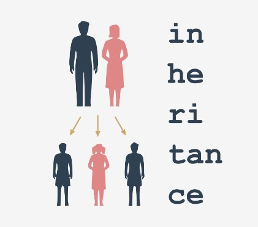

## 3.5.1.1 Fundamentos da OOP: Herança

## Herança - porquê e como?
Antes de começarmos a falar sobre heranças, queremos apresentar um novo e prático mecanismo utilizado pelas classes e objetos Python - **a forma como o objeto é capaz de se introduzir a si próprio.**

Vamos começar com um exemplo. Veja o código no editor.

```
class Star:
    def __init__(self, name, galaxy):
        self.name = name
        self.galaxy = galaxy


sun = Star("Sun", "Milky Way")
print(sun)
```

O programa imprime apenas uma linha de texto, que no nosso caso é a seguinte:

output

`<__main__.Star object at 0x7f1074cc7c50>`


Se executar o mesmo código no seu computador, verá algo muito semelhante, embora o número hexadecimal (a substring a começar por 0x) será diferente, uma vez que é apenas um identificador de objeto interno utilizado pelo Python, e é improvável que pareça o mesmo quando o mesmo código é executado num ambiente diferente.

Como pode ver, a impressão aqui não é realmente útil, e algo mais específico, ou apenas mais bonito, pode ser mais preferível.

Felizmente, o Python oferece precisamente tal função.

## 3.5.1.2 Fundamentos da OOP: Herança

## Herança - porquê e como?

Quando o Python precisa que qualquer classe/objeto seja apresentado como uma string (colocar um objeto como argumento na invocação de função `print()` encaixa-se nesta condição) ele tenta invocar um método chamado `__str__()` do objeto e usar a string que ele devolve.

O método por defeito `__str__()` devolve a string anterior - feia e não muito informativa. Pode alterá-lo apenas **definindo o seu próprio método do nome.**

Acabamos de fazer isso - veja o código no editor.

```
class Star:
    def __init__(self, name, galaxy):
        self.name = name
        self.galaxy = galaxy

    def __str__(self):
        return self.name + ' in ' + self.galaxy


sun = Star("Sun", "Milky Way")
print(sun)
```

Este novo método `__str__()` faz uma string consistindo nos nomes da estrela e da galáxia - nada de especial, mas os resultados da impressão parecem melhores agora, certo?

Consegue adivinhar o output? Execute o código para verificar se estava certo.

output

`Sun in Milky Way`

## 3.5.1.3 Fundamentos da OOP: Herança

## Herança - porquê e como?

O termo herança (inheritance) é mais antigo do que a programação de computadores, e descreve a prática comum de passar vários bens de uma pessoa para outra após a morte da primeira. O termo, quando relacionado à programação de computadores, tem um significado completamente diferente.





Vamos definir o termo para os nossos propósitos:

A herança é uma prática comum (na programação de objetos) de **passar atributos e métodos da superclasse (definida e existente) para uma classe recém-criada, chamada subclasse**.

Por outras palavras, a herança é **uma forma de construir uma nova classe, não a partir do zero, mas usando um repertório de traços já definidos**. A nova classe herda (e esta é a chave) todo o equipamento já existente, mas é capaz de adicionar alguns novos se necessário.

Graças a isso, é possível **construir classes mais especializadas (mais concretas)** usando alguns conjuntos de regras e comportamentos gerais predefinidos.

O fator mais importante do processo é a relação entre a superclasse e todas as suas subclasses (nota: se *B* é uma subclasse de *A* e *C* é uma subclasse de *B*, isto também significa que *C* é uma subclasse de *A*, uma vez que a relação é totalmente transitória).

Um exemplo muito simples de herança de **dois níveis** é apresentado aqui:

```
class Vehicle:
    pass


class LandVehicle(Vehicle):
    pass


class TrackedVehicle(LandVehicle):
    pass
```

Todas as classes apresentadas estão vazias por agora, pois vamos mostrar-lhe como funcionam as relações mútuas entre as super e as subclasses. Em breve iremos preenchê-las com conteúdos.

Podemos dizer que:

* A classe `Vehicle` é a superclasse para ambas as classes `LandVehicle` e `TrackedVehicle` ;
* A classe `LandVehicle` é uma subclasse de `Vehicle` e uma superclasse de `TrackedVehicle` ao mesmo tempo;
* A classe `TrackedVehicle` é uma subclasse de ambas as classes `Vehicle` e `LandVehicle` .

O conhecimento acima vem da leitura do código (por outras palavras, nós conhecemo-lo porque o podemos ver).

O Python sabe o mesmo? É possível perguntar ao Python sobre isso? Sim, é.

## 3.5.1.4 Fundamentos da OOP: Herança

## Herança: issubclass()

O Python oferece uma função que é capaz de **identificar uma relação entre duas classes**, e embora o seu diagnóstico não seja complexo, pode **verificar se uma determinada classe é uma subclasse de qualquer outra classe.**

É este o seu aspecto:

`issubclass(ClassOne, ClassTwo)`

A função devolve True Se `ClassOne` for uma subclasse de `ClassTwo`, e False caso contrário.

Vamos vê-lo em ação - pode surpreendê-lo. Veja o código no editor. Leia-o com atenção.

Existem dois loops nested. O seu objetivo é **verificar todos os pares de classes ordenados possíveis, e imprimir os resultados da verificação para determinar se o par corresponde à relação subclasse-superclasse.**

```
class Vehicle:
    pass


class LandVehicle(Vehicle):
    pass


class TrackedVehicle(LandVehicle):
    pass


for cls1 in [Vehicle, LandVehicle, TrackedVehicle]:
    for cls2 in [Vehicle, LandVehicle, TrackedVehicle]:
        print(issubclass(cls1, cls2), end="\t")
    print()
```

Execute o código. O programa produz o seguinte output:

output

```
True	False	False	
True	True	False	
True	True	True	
```

Vamos tornar o resultado mais legível:

|↓ é uma subclasse de →	|Vehicle	|LandVehicle	|TrackedVehicle|
|---|---|---|---|
|Vehicle	|`True`	|`False`	|`False`|
|LandVehicle	|`True`	|`True`	|`False`|
|TrackedVehicle	|`True`	|`True`	|`True`|

Há uma observação importante a fazer: **cada classe é considerada como uma subclasse de si mesma.**


