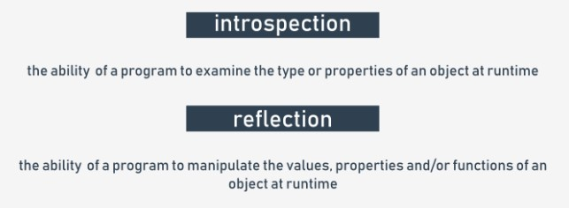

## 3.4.1.1 OOP: Métodos

## Métodos em detalhe

Vamos resumir todos os factos relativos à utilização de métodos em classes Python.

Como já sabe, um **método é uma função incorporada dentro de uma classe.**

Existe um requisito fundamental - um **método é obrigado a ter pelo menos um parâmetro** (não existem métodos sem parâmetros - um método pode ser invocado sem argumento, mas não declarado sem parâmetros).

O primeiro (ou único) parâmetro é geralmente chamado self. Sugerimos que siga a convenção - é normalmente usada, e causará algumas surpresas ao usar outros nomes para a mesma.

O nome self sugere a finalidade do parâmetro - **identifica o objeto para o qual o método é invocado.**

Se vai invocar um método, não deve passar o argumento para o parâmetro `self` - o Python irá configurá-lo por si.

O exemplo no editor mostra a diferença.

```
class Classy:
    def method(self):
        print("method")


obj = Classy()
obj.method()
```

Output do código:

output

`method`

Note a forma como criámos o objeto - **tratamos o nome da classe como uma função**, devolvendo um objeto recentemente instanciado da classe.

Se quiser que o método aceite outros parâmetros `self`, deve:

* colocá-los depois de `self` na definição do método;
* entregá-los durante a invocação sem especificar `self` (como anteriormente)

Tal como aqui:

```
class Classy:
    def method(self, par):
        print("method:", par)


obj = Classy()
obj.method(1)
obj.method(2)
obj.method(3)
```

Output do código:

output

```
method: 1
method: 2
method: 3
```

## 3.4.1.2 OOP: Métodos

## Métodos em detalhe: continuação

O parâmetro `self` é utilizado **para obter acesso à instância do objeto e às variáveis de classe.**

O exemplo mostra as duas formas de utilizar `self`:

```
class Classy:
    varia = 2
    def method(self):
        print(self.varia, self.var)


obj = Classy()
obj.var = 3
obj.method()
```

Output do código:

output

`2 3`

A função `self` é também utilizado **para invocar outros métodos objeto/classe de dentro da classe.**

Tal como aqui:

```
class Classy:
    def other(self):
        print("other")

    def method(self):
        print("method")
        self.other()


obj = Classy()
obj.method()
```

Output do código:

output

```
method
other
```

## 3.4.1.3 OOP: Métodos

## Métodos em detalhe: continuação

Se nomear um método como este: `__init__`, não será um método regular - será um **construtor**.

Se uma classe tem um construtor, é invocada automática e implicitamente quando o objeto da classe é instanciado.

O construtor:

* é **obrigado a ter o parâmetro** `self` (é definido automaticamente, como de costume);
* **pode (mas não é necessário) ter mais parâmetros** do que apenas `self`; se isto acontecer, a forma como o nome da classe é utilizado para criar o objeto deve refletir a definição `__init__` ;
* **pode ser utilizada para configurar o objeto**, ou seja, inicializar devidamente o seu estado interno, criar variáveis de instância, instanciar quaisquer outros objetos se a sua existência for necessária, etc.
Veja o código no editor. O exemplo mostra um construtor muito simples a trabalhar.

Execute-o. Output do código:

```
class Classy:
    def __init__(self, value):
        self.var = value


obj_1 = Classy("object")

print(obj_1.var)
```

output

`object`

Observe que o construtor:

* **não pode devolver um valor**, uma vez que foi concebido para devolver um objeto recém-criado e nada mais;
* **não pode ser invocado diretamente do objeto ou de dentro da classe** (pode invocar um construtor de qualquer uma das subclasses do objeto, mas discutiremos esta questão mais tarde).

## 3.4.1.4 OOP: Métodos

## Métodos em detalhe: continuação

Como `__init__` é um método, e um método é uma função, pode-se fazer os mesmos truques com construtores/métodos que se fazem com funções comuns.

O exemplo no editor mostra como definir um construtor com um valor de argumento padrão. Teste-o.

```
class Classy:
    def __init__(self, value = None):
        self.var = value


obj_1 = Classy("object")
obj_2 = Classy()

print(obj_1.var)
print(obj_2.var)
```

Output do código:

output

```
object
None
```

Tudo o que dissemos sobre **mangling de nome de propriedade** aplica-se também a nomes de métodos - um método cujo nome começa com `__` está (parcialmente) oculto.

O exemplo mostra este efeito:
```
class Classy:
    def visible(self):
        print("visible")
    
    def __hidden(self):
        print("hidden")


obj = Classy()
obj.visible()

try:
    obj.__hidden()
except:
    print("failed")

obj._Classy__hidden()
```

Output do código:

output

```
visible
failed
hidden
```

Execute o programa e teste-o.

## 3.4.1.5 OOP: Métodos

## A vida interior das classes e objetos

Cada classe de Python e cada objeto de Python é pré-equipada com um conjunto de atributos úteis que podem ser utilizados para examinar as suas capacidades.

Já conhece um destes - é a propriedade `__dict__` .

Vamos observar como lida com os métodos - vejamos o código no editor.

```
class Classy:
    varia = 1
    def __init__(self):
        self.var = 2

    def method(self):
        pass

    def __hidden(self):
        pass


obj = Classy()

print(obj.__dict__)
print(Classy.__dict__)
```

Execute-o para ver o seu output. Verifique o output com cuidado.

Encontre todos os métodos e atributos definidos. Localize o contexto no qual eles existem: dentro do objeto ou dentro da classe.

## 3.4.1.6 OOP: Métodos

## A vida interior das classes e objetos: continuação

`__dict__` é um dicionário. Outra propriedade integrada que vale a pena mencionar é `__name__`, que é uma string.

A propriedade contém o **nome da classe** Não é nada de excitante, apenas uma cadeia.

Nota: o atributo `__name__` está ausente do objeto - **só existe dentro das classes.**

Se quiser **encontrar a classe de um determinado objeto**, pode usar uma função chamada `type()`, que é capaz (entre outras coisas) de encontrar uma classe que tenha sido utilizada para instanciar qualquer objeto.

Olhe para o código no editor, execute-o, e veja por si mesmo.

```
class Classy:
    pass


print(Classy.__name__)
obj = Classy()
print(type(obj).__name__)
```

Output do código:

output

```
Classy
Classy
```

Observe que uma declaração como esta:

`print(obj.__name__)`

irá causar um erro.

## 3.4.1.7 OOP: Métodos

## A vida interior das classes e objetos: continuação

`__module__` é também uma string - **armazena o nome do módulo que contém a definição da classe.**

Vamos verificá-la - execute o código no editor.

```
class Classy:
    pass


print(Classy.__module__)
obj = Classy()
print(obj.__module__)
```

Output do código:

output

```
__main__
__main__
```

Como sabe, qualquer módulo chamado `__main__` não é na realidade um módulo, mas o **ficheiro atualmente em execução.**

## 3.4.1.8 OOP: Métodos

## A vida interior das classes e objetos: continuação

`__bases__` é um tuple. O **tuple contém classes** (não nomes de classe) que são superclasses diretas para a classe.

A ordem é a mesma que é utilizada dentro da definição de classe.

Mostrar-lhe-emos apenas um exemplo muito básico, uma vez que queremos destacar **como funciona a herança**.

Além disso, vamos mostrar-lhe como utilizar este atributo quando discutirmos os aspetos objetivos das exceções.

Nota: **apenas as classes têm este atributo** - os objetos não o têm.

Definimos uma função chamada `printbases()`, concebida para apresentar claramente o conteúdo do tuple.

Veja o código no editor. Analise e execute-o. Ele terá como output:

```
class SuperOne:
    pass


class SuperTwo:
    pass


class Sub(SuperOne, SuperTwo):
    pass


def printBases(cls):
    print('( ', end='')

    for x in cls.__bases__:
        print(x.__name__, end=' ')
    print(')')


printBases(SuperOne)
printBases(SuperTwo)
printBases(Sub)

```

output

```
( object )
( object )
( SuperOne SuperTwo )
```

Nota: **uma classe sem superclasses explícitas aponta para o objeto** (uma classe Python predefinida) como seu antepassado direto.

## 3.4.1.9 OOP: Métodos

## Reflexão e introspeção

Todos estes meios permitem ao programador Python realizar duas importantes atividades específicas a muitas linguagens objetivas. São elas:

* **introspeção**, que é a capacidade de um programa para examinar o tipo ou propriedades de um objeto em runtime;
* **reflexão**, que vai um passo além, e é a capacidade de um programa para manipular os valores, propriedades e/ou funções de um objeto em runtime.

Por outras palavras, não é necessário conhecer uma definição completa de classe/objeto para manipular o objeto, pois o objeto e/ou a sua classe contêm os metadados que lhe permitem reconhecer as suas características durante a execução do programa.




## 3.4.1.10 OOP: Métodos

## Investigar classes

O que se pode descobrir sobre as classes em Python? A resposta é simples - tudo.

Tanto a reflexão como a introspeção permitem a um programador fazer qualquer coisa com cada objeto, independentemente da sua proveniência.

Analise o código no editor.

```
class MyClass:
    pass


obj = MyClass()
obj.a = 1
obj.b = 2
obj.i = 3
obj.ireal = 3.5
obj.integer = 4
obj.z = 5


def incIntsI(obj):
    for name in obj.__dict__.keys():
        if name.startswith('i'):
            val = getattr(obj, name)
            if isinstance(val, int):
                setattr(obj, name, val + 1)


print(obj.__dict__)
incIntsI(obj)
print(obj.__dict__)

```

A função chamada `incIntsI()` obtém um objeto de qualquer classe, digitaliza o seu conteúdo a fim de encontrar todos os atributos inteiros com nomes que comecem por i, e incrementa-os por um.

Impossível? De modo algum!

É assim que funciona:

* linha 1: definir uma classe muito simples...
* linhas 3 a 10: ...e preenchê-la com alguns atributos;
* linha 12: esta é a nossa função!
* linha 13: digitalizar o atributo `__dict__` , procurando todos os nomes de atributos;
* linha 14: se um nome começar com i...
* linha 15: ...use a função `getattr()` para obter o seu valor atual; nota: `getattr()` toma dois argumentos: um objeto, e o seu nome de propriedade (como uma string), e devolve o valor do atributo atual;
* linha 16: verificar se o valor é do tipo inteiro, e utilizar a função `isinstance()` para este fim (discutiremos isto mais tarde);
* linha 17: se a verificação correr bem, aumente o valor da propriedade fazendo uso da função `setattr()` ; a função toma três argumentos: um objeto, o nome da propriedade (como uma string) e o novo valor da propriedade.

Output do código:

output

```
{'a': 1, 'integer': 4, 'b': 2, 'i': 3, 'z': 5, 'ireal': 3.5}
{'a': 1, 'integer': 5, 'b': 2, 'i': 4, 'z': 5, 'ireal': 3.5}
```

E é tudo!

## 3.4.1.11 RESUMO DA SECÇÃO

## Key takeaways

1. Um método é uma função incorporada dentro de uma classe. O primeiro (ou único) parâmetro de cada método é normalmente nomeado `self`, que se destina a identificar o objeto para o qual o método é invocado a fim de aceder às propriedades do objeto ou invocar os seus métodos.


2. Se uma classe contém um **construtor** (um método chamado `__init__`) não pode devolver qualquer valor e não pode ser invocada diretamente.


3. Todas as classes (mas não objetos) contêm uma propriedade chamada `__name__`, que armazena o nome da classe. Além disso, uma propriedade chamada `__module__` armazena o nome do módulo no qual a classe foi declarada, enquanto a propriedade nomeada `__bases__` é um tuple contendo as superclasses de uma classe.

Por exemplo:
```
class Sample:
    def __init__(self):
        self.name = Sample.__name__
    def myself(self):
        print("My name is " + self.name + " living in a " + Sample.__module__)


obj = Sample()
obj.myself()
```

Output do código:

output

`My name is Sample living in a __main__`


**Exercício 1**

A declaração da classe `Snake` é dada abaixo. Enriqueça a classe com um método chamado `increment()`, adicionando `1` à `__victims` propriedade.
```
class Snake:
    def __init__(self):
        self.victims = 0
```

Verifique

```
class Snake:
    def __init__(self):
        self.victims = 0

    def increment(self):
        self.victims += 1
```

**Exercício 2**

Redefina o construtor de classe `Snake` , para que tenha um parâmetro para inicializar o campo `victims` com um valor passado para o objeto durante a construção.


Verifique
```
class Snake:
    def __init__(self, victims):
        self.victims = victims	
```

**Exercício 3**

Consegue prever o output do seguinte código?
```
class Snake:
    pass


class Python(Snake):
    pass


print(Python.__name__, 'is a', Snake.__name__)
print(Python.__bases__[0].__name__, 'can be', Python.__name__)
```

Verifique

```
Python is a Snake
Snake can be Python
```

## 3.4.1.12 A classe Timer LAB

## 3.4.1.13 Dias da semana LAB

## 3.4.1.14 Pontos num plano LAB

## 3.4.1.15 Triângulo LAB
