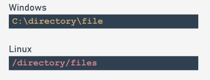
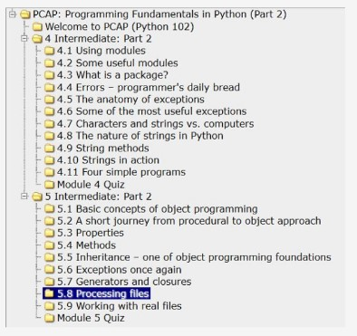
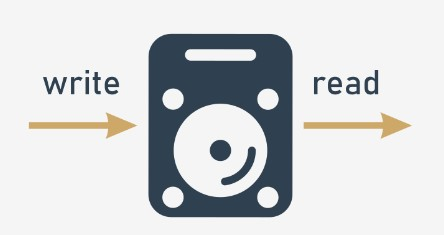

## 4.2.1.1 Processamento de arquivos

## Aceder a arquivos a partir de código Python

Um dos problemas mais comuns no trabalho do programador é **processar dados armazenados** em arquivos, enquanto os arquivos são normalmente armazenados fisicamente utilizando dispositivos de armazenamento - discos rígidos, ópticos, de rede ou solid-state.

É fácil imaginar um programa que ordena 20 números, e é igualmente fácil imaginar o utilizador deste programa a introduzir estes vinte números diretamente a partir do teclado.

É muito mais difícil imaginar a mesma tarefa quando há 20.000 números a serem ordenados, e não há um único utilizador que seja capaz de introduzir estes números sem cometer um erro.

É muito mais fácil imaginar que estes números são armazenados no arquivo de disco que é lido pelo programa. O programa classifica os números e não os envia para o ecrã, mas em vez disso cria um novo arquivo e guarda a sequência ordenada de números lá.

Se quisermos implementar um banco de dados simples, a única maneira de armazenar a informação entre execuções do programa é guardá-la num arquivo (ou arquivos se a sua base de dados for mais complexa).

Em princípio, qualquer problema de programação não simples depende do uso de arquivos, quer processe imagens (armazenadas em arquivos), multiplique matrizes (armazenadas em arquivos) ou calcule salários e impostos (leitura de dados armazenados em arquivos).


Pode perguntar-se porque esperámos até agora para lhe mostrar estas questões.

A resposta é muito simples - a forma do Python de aceder e processar arquivos é implementada usando um conjunto consistente de objetos. Não há melhor momento para falar sobre o assunto.

## 4.2.1.2 Processamento de arquivos

## Nomes de arquivo

Diferentes sistemas operativos podem tratar os arquivos de diferentes formas. Por exemplo, o Windows utiliza uma convenção de nomes diferente da adotada nos sistemas Unix/Linux.

Se utilizarmos a noção de um nome de arquivo canónico (um nome que define de forma única a localização do arquivo independentemente do seu nível na árvore de diretoria) podemos perceber que estes nomes têm um aspeto diferente no Windows e no Unix/Linux:



Como pode ver, os sistemas derivados de Unix/Linux não utilizam a letra da unidade de disco (por exemplo, `C:`) e todas as diretorias crescem a partir de uma diretoria de raiz chamada `/`, enquanto os sistemas Windows reconhecem a diretoria de raiz como `\`.

Além disso, os nomes dos arquivos do sistema Unix/Linux são sensíveis a maiúsculas e minúsculas. Os sistemas Windows armazenam a maiúscula ou minúscula das letras utilizadas no nome do arquivo, mas não distinguem de todo se são de facto maiúsculas ou minúsculas.

Isto significa que estas duas strings: `ThisIsTheNameOfTheFile` e `thisisthenameofthefile` descrevem dois arquivos diferentes em sistemas Unix/Linux, mas são o mesmo nome para apenas um arquivo em sistemas Windows.

A principal e mais marcante diferença é que tem de usar **dois separadores diferentes para os nomes das diretorios:** `\` no Windows, e `/` em Unix/Linux.

Esta diferença não é muito importante para o utilizador normal, mas é **muito importante quando se escreve programas em Python.**

Para entender o porquê, tente recordar o papel muito específico desempenhado pelo `\` dentro de strings Python.

## 4.2.1.3 Processamento de arquivos

## Nomes de arquivos: continuação

Suponha que está interessado num arquivo específico localizado na diretoria `dir`, e nomeado file.

Suponha também que pretende atribuir uma string contendo o nome do arquivo.

Em sistemas Unix/Linux, pode parecer-se com o seguinte:

`name = "/dir/file"`

Mas se o tentar codificar para o sistema Windows:

`name = "\dir\file"`

terá uma surpresa desagradável: ou o Python irá gerar um erro, ou a execução do programa irá comportar-se de forma estranha, como se o nome do arquivo tivesse sido distorcido de alguma forma.

Na verdade, não é estranho, mas bastante óbvio e natural. O Python usa o `\` como um caratere de escape (como `\n`).

Isto significa que os nomes dos arquivos do Windows devem ser escritos da seguinte forma:

`name = "\\dir\\file"`

Felizmente, há também mais uma solução. O Python é suficientemente inteligente para ser capaz de converter barras em barras invertidas, cada vez que descobre que tal é exigido pelo sistema operativo.

Isto significa que quaisquer das seguintes tarefas:
```
name = "/dir/file"
name = "c:/dir/file"
```

funcionará com o Windows, também.

Qualquer programa escrito em Python (e não só em Python, porque essa convenção se aplica a praticamente todas as linguagens de programação) não comunica diretamente com os arquivos, mas através de algumas entidades abstratas que são nomeadas de forma diferente em diferentes linguagens ou ambientes - os termos mais utilizados são **handles** ou **streams** (vamos usá-los aqui como sinónimos).

O programador, tendo um conjunto de funções/métodos mais ou menos ricos, é capaz de realizar certas operações no stream, que afetam os arquivos reais utilizando mecanismos contidos no kernel do sistema operativo.

Desta forma, é possível implementar o processo de acesso a qualquer arquivo, mesmo quando o nome do arquivo é desconhecido no momento da redação do programa.

As operações realizadas com o stream abstrato refletem as atividades relacionadas com o arquivo físico.





Para conectar (vincular) o stream com o arquivo, é necessário realizar uma operação explícita.

A operação de conectar o stream com um arquivo chama-se **abrir o arquivo**, enquanto que desconectar esta ligação chama-se **fechar o arquivo**.

Assim, a conclusão é que a primeira operação realizada no stream é sempre `open` e a última é `close`. O programa, na verdade, é livre de manipular o stream entre estes dois eventos e para lidar com o arquivo associado.

Esta liberdade é limitada, naturalmente, pelas características físicas do arquivo e pela forma como o arquivo foi aberto.

Digamos novamente que a abertura do stream pode falhar, e pode acontecer devido a várias razões: a mais comum é a falta de um arquivo com um nome especificado.

Também pode acontecer que o arquivo físico exista, mas o programa não está autorizado a abri-lo. Há também o risco de que o programa tenha aberto demasiados streams, e o sistema operacional específico pode não permitir a abertura simultânea de mais de n arquivos (por exemplo, 200).

Um programa bem escrito deve detetar estas aberturas falhadas, e reagir em conformidade.

## 4.2.1.4 Processamento de arquivos

## Stream de arquivos

A abertura do stream não está apenas associada ao arquivo, mas deve também declarar a forma pela qual o stream será processado. Esta declaração é chamada **open mode** (modo aberto).

Se a abertura for bem sucedida, o **programa será autorizado a executar apenas as operações que sejam consistentes com o open mode declarado.**

Há duas operações básicas executadas no stream:

* **ler** a partir do stream: as porções dos dados são recuperadas do arquivo e colocadas numa área da memória gerida pelo programa (por exemplo, uma variável);
* **escrever** para o stream: as porções dos dados da memória (por exemplo, uma variável) são transferidas para o arquivo.

Existem três modos básicos usados para abrir o stream:

* **read mode** (modo de leitura): um stream aberto neste modo permite **apenas operações de leitura**; tentar escrever no stream causará uma exceção (nomeada `UnsupportedOperation`, que herda `OSError` e `ValueError`, e vem do `io` módulo);
* **write mode** (modo de escrita): um stream aberto neste modo permite **apenas operações de escrita**; tentar ler o stream causará a exceção mencionada acima;
* **update mode** (modo de atualização): um stream aberto neste modo permite **tanto escritas como leituras.**

Antes de discutirmos como manipular os streams, devemos-lhe algumas explicações. **O stream comporta-se quase como um gravador**.

Quando se lê algo de um stream, uma cabeça virtual move-se sobre o stream de acordo com o número de bytes transferidos do stream.

Quando se escreve algo no stream, a mesma cabeça move-se ao longo do stream gravando os dados a partir da memória.

Sempre que falarmos de ler e escrever para o stream, tente imaginar esta analogia. Os livros de programação referem-se a este mecanismo como a **current file position** (posição atual do arquivo), e também utilizaremos este termo.



Agora é necessário mostrar-lhe o objeto responsável por representar streams em programas.

## 4.2.1.5 Processamento de arquivos

## Handles de arquivo

O Python assume que **cada arquivo está escondido atrás de um objeto de uma classe adequada.**

Claro, é difícil não perguntar como interpretar a palavra *adequada*.

Os arquivos podem ser processados de várias maneiras - alguns deles dependem do conteúdo do arquivo, alguns das intenções do programador.

Em qualquer um dos casos, arquivos diferentes podem exigir diferentes conjuntos de operações, e comportar-se de maneiras diferentes.

Um objeto de uma classe adequada **é criado quando se abre o arquivo e aniquilado no momento do encerramento.**

Entre estes dois eventos, pode-se usar o objeto para especificar quais as operações que devem ser executadas num stream específico. As operações que tem permissão para usar são impostas pela **forma como abriu o arquivo**.

Em geral, o objeto vem de uma das classes mostradas aqui:


Nota: nunca se usa construtores para dar vida a estes objetos. A única forma de os **obter é ao invocar a função chamada** `open()`.

A função analisa os argumentos que forneceu e cria automaticamente o objeto necessário.

Se se quiser **livrar do objeto, invoca-se o método chamado** `close()`.

A invocação irá cortar a ligação com o objeto e o arquivo, e removerá o objeto.

Para os nossos propósitos, vamos preocupar-nos apenas com fluxos representados por objetos `BufferIOBase` e `TextIOBase` . Compreenderá porquê em breve.

## 4.2.1.6 Processamento de arquivos

## Handles de arquivos: continuação

Devido ao tipo de conteúdo do stream, **todos os streams estão divididos em streams de texto e streams binários.**

Os streams de texto são estruturados em linhas; ou seja, contêm carateres tipográficos (letras, dígitos, pontuação, etc.) dispostos em filas (linhas), como se vê a olho nu quando se olha para o conteúdo do arquivo no editor.

Este arquivo é escrito (ou lido) na sua maioria, caratere por caratere, ou linha por linha.

Os streams binários não contêm texto mas uma sequência de bytes de qualquer valor. Esta sequência pode ser, por exemplo, um programa executável, uma imagem, um áudio ou um videoclipe, um arquivo de base de dados, etc.

Como estes arquivos não contêm linhas, as leituras e escritas referem-se a porções de dados de qualquer tamanho. Assim, os dados são lidos/escritos byte a byte, ou bloco a bloco, onde o tamanho do bloco varia geralmente de um a um valor arbitrariamente escolhido.

Então aparece um problema subtil. Nos sistemas Unix/Linux, as extremidades das linhas são marcadas por um único caratere chamado `LF` (código ASCII 10) designado nos programas Python como `\n`.

Outros sistemas operativos, especialmente estes derivados do sistema pré-histórico CP/M (que também se aplica aos sistemas da família Windows) utilizam uma convenção diferente: o fim da linha é marcado por um par de carateres, `CR` e `LF` (códigos ASCII 13 e 10) que podem ser codificados como `\r\n`.


Esta ambiguidade pode causar várias consequências desagradáveis.

Se criar um programa responsável pelo processamento de um arquivo de texto, e este for escrito para Windows, pode reconhecer as extremidades das linhas ao encontrar os carateres `\r\n` , mas o mesmo programa em execução num ambiente Unix/Linux será completamente inútil, e vice-versa: o programa escrito para sistemas Unix/Linux poderá ser inútil no Windows.

Estas características indesejáveis do programa, que impedem ou dificultam a utilização do programa em diferentes ambientes, são chamadas **não-portabilidade**.

Da mesma forma, a característica do programa que permite a execução em diferentes ambientes chama-se **portabilidade**. Um programa dotado de tal característica é chamado um **programa portátil**.

## 4.2.1.7 Processamento de arquivos

## Handles de arquivos: continuação

Uma vez que as questões de portabilidade eram (e ainda são) muito sérias, foi tomada a decisão de resolver definitivamente a questão de uma forma que não atrai a atenção do programador.


Foi feito ao nível das classes, que são responsáveis pela leitura e escrita dos carateres de e para o stream. Funciona da seguinte maneira:

* quando o stream está aberto e é avisado que os dados no arquivo associado serão processados como texto (ou não existe tal aviso), é **mudada para o modo de texto;**

* durante a leitura/escrita de linhas de/para o arquivo associado, nada de especial ocorre no ambiente Unix, mas quando as mesmas operações são realizadas no ambiente Windows, ocorre um processo chamado **tradução de carateres newline**: quando se lê uma linha do arquivo, cada par de carateres `\r\n` é substituído por um único caratere `\n` , e vice-versa; durante as operações de escrita, cada caratere `\n` é substituído por um par de `\r\n` carateres;

* o mecanismo é completamente **transparente** para o programa, que pode ser escrito como se fosse destinado a processar apenas arquivos de texto Unix/Linux; o source code executado num ambiente Windows também funcionará corretamente;

* quando o stream está aberto e é aconselhado a fazê-lo, o seu conteúdo é tomado tal como está, **sem qualquer conversão** - nenhum byte é adicionado ou omitido.

## Abertura dos streams

A **abertura do stream** é realizada por uma função que pode ser invocada da seguinte forma:

`stream = open(file, mode = 'r', encoding = None)`

Vamos analisá-la:

* o nome da função (`open`) fala por si; se a abertura for bem sucedida, a função devolve um objeto de stream; caso contrário, é levantada uma exceção (por exemplo, `FileNotFoundError` **se o arquivo que vai ler não existir**);

* o primeiro parâmetro da função (`file`) especifica o nome do arquivo a ser associado ao stream;

* o segundo parâmetro (`mode`) especifica o modo aberto utilizado para o stream; é uma string cheia de carateres, e cada um deles tem o seu significado especial (mais detalhes em breve);

* o terceiro parâmetro (`encoding`) especifica o tipo de codificação (por exemplo, UTF-8 quando se trabalha com arquivos de texto)

* a abertura deve ser a primeira operação realizada no stream.
Nota: o modo e os argumentos de codificação podem ser omitidos - os seus valores por defeito são então assumidos. O modo de abertura padrão é a leitura em modo de texto, enquanto que a codificação padrão depende da plataforma utilizada.

Deixe-nos agora apresentar-lhe os modos abertos mais importantes e úteis. Preparado?

## 4.2.1.8 Processamento de arquivos

## Abrir os streams: modos

`r` modo aberto: read

* o stream será aberto em **read mode** (modo de leitura);
* o arquivo associado ao stream **tem de existir** e tem de ser legível, caso contrário a função `open()` levanta uma exceção.

`w` modo aberto: write

* o stream será aberto em **write mode** (modo de escrita);
* o arquivo associado ao stream **não precisa de existir**; se não existir, será criado; se existir, será truncado até ao comprimento de zero (apagado); se a criação não for possível (por exemplo, devido às permissões do sistema) a função open() levanta uma exceção.

`a` modo aberto: append

* o stream será aberto em **append mode** (modo anexo);
* o arquivo associado ao stream **não precisa de existir**; se não existir, será criado; se existir, a cabeça de gravação virtual será colocada no fim do arquivo (o conteúdo anterior do arquivo permanece intocado).

`r+` modo aberto: read and update

* o stream será aberto em **read and update mode** (modo de leitura e atualização);
* o arquivo associado ao stream **tem de existir e tem de ser gravável**, caso contrário a função `open()` levanta uma exceção;
* tanto as operações de leitura como de escrita são permitidas para o stream.

`w+` modo aberto: write and update

* o stream será aberto em **write and update mode** (modo de gravação e atualização);
* o arquivo associado ao stream **não precisa de existir**; se não existir, será criado; o conteúdo anterior do arquivo permanece intocado;
* tanto as operações de leitura como de escrita são permitidas para o stream.

## Seleção de texto e modos binários

Se houver uma letra b no final da string de modo significa que o stream deve ser aberto no **modo binário**.

Se a string de modo termina com uma letra `t` o stream é aberto no **modo de texto**.

O modo de texto é o comportamento por defeito assumido quando não é utilizado um especificador do modo binário/texto.

Finalmente, a abertura bem sucedida do arquivo irá definir a posição atual do arquivo (a cabeça de leitura/escrita virtual) antes do primeiro byte do arquivo, **se o modo não for** `a` e após o último byte de arquivo **se o modo estiver definido para** `a`.


|**Modo de texto**	|**Modo binário**	|Descrição|
|---|---|---|
|`rt`	|`rb`	|read|
|`wt`	|`wb`	|write|
|`at`	|`ab`	|append|
|`r+t`	|`r+b`	|read and update|
|`w+t`	|`w+b`	|write and update|

**EXTRA**

Também se pode abrir um arquivo para a sua criação exclusiva. Pode fazer isto usando o `x` modo aberto. Se o arquivo já existir, a função `open()` irá levantar uma exceção.

## 4.2.1.9 Processamento de arquivos

## Abrir o stream pela primeira vez

Imagine que queremos desenvolver um programa que leia o conteúdo do arquivo de texto nomeado: `C:\Users\User\Desktop\file.txt.`

Como abrir esse arquivo para leitura? Aqui está o snippet relevante do código:
```
try:
    stream = open("C:\Users\User\Desktop\file.txt", "rt")
    # Processing goes here.
    stream.close()
except Exception as exc:
    print("Cannot open the file:", exc)
```

O que se passa aqui?

* abrimos o bloco try-except porque queremos lidar suavemente com os erros de runtime;
* utilizámos a função `open()` para tentar abrir o arquivo especificado (note a forma como especificámos o nome do arquivo)
* o modo aberto é definido como texto a ler (como **o texto é a definição padrão**, podemos saltar o `t` na string de modo)
* em caso de sucesso, obtemos um objeto da função open() e atribuímo-lo à variável de stream;
* Se `open()` falhar, tratamos da exceção imprimindo a informação de erro completa (é bom saber o que aconteceu exatamente)
  
## Streams pré-abertos

Dissemos anteriormente que qualquer operação de stream deve ser precedida pela `open()` invocação de função. Existem três exceções bem definidas à regra.

Quando o nosso programa começa, os três streams já estão abertos e não requerem quaisquer preparações extra. Além disso, o seu programa pode utilizar estes streams explicitamente se tiver o cuidado de importar o módulo `sys` :

`import sys`

porque é aí que a declaração dos três streams é colocada.

Os nomes desses streams são: `sys.stdin`, `sys.stdout`, e `sys.stderr`.

Vamos analisá-los:

* `sys.stdin`
    * `stdin` (de standard input)
    * o stream `stdin` é normalmente associado ao teclado, pré-aberto para leitura e considerado como a principal fonte de dados para os programas em execução;
    * a bem conhecida função `input()` lê dados de `stdin` por defeito.

* `sys.stdout`
    * stdout (de standard output)
    * o stream `stdout` é normalmente associado ao ecrã, pré-aberto para escrita, considerado como o alvo principal para o output de dados pelo programa em execução;
    * a bem conhecida função `print()` faz output dos dados para o stream `stdout` .

* `sys.stderr`
    * `stderr` (de standard error output)
    * o stream `stderr` é normalmente associado ao ecrã, pré-aberto para escrita, considerado como o local principal onde o programa em execução deve enviar informações sobre os erros encontrados durante o seu trabalho;
    * não apresentámos nenhum método para enviar os dados para este stream (fá-lo-emos em breve, prometemos)
    * a separação de `stdout` (resultados úteis produzidos pelo programa) a partir de `stderr` (mensagens de erro, inegavelmente úteis mas que não fornecem resultados) dá a possibilidade de redirecionar estes dois tipos de informação para os diferentes alvos. Uma discussão mais alargada sobre esta questão está para além do âmbito do nosso curso. O manual do sistema de funcionamento fornecerá mais informações sobre estas questões.

## 4.2.1.10 Processamento de arquivos

## Fechar streams

A última operação executada num stream (não inclui streams `stdin`, `stdout`, e `stderr` que não o exijam) deve estar **a fechar**.

Essa ação é executada por um método invocado de dentro do objeto de stream aberto: `stream.close()`.

* o nome da função definitivamente comenta-se a si próprio: `close()`
* a função não espera exatamente nenhum argumento; o stream não precisa de ser aberto
* a função não devolve nada, mas levanta a exceção IOError em caso de erro;
* a maioria dos programadores acreditam que a função `close()` é sempre bem sucedida e, portanto, não há necessidade de verificar se cumpriu devidamente a sua tarefa.

    Esta crença é apenas parcialmente justificada. Se o stream foi aberto para escrita e, em seguida, uma série de operações de escrita foram executadas, pode acontecer que os dados enviados para o stream ainda não tenham sido transferidos para o dispositivo físico (devido a um mecanismo chamado **caching** ou **buffering**).

    Uma vez que o fecho do stream força os buffers a lhes fazer flush, pode ser que os flushes falhem e, portanto, a `close()` falha também.

Já mencionámos falhas causadas por funções que operam com streams, mas não mencionámos uma palavra sobre como podemos identificar exatamente a causa da falha.

A possibilidade de fazer um diagnóstico existe e é fornecida por um componente de exceção dos streams de que vamos falar agora.

## Diagnosticar problemas de stream

O objeto `IOError` está equipado com uma propriedade chamada `errno` (o nome vem da frase error number) e pode acedê-lo da seguinte forma:

```
try:
    # Some stream operations.
except IOError as exc:
    print(exc.errno)
```

O valor do atributo `errno` pode ser comparado com uma das constantes simbólicas predefinidas, definidas no módulo `errno` .

Vamos dar uma vista de olhos a algumas **constantes úteis para detetar erros de stream:**

* `errno.EACCES` → Permission denied

    O erro ocorre quando tenta, por exemplo, abrir um arquivo com o atributo read only para escrita.

* `errno.EBADF` → Bad file number

    O erro ocorre quando tenta, por exemplo, operar com um stream não aberto.

* `errno.EEXIST` → File exists

    O erro ocorre quando tenta, por exemplo, renomear um arquivo com o seu nome anterior.

* `errno.EFBIG` → File too large

    O erro ocorre quando tenta criar um arquivo maior do que o máximo permitido pelo sistema operativo.

* `errno.EISDIR` → Is a directory

    O erro ocorre quando tenta tratar um nome de diretoria como o nome de um arquivo comum.

* `errno.EMFILE` → Too many open files

    O erro ocorre quando tenta abrir simultaneamente mais streams do que os aceitáveis para o seu sistema operativo.

* `errno.ENOENT` → No such file or directory

    O erro ocorre quando tenta aceder a um arquivo/diretoria inexistente.

* `errno.ENOSPC` → No space left on device

    O erro ocorre quando não há espaço livre na media.

A lista completa é muito mais longa (inclui também alguns códigos de erro não relacionados ao processamento de stream.)

## 4.2.1.11 Processamento de arquivos

## Diagnosticar problemas de stream: continuação

Se você for programador muito cuidadoso, poderá sentir a necessidade de utilizar a sequência de afirmações semelhante às apresentadas no editor.

Felizmente, existe uma função que pode drasticamente **simplificar o código de tratamento de erros.**

O seu nome é `strerror()`, e vem do módulo `os` e **espera apenas um argumento - um número de erro.**

O seu papel é simples: dá-se um número de erro e obtém-se uma string descrevendo o significado do erro.

Nota: se passar um código de erro inexistente (um número que não está vinculado a nenhum erro real), a função irá levantar uma exceção `ValueError` .

Agora podemos simplificar o nosso código da seguinte forma:

```
from os import strerror

try:
    s = open("c:/users/user/Desktop/file.txt", "rt")
    # Actual processing goes here.
    s.close()
except Exception as exc:
    print("The file could not be opened:", strerror(exc.errno))
```

Okay. Agora é altura de lidar com arquivos de texto e familiarizar-se com algumas técnicas básicas que pode utilizar para os processar.

```
import errno

try:
    s = open("c:/users/user/Desktop/file.txt", "rt")
    # Actual processing goes here.
    s.close()
except Exception as exc:
    if exc.errno == errno.ENOENT:
        print("The file doesn't exist.")
    elif exc.errno == errno.EMFILE:
        print("You've opened too many files.")
    else:
        print("The error number is:", exc.errno)
```

## 4.2.1.12 RESUMO DA SEÇÃO

## Key takeaways

1. Um arquivo tem de estar **aberto** antes de poder ser processado por um programa, e deve estar **fechado** quando o processamento estiver terminado.

A abertura do arquivo associa-o ao **stream**, que é uma representação abstrata dos dados físicos armazenados na media. A forma como o stream é processado é chamada **modo aberto**. Existem **três** modos abertos:

* **modo de leitura** — apenas são permitidas operações de leitura;
* **modo de escrita** — apenas são permitidas operações de escrita;
* **modo de update** — tanto as escritas como as leituras são permitidas.

2. Dependendo do conteúdo do arquivo físico, diferentes classes de Python podem ser utilizadas para processar arquivos. Em geral, o `BufferedIOBase` é capaz de processar qualquer arquivo, enquanto `TextIOBase` é uma classe especializada dedicada ao processamento de arquivos de texto (ou seja, arquivos contendo textos visíveis para humanos, divididos em linhas utilizando marcadores de nova linha). Assim, os streams podem ser divididos em **binários** e de **texto**.

3. A seguinte sintaxe da função `open()` é utilizada para abrir um arquivo:

`open(file_name, mode=open_mode, encoding=text_encoding)`

A invocação cria um objeto de fluxo e associa-o ao arquivo com o nome `file_name`, usando o especificado `open_mode` e definindo o especificado `text_encoding`, ou **levanta uma exceção no caso de um erro.**

4. Três streams **predefinidos** já estão abertos quando o programa é iniciado:

* `sys.stdin` — standard input;
* `sys.stdout` — standard output;
* `sys.stderr` — standard error output.

4. O objeto da exceção `IOError` , criado quando qualquer operação de arquivo falha (incluindo operações abertas), contém uma propriedade chamada `errno`, que contém o código de conclusão da ação falhada. Use este valor para diagnosticar o problema.


**Exercício 1**

Como codificar o valor do argumento `open()` da função `mode` se for criar um novo arquivo de texto para o preencher apenas com um artigo?

Verifique

`"wt"` ou `"w"`

**Exercício 2**

Qual é o significado do valor representado por `errno.EACESS`?

Verifique

**Permissão negada**: não tem permissão para aceder ao conteúdo do arquivo.

**Exercício 3**

Qual é o output esperado do código seguinte, supondo que o arquivo nomeado file não existe?

```
import errno

try:
    stream = open("file", "rb")
    print("exists")
    stream.close()
except IOError as error:
    if error.errno == errno.ENOENT:
        print("absent")
    else:
        print("unknown")
```

Verifique

`absent`

