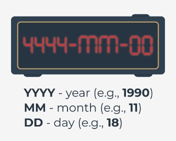

## 4.5.1.1 O módulo datetime

## Introdução ao módulo datetime .

Nesta secção, aprenderá sobre um módulo Python chamado datetime.

Como pode adivinhar, proporciona **classes para trabalhar com data e hora**. Se pensa que não precisa de aprofundar este tópico, falemos de exemplos de utilização de data e hora na programação.

Data e hora têm inúmeras utilizações e é provavelmente difícil encontrar uma aplicação de produção que não as utilize. Aqui estão alguns exemplos:

* **registo de eventos** - graças ao conhecimento da data e hora, somos capazes de determinar quando ocorre exatamente um erro crítico na nossa aplicação. Ao criar registos, pode especificar o formato de data e hora;
* **reastreamento de alterações na base de dados** - por vezes é necessário armazenar informação sobre quando um registo foi criado ou modificado. O módulo datetime será perfeito para este caso;
* **validação de dados** - em breve aprenderá como ler a data e hora atuais em Python. Sabendo a data e hora atuais, podemos validar vários tipos de dados, por exemplo, se um cupão de desconto introduzido por um utilizador na nossa aplicação ainda é válido;
* **armazenar informação importante** - consegue imaginar transferências bancárias sem o armazenamento da informação de quando foram feitas? A data e a hora de certas ações devem ser preservadas, e nós temos de lidar com isso.

A data e hora são utilizadas em quase todas as áreas das nossas vidas, por isso é importante familiarizar-se com o módulo Python datetime. Está pronto para uma nova dose de conhecimento?

## 4.5.1.2 O módulo datetime

## Obter a data local atual e criar objetos de data

Uma das classes fornecidas pelo módulo `datetime` é uma classe chamada `date`. Os objetos desta classe representam uma data que consiste no ano, mês e dia. Veja o código no editor para ver como é na prática e obter a data local atual usando o `today` método.

Execute o código para ver o que acontece.

```
from datetime import date

today = date.today()

print("Today:", today)
print("Year:", today.year)
print("Month:", today.month)
print("Day:", today.day)
```

output

```
Today: 2023-10-29
Year: 2023
Month: 10
Day: 29
```

O método `today` devolve um objeto `date` que representa a data local atual. Note-se que o objeto `date` tem três atributos: ano, mês e dia.

Tenha cuidado, pois estes atributos são apenas de leitura. Para criar um objeto `date` , deve passar os parâmetros de ano, mês e dia como se segue:

```
from datetime import date

my_date = date(2019, 11, 4)
print(my_date)
```

Execute o exemplo para ver o que acontece.

output

```
2019-11-04
```

Ao criar um objeto de data, tenha em mente as seguintes restrições:

|Parâmetro	|Restrições|
|---|---|
|`year`| O parâmetro ano deve ser maior ou igual a 1 (constante MINYEAR) e menor ou igual a 9999 (constante MAXYEAR).|
|`month`|	O parâmetro mês deve ser maior ou igual a 1 e menor ou igual a 12.|
|day|O parâmetro dia deve ser maior ou igual a 1 e menor ou igual ao último dia do mês e ano em questão.|

**Nota**: Mais tarde neste curso aprenderá a alterar o formato padrão da data.

## 4.5.1.3 O módulo datetime

## Criar um objeto de data a partir de um timestamp

A classe `date` dá-nos a capacidade de criar um objeto de data a partir de um timestamp.

Em Unix, o timestamp expressa o número de segundos desde 1 de janeiro de 1970, 00:00:00 (UTC). Esta data é chamada a **época Unix**, porque foi quando a contagem do tempo começou nos sistemas Unix.

O timestamp é na realidade a diferença entre uma determinada data (incluindo a hora) e 1 de janeiro de 1970, 00:00:00 (UTC), expressa em segundos.

Para criar um objeto de data a partir de um timestamp, temos de passar um timestamp Unix para o método `fromtimestamp` .

Para este fim, podemos usar o módulo `time` , que fornece funções relacionadas ao tempo. Uma delas é uma função chamada `time()` que devolve o número de segundos desde 1 de janeiro de 1970 até ao momento atual sob a forma de um número float. Dê uma vista de olhos no exemplo no editor.

Execute o código para ver o output.

```
from datetime import date
import time

timestamp = time.time()
print("Timestamp:", timestamp)

d = date.fromtimestamp(timestamp)
print("Date:", d)
```

output

```
Timestamp: 1698618447.9605234
Date: 2023-10-29
```

Se executar o código de amostra várias vezes, poderá ver como o timestamp se incrementa a si próprio. Vale a pena acrescentar que o resultado da função `time` depende da plataforma, porque **nos sistemas Unix e Windows, os segundos bissextos não são contados.**

**Nota**: Nesta parte do curso falaremos também sobre o módulo time.

## 4.5.1.4 O módulo datetime

## Criação de um objecto de data utilizando o formato ISO

O módulo `datetime` fornece vários métodos para criar um objeto `date` . Um deles é o método `fromisoformat` , que tem uma data no formato **YYYY-MM-DD** em conformidade com a norma ISO 8601.

A norma ISO 8601 define a forma como a data e a hora são representadas. É muitas vezes utilizada, pelo que vale a pena tomar um momento para se familiarizar com ela. Veja a imagem descrevendo os valores exigidos pelo formato:





Agora olhe para o código no editor e execute-o.

```
from datetime import date

d = date.fromisoformat('2019-11-04')
print(d)
```

output

`2019-11-04`

No nosso exemplo, YYYY é 2019, MM é 11 (novembro) e DD é 04 (quarto dia de novembro).

Ao substituir a data, certifique-se de acrescentar 0 antes de um mês ou de um dia que seja expresso por um número inferior a 10.

**Note**: O método `fromisoformat` está disponível em Python desde a versão 3.7.

## 4.5.1.5 O módulo datetime

### Os loops replace() .

Por vezes pode ser necessário substituir o ano, mês, ou dia por um valor diferente. Não se pode fazer isto com os atributos de ano, mês e dia porque são apenas de leitura. Neste caso, pode utilizar o método denominado `replace`.

Execute o código no editor.

```
from datetime import date

d = date(1991, 2, 5)
print(d)

d = d.replace(year=1992, month=1, day=16)
print(d)

```

Resultado:

output

```
1991-02-05
1992-01-16
```

Os parâmetros *ano, mês e dia* são opcionais. Pode passar apenas um parâmetro para o método `replace` , por exemplo, ano, ou todos os três como no exemplo.

O método `replace` devolve um objeto com data alterada, pelo que se deve lembrar de o atribuir a alguma variável.

## 4.5.1.6 O módulo datetime

## Que dia da semana é hoje?

Um dos métodos mais úteis que facilita o trabalho com datas é o método chamado `weekday`. Ele devolve o dia da semana como um número inteiro, onde 0 é segunda-feira e 6 é domingo. Execute o código no editor.

Resultado:

output

`0`


A classe `date` tem um método semelhante chamado isoweekday, que também devolve o dia da semana como um inteiro, mas 1 é segunda-feira, e 7 é domingo:

```
from datetime import date

d = date(2019, 11, 4)
print(d.isoweekday())
```

Resultado:

output

`1`

Como pode ver, para a mesma data recebemos um número inteiro diferente, mas expressando o mesmo dia da semana. O número inteiro devolvido pelo método `isodayweek` segue a especificação ISO 85601.

## 4.5.1.7 O módulo datetime

## Criar objetos time .

Já sabe como apresentar uma data utilizando o objeto `date` . O módulo `datetime` também tem uma classe que lhe permite apresentar o tempo. Consegue adivinhar o seu nome? Sim, é chamada `time`:

`time(hour, minute, second, microsecond, tzinfo, fold)`

A função `time` aceita os seguintes parâmetros opcionais:

|Parâmetro	|Restrições|
|---|---|
|hour |O parâmetro hora deve ser maior ou igual a 0 e inferior a 23.|
|minute	|O parâmetro minuto deve ser maior ou igual a 0 e inferior a 59.|
|second	|O parâmetro segundo deve ser maior ou igual a 0 e inferior a 59.|
|microsecond|O parâmetro microssegundo deve ser maior ou igual a 0 e inferior a 1000000.|
|tzinfo	|O parâmetro tzinfo deve ser um objeto de subclasse tzinfo ou None (default).|
|fold|O parâmetro fold deve ser 0 ou 1 (padrão 0).|

O parâmetro *tzinfo* está associado a fusos horários, enquanto o *fold* está associado a tempo de relógio. Não os utilizaremos durante este curso, mas encorajamo-lo a familiarizar-se com eles.

Vejamos como criar um objeto time na prática. Execute o código no editor.

Resultado:

output

```
Time: 14:53:20.000001
Hour: 14
Minute: 53
Second: 20
Microsecond: 1
```

No exemplo, passámos quatro parâmetros para o construtor de classe: *hora, minuto, segundo e microssegundo*. Cada um deles pode ser acedido utilizando os atributos de classe.

**Nota**: Em breve lhe diremos como pode alterar a formatação temporal padrão.

## 4.5.1.8 O módulo time

## 4.5.1.9 O módulo time

## 4.5.1.10 O módulo time

## 4.5.1.11 O módulo time

## 4.5.1.12 Os módulos datetime e time (continuação)

## 4.5.1.13 Os módulos datetime e time (continuação)

## 4.5.1.14 Os módulos datetime e time (continuação)

## 4.5.1.15 Os módulos datetime e time (continuação)

## 4.5.1.16 Os módulos datetime e time (continuação)

## 4.5.1.17 Os módulos datetime e time (continuação)

## 4.5.1.18 Os módulos datetime e time (continuação)

## 4.5.1.19 Os módulos datetime e time (continuação)

## 4.5.1.20 Os módulos datetime e time (continuação)

## 4.5.1.21 Os módulos datetime e time (continuação)

## 4.5.1.22 LAB: Os módulos datetime e time

## 4.5.1.23 RESUMO DA SECÇÃO