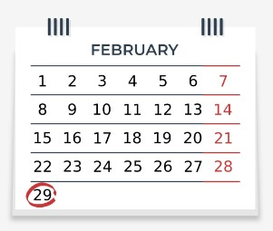
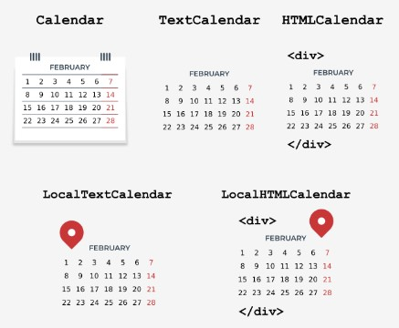

## 4.6.1.1 O módulo calendar

## Introdução ao módulo calendar .

Para além dos módulos `datetime` e `time` , a biblioteca padrão Python fornece um módulo chamado `calendar` que, como o nome sugere, oferece **funções relacionadas com o calendário.**

Uma delas é, evidentemente, a exibição do calendário. É importante que os dias da semana sejam exibidos de segunda a domingo, e cada dia da semana tenha a sua representação sob a forma de um número inteiro:

|Dia da semana	|Valor inteiro	|Constante|
|---|---|---|
|Segunda-feira	|0	|`calendar.MONDAY`|
|Terça-feira	|1	|`calendar.TUESDAY`|
|Quarta-feira	|2	|`calendar.WEDNESDAY`|
|Quinta-feira	|3	|`calendar.THURSDAY`|
|Sexta-feira	|4	|`calendar.FRIDAY`|
|Sábado	|5	|`calendar.SATURDAY`|
|Domingo	|6	|`calendar.SUNDAY`|

A tabela acima mostra a representação dos dias da semana no módulo `calendar` . O primeiro dia da semana (segunda-feira) é representado pelo valor *0* e pela constante *calendar.MONDAY*, enquanto que o último dia da semana (domingo) é representado pelo valor *6* e pela constante *calendar.SUNDAY*.


Para os meses, os valores inteiros são indexados a partir de 1, ou seja, janeiro é representado por 1, e dezembro por 12. Infelizmente, não há constantes que expressem os meses.

As informações acima referidas ser-lhe-ão úteis quando trabalhar com o módulo `calendar` nesta parte do curso, mas primeiro vamos começar com alguns exemplos simples de calendário.

## 4.6.1.2 O módulo calendar

## O seu primeiro calendário

Começará a sua aventura com o módulo `calendar` com uma função simples chamada `calendar`, que permite **exibir o calendário para todo o ano**. Vejamos como usá-lo para exibir o calendário de 2020. Execute o código no editor e veja o que acontece.

```
import calendar
print(calendar.calendar(2023))
```

O resultado exibido é semelhante ao resultado do comando *cal* disponível em Unix. Se quiser alterar a formatação padrão do calendário, pode utilizar os seguintes parâmetros:

* `w` – largura da coluna de data (default 2)
* `l` – número de linhas por semana (default 1)
* `c` — número de espaços entre as colunas do mês (default 6)
* `m` — número de colunas (default 3)

A função de calendário requer que se especifique o ano, enquanto que os outros parâmetros responsáveis pela formatação são opcionais. Encorajamo-lo a experimentar por si próprio estes parâmetros.

Uma boa alternativa à função acima é a função chamada prcal, que também toma os mesmos parâmetros que a função `calendar` , mas não requer o uso da função `print` para exibir o calendário. A sua utilização assemelha-se a esta:

```
import calendar
calendar.prcal(2020)
```

## 4.6.1.3 O módulo calendar

## Calendário para um mês específico

O módulo `calendar` tem uma função chamada `month`, que permite exibir um calendário para um mês específico. A sua utilização é muito simples, apenas precisa de especificar o ano e o mês - verifique o código no editor.

```
import calendar
print(calendar.month(2020, 11))
```

O exemplo exibe o calendário para novembro de 2020. Como na função `calendar` , pode alterar a formatação padrão usando os seguintes parâmetros:

* `w` – largura da coluna de data (default 2)
* `l` – número de linhas por semana (default 1)

**Nota:** Também pode usar a função `prmonth` , que tem os mesmos parâmetros que a função `month` , mas não exige que use a função `print` para exibir o calendário.

## 4.6.1.4 O módulo calendar

## Os loops setfirstweekday() .

Como já sabe, por defeito no módulo `calendar` , o primeiro dia da semana é segunda-feira. No entanto, pode alterar este comportamento usando uma função chamada `setfirstweekday`.

Lembra-se da tabela que mostra os dias da semana e a sua representação sob a forma de valores inteiros? É altura de a utilizar, porque o módulo `setfirstweekday` requer um parâmetro expressando o dia da semana sob a forma de um valor inteiro. Dê uma vista de olhos no exemplo no editor.

O exemplo utiliza a constante `calendar.SUNDAY` , que contém um valor de 6. Claro que pode passar esse valor diretamente para a função `setfirstweekday` , mas a versão com uma constante é mais elegante.

Como resultado, obtemos um calendário mostrando o mês de dezembro de 2020, no qual o primeiro dia de todas as semanas é domingo.

```
import calendar

calendar.setfirstweekday(calendar.SUNDAY)
calendar.prmonth(2020, 12)
```

## 4.6.1.5 O módulo calendar

## Os loops weekday() .

Outra função útil fornecida pelo módulo `calendar` é a função chamada `weekday`, que devolve o dia da semana como um valor inteiro para o ano, mês e dia em questão. Vamos vê-la na prática.

Execute o código no editor para verificar o dia da semana que cai a 24 de dezembro de 2020.

```
import calendar
print(calendar.weekday(2020, 12, 24))
```

Resultado:

output

`3`


A função `weekday` devolve 3, o que significa que 24 de dezembro de 2020 é uma quinta-feira.

## 4.6.1.6 O módulo calendar

## Os loops weekheader() .

Já deve ter reparado que o calendário contém cabeçalhos semanais de forma abreviada. Se necessário, pode obter nomes curtos de dias de semana usando o método `weekheader` .

O método `weekheader` exige que especifique a largura em carateres para um dia da semana. Se a largura que fornecer for superior a 3, ainda receberá os nomes abreviados dos dias da semana compostos por três carateres.

Vejamos então como obter um cabeçalho mais pequeno. Execute o código no editor.

```
import calendar
print(calendar.weekheader(2))
```

Resultado:

output

`Mo Tu We Th Fr Sa Su`


**Nota:** Se mudar o primeiro dia da semana, por exemplo, utilizando a função `setfirstweekday` , afetará o resultado da função `weekheader` .

## 4.6.1.7 O módulo calendar

## Como verificamos se um ano é um ano bissexto?

O módulo `calendar` fornece duas funções úteis para verificar se os anos são anos bissextos.



O primeiro, chamado `isleap`, devolve *True* se o ano passado for bissexto, ou *False* caso contrário. O segundo, chamado `leapdays`, devolve o número de anos bissextos num determinado intervalo de anos.

Execute o código no editor.

```
import calendar

print(calendar.isleap(2020))
print(calendar.leapdays(2010, 2021))  # Up to but not including 2021.
```

Resultado:

output

```
True
3
```

No exemplo, obtemos o resultado 3, porque no período de 2010 a 2020 há apenas três anos bissextos (nota: 2021 não está incluído). São os anos de 2012, 2016 e 2020.

## 4.6.1.8 O módulo calendar

## Classes para criação de calendários

As funções apresentadas não são tudo o que o módulo `calendar` oferece. Para além delas, podemos utilizar as seguintes classes:

* `calendar.Calendar` - fornece métodos para preparar dados de calendário para formatação;
* `calendar.TextCalendar` - é utilizada para criar calendários de texto regulares;
* `calendar.HTMLCalendar` - é utilizada para criar calendários HTML;
* `calendar.LocalTextCalendar` — é uma subclasse da classe calendar.TextCalendar . O construtor desta classe toma o parâmetro locale, que é utilizado para devolver os nomes apropriados dos meses e dias da semana.
* `calendar.LocalHTMLCalendar` — é uma subclasse da classe `calendar.HTMLCalendar` . O construtor desta classe toma o parâmetro locale, que é utilizado para devolver os nomes apropriados dos meses e dias da semana.

Durante este curso, já teve a oportunidade de criar calendários de texto ao discutir as funções do módulo `calendar` .

Está na hora de experimentar algo novo. Vamos analisar mais de perto os métodos da classe `calendar` .





## 4.6.1.9 O módulo calendar

## Criar um objeto Calendar .

O construtor de classes `Calendar` toma um parâmetro opcional chamado `firstweekday`, por defeito igual a 0 (segunda-feira).

O parâmetro `firstweekday` deve ser um inteiro entre 0-6. Para este efeito, podemos utilizar as constantes já conhecidas - ver o código no editor.

```
import calendar  

c = calendar.Calendar(calendar.SUNDAY)

for weekday in c.iterweekdays():
    print(weekday, end=" ")
```

O programa fará output do seguinte resultado:

output

`6 0 1 2 3 4 5`


O exemplo de código usa o método de classe `Calendar` chamado `iterweekdays`, que devolve um iterador para os números dos dias da semana.

O primeiro valor devolvido é sempre igual ao valor da propriedade `firstweekday` . Visto no nosso exemplo o primeiro valor devolvido ser 6, isso significa que a semana começa num domingo.

## 4.6.1.10 O módulo calendar

## Os loops itermonthdates() .

A classe `Calendar` tem vários métodos que devolvem um iterador. Um deles é o método `itermonthdates` , que requer a especificação do ano e mês.

Como resultado, todos os dias no mês e ano especificados são devolvidos, tal como todos os dias antes do início do mês ou do final do mês que são necessários para obter uma semana completa.

Cada dia é representado por um objeto `datetime.date` . Dê uma vista de olhos no exemplo no editor.

```
import calendar  

c = calendar.Calendar()

for date in c.itermonthdates(2019, 11):
    print(date, end=" ")
```

O código exibe todos os dias de novembro de 2019. Como o primeiro dia de novembro de 2019 foi uma sexta-feira, os dias seguintes também são devolvidos para obter a semana completa: 10/28/2019 (segunda-feira) 10/29/2019 (terça-feira) 10/30/2019 (quarta-feira) 10/31/2019 (quinta-feira).

O último dia de novembro de 2019 foi um sábado, portanto, para manter a semana completa, mais um dia é devolvido 12/01/2019 (sexta-feira).

## 4.6.1.11 O módulo calendar

## Outros métodos que devolvem iteradores

Outro método útil na classe `Calendar` é o método chamado `itermonthdates`, que toma ano e mês como parâmetros e, em seguida, devolve o iterador para os dias da semana representados por números.

Dê uma vista de olhos no exemplo no editor.

```
import calendar  

c = calendar.Calendar()

for iter in c.itermonthdays(2019, 11):
    print(iter, end=" ")
```

Certamente notou no grande número de 0s devolvidos como resultado do código de exemplo. Estes são dias fora do intervalo de meses especificado, que são adicionados para manter a semana completa.

Os quatro primeiros zeros representam 28/10/2019 (segunda-feira) 29/10/2019 (terça-feira) 30/10/2019 (quarta-feira) 31/10/2019 (quinta-feira). Os restantes números são dias no mês, exceto o último valor de 0, que substitui a data 01/12/2019 (domingo).

Existem quatro outros métodos semelhantes na classe `Calendar` que diferem nos dados devolvidos:

* `itermonthdates2` — devolve dias sob a forma de tuples constituídas por um número de dia do mês e um número de dia da semana;
* `itermonthdates3` — devolve dias sob a forma de tuples constituídas por um número do ano, um do mês e um do dia do mês. Este método está disponível a partir da versão 3.7 do Python.
* `itermonthdates4` — devolve dias sob a forma de tuples constituídas por um número do ano, um do mês, um do dia do mês e um do dia da semana. Este método está disponível a partir da versão 3.7 do Python.

Para fins de teste, utilize o exemplo acima e veja como se apresentam na prática os valores de retorno dos métodos descritos.

## 4.6.1.12 O módulo calendar

## Os loops monthdays2calendar() .

A classe `Calendar` tem vários outros métodos úteis, sobre os quais pode aprender mais na documentação (https://docs.python.org/3/library/calendar.html).

Um deles é o método `monthdays2calendar` , que toma o ano e o mês, e, em seguida, devolve uma lista de semanas num mês específico. Cada semana é um tuple composto por números do dia e números do dia da semana. Veja o código no editor.

```
import calendar  

c = calendar.Calendar()

for data in c.monthdays2calendar(2020, 12):
    print(data)
```

Note-se que os números dos dias fora do mês são representados por 0, enquanto os números do dia da semana são um número de 0-6, onde 0 é segunda-feira e 6 é domingo.

Dentro de momentos, este método pode ser-lhe útil para completar uma tarefa de laboratório. Está preparado?

## 4.6.1.13 LAB: o módulo calendar

## 4.6.1.14 RESUMO DA SECÇÃO

## Key takeaways

1. no módulo `calendar` , os dias da semana são exibidos de segunda-feira a domingo. Cada dia da semana tem a sua representação sob a forma de um número inteiro, onde o primeiro dia da semana (segunda-feira) é representado pelo valor 0, enquanto o último dia da semana (domingo) é representado pelo valor 6.


2. Para exibir um calendário para qualquer ano, chame a função `calendar` com o ano passado como seu argumento, por exemplo:

```
import calendar
print(calendar.calendar(2020))
```

Nota: Uma boa alternativa para a função acima é a função chamada `prcal`, que também toma os mesmos parâmetros que a função `calendar` , mas não requer o uso da função `print` para exibir o calendário.


3. Para exibir um calendário para qualquer mês do ano, chame a função `month` , passando ano e mês para ela. Por exemplo:

```
import calendar
print(calendar.month(2020, 9))
```

Nota: Também pode utilizar a função `prmonth` , que tem os mesmos parâmetros que a função `month` , mas não requer o uso da função `print` para exibir o calendário.


4. O objeto da exceção `setfirstweekday` permite-lhe alterar o primeiro dia da semana. Toma um valor de 0 a 6, onde 0 é domingo e 6 é sábado.


5. O resultado da função `weekday` é um dia da semana como um valor inteiro para um determinado ano, mês e dia:

```
import calendar
print(calendar.weekday(2020, 9, 29)) # This displays 1, which means Tuesday.
```


6. A função `weekheader` devolve os nomes dos dias da semana numa forma abreviada. O método `weekheader` exige que especifique a largura em carateres para um dia da semana. Se a largura que fornecer for superior a 3, ainda receberá os nomes abreviados dos dias da semana compostos por apenas três carateres. Por exemplo:

```
import calendar
print(calendar.weekheader(2)) # This display: Mo Tu We Th Fr Sa Su
```


7. Uma função muito útil disponível no módulo `calendar` é a função chamada `isleap`, que, como o nome sugere, permite verificar se o ano é um ano bissexto ou não:

```
import calendar
print(calendar.isleap(2020)) # This displays: True
```


8. Pode criar um objeto `calendar` você mesmo usando a classe `Calendar` , que, ao criar o seu objeto, lhe permite alterar o primeiro dia da semana com o parâmetro opcional `firstweekday` , por exemplo:

```
import calendar  

c = calendar.Calendar(2)

for weekday in c.iterweekdays():
    print(weekday, end=" ")
# Result: 2 3 4 5 6 0 1
```

O `iterweekdays` devolve um iterador para números de dias úteis. O primeiro valor devolvido é sempre igual ao valor da propriedade `firstweekday` .


**Exercício 1**

Qual é o output do seguinte snippet?

```
import calendar
print(calendar.weekheader(1))
```

Verifique

`M T W T F S S`


`Exercício 2`

Qual é o output do seguinte snippet?

```
import calendar  

c = calendar.Calendar()

for weekday in c.iterweekdays():
    print(weekday, end=" ")
```

Verifique

`0 1 2 3 4 5 6`

## 4.6.1.15 Conclusão do Módulo

## Parabéns! Completou o PE2: Módulo 4.

Muito bem! Chegou ao fim do Módulo 4 e completou um marco importante na sua educação em programação Python. Aqui está um breve resumo dos objetivos que abordou e com os quais se familiarizou no Módulo 4:

* geradores e iteradores;
* compreensões de lista;
* as funções lambda, map e filter;
* closures;
* trabalhar com ficheiros (streams de ficheiros, processamento de ficheiros, diagnóstico de problemas de stream)
* processamento de texto e ficheiros binários;
* módulos STL Python selecionados: os, datetime, time e calendar.

Está agora pronto para fazer o quiz do módulo e tentar o desafio final: Teste do Módulo 4, que o ajudará a avaliar o que aprendeu até agora.